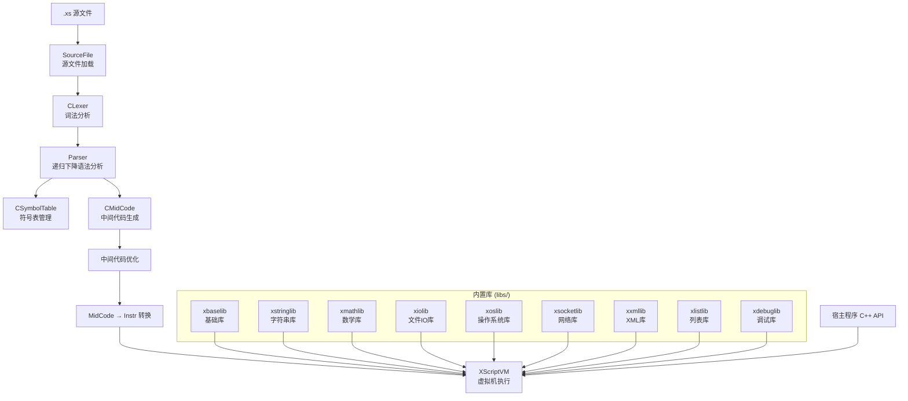

# XScript 脚本语言引擎 — 技术实现分析

## 1. 项目概述

XScript 是一个用 C++ 实现的**嵌入式脚本语言引擎**，设计理念类似于 Lua，旨在为宿主 C++ 程序提供灵活的脚本扩展能力。项目采用 Visual Studio 开发环境（.sln / .vcxproj），编译产物为 `XScripter.exe`。

整个引擎实现了完整的**编译→执行**流水线：

```
源文件(.xs) → 词法分析(Lexer) → 语法分析(Parser) → 中间代码生成(MidCode) → 中间代码优化 → 虚拟机执行(VM)
```

---

## 2. 整体架构



---

## 3. 类型系统

### 3.1 Value 类型结构

`Value` 是 XScript 中最核心的数据表示，采用 **tagged union（标签联合体）** 设计：

```cpp
struct Value
{
    int type;           // 类型标签 (ValueType 枚举)
    union
    {
        XInt            iIntValue;         // 整数值
        XFloat          fFloatValue;       // 浮点数值
        int             iFunctionValue;    // 函数索引
        int             iInstrIndex;       // 指令索引
        int             iRegIndex;         // 寄存器索引
        XString*        stringValue;       // 字符串指针
        Function*       func;              // 函数指针
        TableValue*     tableData;         // 表指针
        void*           lightUserData;     // 轻量用户数据
        XScriptState*   threadData;        // 协程/线程
        UserData*       userData;          // 用户数据
        ListValue*      listData;          // 列表指针
    };
};
```

### 3.2 值类型枚举 (ValueType)

| 类型 | 值 | 说明 |
|------|-----|------|
| `OP_TYPE_NIL` | -1 | 空值 |
| `OP_TYPE_INT` | 0 | 整数 |
| `OP_TYPE_FLOAT` | 1 | 浮点数 |
| `OP_TYPE_STRING` | 2 | 字符串（GC管理的 `XString*`） |
| `OP_TYPE_TABLE` | 3 | 哈希表（类似 Lua table） |
| `OP_LIGHTUSERDATA` | 4+ | 轻量用户数据（裸指针） |
| `OP_TYPE_FUNC` | 6 | 函数（C函数或脚本函数） |
| `OP_TYPE_PROTO` | 7 | 函数原型 |
| `OP_TYPE_UPVAL` | 8 | UpValue |
| `OP_TYPE_THREAD` | 9 | 协程/线程 |
| `OP_TYPE_USERDATA` | 10 | 用户数据（绑定C++对象） |
| `OP_TYPE_LIST` | 11 | 列表/数组 |

### 3.3 数值精度可配置

通过 `USE_HIGH_PRECIOUS_NUMBER` 宏切换：

| 模式 | XInt | XFloat | 字符串转换 |
|------|------|--------|-----------|
| 默认 | `int` | `float` | `atoi` / `(float)atof` |
| 高精度 | `signed long long` | `double` | `atoll` / `atof` |

### 3.4 用户数据类型编码

用户数据类型使用高16位标识类型，低16位标识子类型索引：

```cpp
#define IsUserType(type)        ((type >> 16) == OP_LIGHTUSERDATA)
#define UserDataType(type)      (type & 0xffff)
#define MAKE_USERTYPE(index)    ((OP_LIGHTUSERDATA << 16) + index)
```

---

## 4. 词法分析器 (CLexer)

### 4.1 有限状态自动机

词法分析器使用 **DFA（确定性有限状态自动机）** 进行词法分析，定义了 14 种词法状态：

| 状态 | 值 | 说明 |
|------|-----|------|
| `LEX_STATE_START` | 1 | 起始状态 |
| `LEX_STATE_INT` | 2 | 整数 |
| `LEX_STATE_FLOAT` | 3 | 浮点数 |
| `LEX_STATE_IDENT` | 4 | 标识符 |
| `LEX_STATE_OP` | 5 | 运算符 |
| `LEX_STATE_DELIM` | 6 | 分隔符 |
| `LEX_STATE_STRING` | 7 | 字符串 |
| `LEX_STATE_STRING_ESCAPE` | 8 | 转义字符 |
| `LEX_STATE_STRING_CLOSE_QUOTE` | 9 | 字符串闭合引号 |
| `LEX_STATE_LINE_COMMENT` | 10 | 行注释 `//` |
| `LEX_STATE_SEGMENT_COMMENT` | 11 | 块注释 `/* */` |
| `LEX_STATE_POINT` | 12 | 单点 `.` |
| `LEX_STATE_TWO_POINT` | 13 | 双点 `..` |
| `LEX_STATE_THREE_POINT` | 14 | 三点 `...` |

### 4.2 Token 类型

定义了 30+ 种 Token 类型（`TokenType` 枚举），包括：
- 字面量：`TOKEN_TYPE_INT`, `TOKEN_TYPE_FLOAT`, `TOKEN_TYPE_STRING`
- 标识符：`TOKEN_TYPE_IDENT`
- 保留字：`var`, `global`, `true`, `false`, `if`, `else`, `break`, `continue`, `for`, `while`, `foreach...in`, `function`, `return`, `nil`, `lambda`, `or`
- 分隔符：`()`, `{}`, `[]`, `,`, `;`, `:`, `.`, `...`, `?`, `#`, `::`
- 运算符：各类算术、比较、逻辑、位运算、赋值运算符

### 4.3 Token 录制/回放机制

为支持语法分析的**前瞻和回溯**，词法分析器实现了最多 **7层深度** 的 Token 录制机制，每层最多记录 200 个 Token：

```cpp
#define MAX_RECORD_DEPTH           7
#define MAX_NUM_RECORD_TOKEN       200

int mRecordTokens[MAX_RECORD_DEPTH][MAX_NUM_RECORD_TOKEN];
std::string mTokensLexeme[MAX_RECORD_DEPTH][MAX_NUM_RECORD_TOKEN];
```

关键接口：
- `beginRecordToken()` / `endRecordToken()` — 开始/结束录制
- `beginReadTokenFromRecord()` / `endReadTokenFromRecord()` — 从录制中回放
- `RewindToken()` / `BackToken()` — 回退 Token

---

## 5. 语法分析器 (Parser)

### 5.1 递归下降解析器

Parser 是项目中最大的文件（~77KB），采用**递归下降**方式实现，每个语法结构对应一个解析函数。

### 5.2 支持的语法结构

| 语法 | 示例 |
|------|------|
| 变量声明 | `var a, b = 1, 3;` |
| 全局变量 | `global gTest = 10;` |
| 函数定义 | `function div(a, b) { return a / b; }` |
| Lambda | `var f = lambda(x) { return x * 2; };` |
| 条件语句 | `if / else` |
| For 循环 | `for (i = 0; i < 10; i++) { ... }` |
| While 循环 | `while (cond) { ... }` |
| Foreach | `foreach(key, value in ipairs(table)) { ... }` |
| 循环控制 | `break / continue` |
| 返回语句 | `return` |
| Table 初始化 | `var t = {c = "c", d = "d", ["key"] = "value"};` |
| List 初始化 | `var list = [1, 2, 3];` |
| 多重赋值 | `var a, b = 1, 2;` |

### 5.3 寄存器分配

Parser 使用**寄存器分配机制**来优化中间代码，最多使用 8 个寄存器（`MAX_FUNC_REG = 8`），局部变量和中间结果存储在寄存器中，减少栈操作。

### 5.4 中间代码优化器

Parser 包含 `optimizeCode()` 方法，执行以下优化：
- **死代码消除**：移除不可达代码
- **跳转优化**：优化条件跳转链

---

## 6. 中间代码 (MidCode)

### 6.1 I-Code 结构

中间代码使用 `ICode` 结构表示：

```cpp
struct ICode
{
    int iCodeType;          // ICODE_NODE_INSTR / ICODE_NODE_SOURCE_LINE / ICODE_NODE_JUMP_TARGET
    Code code;              // 指令操作码和操作数列表
    int JumpIndex;          // 跳转目标索引
    int lineIndex;          // 源码行号
};
```

### 6.2 指令集 (InstrCode)

共定义了 **45 条指令**，分为以下类别：

#### 算术指令
| 指令 | 说明 |
|------|------|
| `INSTR_MOV` | 赋值 |
| `INSTR_ADD` | 加法 |
| `INSTR_SUB` | 减法 |
| `INSTR_MUL` | 乘法 |
| `INSTR_DIV` | 除法 |
| `INSTR_MOD` | 取模 |
| `INSTR_EXP` | 幂运算 (^) |
| `INSTR_NEG` | 取负 |
| `INSTR_INC` | 自增 (++) |
| `INSTR_DEC` | 自减 (--) |

#### 复合赋值指令
| 指令 | 说明 |
|------|------|
| `INSTR_ADD_TO` | += |
| `INSTR_SUB_TO` | -= |
| `INSTR_MUL_TO` | *= |
| `INSTR_DIV_TO` | /= |
| `INSTR_MOD_TO` | %= |
| `INSTR_EXP_TO` | ^= |
| `INSTR_AND_TO` | &= |
| `INSTR_OR_TO` | \|= |
| `INSTR_XOR_TO` | #= |
| `INSTR_NOT_TO` | != (逻辑非赋值) |
| `INSTR_SHL_TO` | <<= |
| `INSTR_SHR_TO` | >>= |
| `INSTR_CONCAT_TO` | $= |

#### 位运算指令
| 指令 | 说明 |
|------|------|
| `INSTR_AND` | 按位与 (&) |
| `INSTR_OR` | 按位或 (\|) |
| `INSTR_XOR` | 按位异或 (#) |
| `INSTR_SHL` | 左移 (<<) |
| `INSTR_SHR` | 右移 (>>) |

#### 跳转/比较指令
| 指令 | 说明 |
|------|------|
| `INSTR_JMP` | 无条件跳转 |
| `INSTR_JE` | 相等跳转 |
| `INSTR_JNE` | 不等跳转 |
| `INSTR_JG` | 大于跳转 |
| `INSTR_JL` | 小于跳转 |
| `INSTR_JGE` | 大于等于跳转 |
| `INSTR_JLE` | 小于等于跳转 |

#### 逻辑/测试指令
| 指令 | 说明 |
|------|------|
| `INSTR_LOGIC_NOT` | 逻辑非 (!) |
| `INSTR_LOGIC_AND` | 逻辑与 (&&) |
| `INSTR_LOGIC_OR` | 逻辑或 (\|\|) |
| `INSTR_TEST_E` | 相等测试 |
| `INSTR_TEST_NE` | 不等测试 |
| `INSTR_TEST_G` | 大于测试 |
| `INSTR_TEST_L` | 小于测试 |
| `INSTR_TEST_GE` | 大于等于测试 |
| `INSTR_TEST_LE` | 小于等于测试 |

#### 函数/数据指令
| 指令 | 说明 |
|------|------|
| `INSTR_FUNC` | 函数定义 |
| `INSTR_CALL` | 函数调用 |
| `INSTR_RET` | 返回 |
| `INSTR_PUSH` | 入栈 |
| `INSTR_POP` | 出栈 |
| `INSTR_TYPE` | 类型查询 |
| `INSTR_LOADNIL` | 加载空值 |
| `INSTR_APPEND` | 列表追加 |
| `INSTR_CONCAT` | 字符串拼接 ($) |

### 6.3 操作数类型 (RuntimeOperatorType / ParseOperandType)

**运行时操作数类型**：
| 类型 | 说明 |
|------|------|
| `ROT_Int` | 整数值 |
| `ROT_Float` | 浮点数值 |
| `ROT_String` | 字符串引用 |
| `ROT_Table` | 表引用 |
| `ROT_UpValue_Table` | UpValue 表引用 |
| `ROT_UpVal_Index` | UpValue 索引 |
| `ROT_Stack_Index` | 栈索引 |
| `ROT_Instr_Index` | 指令索引 |
| `ROT_FuncValue` | 函数值 |
| `ROT_Reg` | 寄存器 |

**解析时操作数类型**：
| 类型 | 说明 |
|------|------|
| `PST_Int` | 整数 |
| `PST_Float` | 浮点数 |
| `PST_String_Index` | 字符串索引 |
| `PST_Var_Index` | 变量索引 |
| `PST_JumpTarget_Index` | 跳转目标索引 |
| `PST_FuncIndex` | 函数索引 |
| `PST_Reg` | 寄存器 |
| `PST_Table` | 表 |

### 6.4 中间代码到指令的转换

`ConvertMidCodeToInstr()` 方法将中间代码转换为 VM 可执行的 `Instr` 指令流：

```
ICode (MidCode) → Instr (VM Instructions)
```

`Instr` 结构：
```cpp
struct Instr
{
    int opType;                  // 指令类型
    int numOpCount;              // 操作数数量
    RuntimeOperator* mOpList;    // 操作数列表
    int lineIndex;               // 源码行号
};
```

---

## 7. 符号表 (CSymbolTable)

符号表管理三类符号：

### 7.1 变量符号 (VariantST)
```cpp
struct VariantST
{
    int  iIndex;
    char varName[MAX_IDENT_SIZE];   // 最大标识符长度 40
    int  iScope;                    // 作用域层级
    int  iSize;                     // 大小
    int  iType;                     // 类型
    int  stackIndex;                // 栈偏移
    std::vector<Operand> initValues; // 初始值
};
```

### 7.2 函数符号 (FunctionST)
```cpp
struct FunctionST
{
    int     iIndex;
    char    funcName[MAX_FUNC_NAME_SIZE]; // 最大函数名长度 64
    int     iParamSize;                   // 参数数量
    int     localDataSize;                // 局部数据大小
    int     curParamIndex;
    bool    hasVarArgs;                   // 是否支持可变参数
    int     curVarIndex;
    int     parentIndex;                  // 父函数索引
    std::vector<int> subIndexVec;         // 子函数索引列表
    std::vector<UpValueST> upValueVec;    // UpValue 列表
};
```

### 7.3 字符串常量 (StringST)
```cpp
struct StringST
{
    int  iIndex;
    char str[MAX_STRING_SIZE];    // 最大字符串长度 256
};
```

### 7.4 变量作用域

三种变量可见性状态：
- **`VLOCAL`** — 局部变量，存储在执行栈上
- **`VUPVALUE`** — UpValue（闭包捕获的外部变量）
- **`VGLOBAL`** — 全局变量，存储在全局数据区

---

## 8. 虚拟机 (XScriptVM)

虚拟机是整个引擎的核心，也是最大的文件（~77KB）。

### 8.1 虚拟机架构

XScriptVM 采用**混合架构**：结合栈机和寄存器机的优点。

#### 内存布局
```
┌──────────────────────────────────────┐
│ 全局变量区 (mGlobalStackElements)      │  MAX_GLOBAL_DATASIZE = 1024
├──────────────────────────────────────┤
│ 执行栈 (mStackElements)              │  MAX_STACK_SIZE = 0xFFFF
├──────────────────────────────────────┤
│ 寄存器 (mRegValue)                   │  8 个通用寄存器
└──────────────────────────────────────┘
```

#### 关键数据成员
```cpp
class XScriptVM
{
    CGObject*       mRootCG;               // GC 对象链表根节点
    Instr*          mCurInstr;             // 当前执行指令
    XScriptState    mMainXScriptState;     // 主线程状态
    XScriptState*   mCurXScriptState;      // 当前线程状态
    Value           mRegValue[8];          // 8 个通用寄存器
    Value*          mGlobalStackElements;  // 全局变量区
    Value*          mNilValue;             // nil 单例
    TABLE           mEnvTable;             // 环境表
    TABLE           mModuleTable;          // 模块缓存表
    TABLE           mMetaTable;            // 全局元表
    TABLE           mStringMetaTable;      // 字符串元表
    TABLE           mListMetaTable;        // 列表元表
    XScript_LongJmp* mLongJmp;            // 错误恢复跳转链
    char*           mStrBuffer;            // 字符串操作缓冲区
    // ... 其他成员
};
```

### 8.2 线程状态 (XScriptState)

```cpp
class XScriptState
{
    UpValue*        mNextRefUpVals;        // 待清理的 UpValue 链表
    CallInfo*       mCallInfoBase;         // 调用信息栈
    int             mCurCallIndex;         // 当前调用深度
    FuncState*      mCurFunctionState;     // 当前函数状态
    Function*       mCurFunction;          // 当前函数
    Value*          mStackElements;        // 执行栈
    int             mStackSize;            // 栈容量
    int             mTopIndex;             // 栈顶指针
    int             mFrameIndex;           // 栈帧指针
    int             mInstrIndex;           // 指令索引
    int             mStatus;               // 线程状态
    Function*       mCurrentCFunction;     // 当前C函数
    Function*       mStartFunction;        // 起始函数
};
```

调用栈深度限制：`MAX_LUA_CALL_STACK_DEPTH = 1024`

### 8.3 调用信息 (CallInfo)

```cpp
class CallInfo
{
    FuncState*  mCurFunctionState;    // 当前函数状态
    Function*   mCurFunction;         // 当前函数
    int         mInstrIndex;          // 指令索引
    int         mCurLine;             // 当前行号
    int         mFrameIndex;          // 栈帧指针
};
```

### 8.4 指令执行引擎

核心执行循环位于 `ExecuteFunction()` 方法，采用 **switch-case** 方式分发指令：

```
while (有指令可执行) {
    switch (当前指令类型) {
        case INSTR_MOV:     ...
        case INSTR_ADD:     ...
        case INSTR_CALL:    ...
        // ... 45 种指令
    }
}
```

### 8.5 操作数解析 (ResolveOpPointer)

指令的操作数通过 `ResolveOpPointer` 宏解析，根据操作数类型从不同位置获取值：

| 操作数类型 | 值来源 |
|-----------|--------|
| `ROT_Stack_Index` | 执行栈（考虑环境表回退） |
| `ROT_Table` / `ROT_UpValue_Table` | 表数据或 UpValue 表 |
| `ROT_UpVal_Index` | UpValue 数组 |
| `ROT_Reg` | 寄存器 |

栈索引解析支持负索引（相对栈帧指针）：
```cpp
#define resoveStackIndex(index)  (index < 0 ? (mCurXScriptState->mFrameIndex + index) : index)
```

环境表回退机制：
```cpp
#define ResoveStackIndexWithEnv(index) \
    (index < 0 ? mCurXScriptState->mStackElements[(mCurXScriptState->mFrameIndex + index)] \
               : ((mEnvTable != NULL) ? GetEnvValue(index) : mGlobalStackElements[GloablVarStackIndex(index)]))
```

---

## 9. 执行宏详解 (MacroDefs.h)

由于 C++ 不支持运行时代码生成，虚拟机使用**宏模板**来实现指令执行逻辑。这些宏定义在 [MacroDefs.h](c:\Projects\XScript\MacroDefs.h) 中。

### 9.1 数学运算宏 `EXEC_INSTR_MATH`

处理二元算术运算（`+`, `-`, `*`, `/`, `%`, `^`），支持类型转换和元方法回退：

```
解析操作数1（目标值）和操作数2
→ 根据操作数类型组合（INT×INT, INT×FLOAT, FLOAT×INT, FLOAT×FLOAT, STRING→FLOAT转换）
→ 执行运算
→ 如果结果为 NIL（类型不匹配），尝试元方法回退
→ 存储结果
```

### 9.2 比较跳转宏 `EXEC_INSTR_J`

处理条件跳转（`>`, `<`, `>=`, `<=`, `==`, `!=`），直接修改指令索引实现跳转：

```
解析操作数1和操作数2
→ INT×INT: 直接比较
→ INT×FLOAT: 整数转浮点比较
→ FLOAT×INT / FLOAT×FLOAT: 浮点比较
→ STRING×STRING: strcmp 比较
→ TABLE/USERDATA/LIGHTUSERDATA: 比较引用 + 元方法回退
→ NIL: 特殊处理
→ 条件成立时跳转到目标指令
```

### 9.3 测试跳转宏 `EXEC_INSTR_JE`

三操作数版本，用于 `if (a OP b)` 结构，第三个操作数为跳转目标。

### 9.4 测试宏 `EXEC_INSTR_TEST_E`

执行比较运算并将布尔结果压入操作数0：

```
解析操作数1和操作数2
→ 支持数值、字符串、表/用户数据/轻量用户数据、nil 的比较
→ 不匹配的类型返回 false
→ 结果存入操作数0
```

### 9.5 复合赋值宏 `EXEC_INSTR_MATH_TO`

形如 `a += b` 的运算：

```
解析目标值和源值
→ 根据类型执行运算
→ 结果写回目标位置
```

### 9.6 自增/自减宏 `EXEC_INSTR_MATH_INC`

`++` / `--` 运算，仅限整数类型：

```
解析目标值
→ 如果是整数，加/减 1
→ 否则报错
```

### 9.7 逻辑运算宏 `EXEC_INSTR_LOGIC_OP`

`&&` / `||` 运算，仅限整数操作数：

```
解析两个操作数
→ 如果都是整数，执行逻辑运算
→ 否则报错
```

### 9.8 位运算宏 `EXEC_INSTR_BIT_OP`

`&` / `|` / `#`(异或) 运算，仅限整数操作数。

### 9.9 哈希表键定位宏 `GetHashPos`

根据键的类型计算哈希表位置：

```
用户数据类型 → lightUserData 取模
INT/FLOAT → 数值取模
STRING → 字符串哈希取模
TABLE → 表指针取模（容量-1）
LIGHTUSERDATA → 指针取模（容量-1）
FUNC → 函数指针取模（容量-1）
```

---

## 10. 表 (Table) 数据结构

`TableValue` 类似 Lua 的 table，采用**双结构设计**：

```
┌─────────────────────────────┐
│ 数组部分 (mArrayData)        │  连续整数键，O(1) 访问
├─────────────────────────────┤
│ 哈希表部分 (mNodeData)       │  非整数键，O(1) 平均访问
└─────────────────────────────┘
```

```cpp
class TableValue
{
    GCCommonHeader;
    XInt        mArraySize;          // 数组部分大小
    Value*      mArrayData;          // 数组部分数据
    int         mNodeCapacity;       // 哈希表容量
    TableNode*  mNodeData;           // 哈希表节点
    int         lastFreePos;         // 最后空闲位置
    TableValue* mMetaTable;          // 元表
};
```

### 哈希冲突解决

使用**链地址法**解决哈希冲突：

```cpp
struct TableKey
{
    Value       keyVal;
    TableNode*  next;     // 冲突链
};

struct TableNode
{
    TableKey    key;
    Value       value;
};
```

### 哈希表扩容

当哈希表满时，调用 `RehashTable()` 进行扩容和重新哈希。

---

## 11. 列表 (List) 数据结构

```cpp
class ListValue
{
    GCCommonHeader;
    XInt        mCapacity;       // 容量
    XInt        mListSize;       // 实际大小
    Value*      mListData;       // 数据数组
    TableValue* mMetaTable;      // 元表
};
```

列表类似动态数组，支持索引访问、追加、插入、删除等操作，内置排序功能：

| 方法 | 说明 |
|------|------|
| `Append` | 追加元素 |
| `Insert` | 指定位置插入 |
| `Remove` | 按值删除 |
| `RemoveAtPos` | 按位置删除 |
| `Resize` / `Shrink` | 调整大小 |
| `Reverse` | 反转 |
| `Sort` | 排序 |
| `SortWithKey` | 按键排序 |
| `SortWithCmp` | 自定义比较排序 |
| `Count` | 统计某值出现次数 |

---

## 12. 字符串管理 (XString)

```cpp
struct XString
{
    GCCommonHeader;
    unsigned int hash;      // 哈希值（预计算）
    int          len;       // 字符串长度
    char         value[1];  // 柔性数组，存储字符串内容
};
```

### 字符串哈希表

虚拟机维护一个字符串哈希表 `mStringHashTable` 用于**字符串驻留（interning）**，相同内容的字符串共享同一 `XString` 对象，便于快速比较和节省内存。

### 字符串拼接

XScript 使用 `$` 作为字符串拼接运算符：
```javascript
var s = "hello" $ " " $ "world";
s $= "!";    // 等价于 s = s $ "!"
```

---

## 13. 函数系统

### 13.1 函数对象

```cpp
class Function
{
    GCCommonHeader;
    bool isCFunc;              // 是否为C函数
    FuncUnion funcUnion;       // 函数体
};

typedef union FuncUnion
{
    CFunction   cFunc;         // C函数
    LuaFunction luaFunc;       // 脚本函数
} FuncUnion;
```

### 13.2 C 函数

```cpp
class CFunction
{
    Value*      mUpVal;        // UpValue 数组
    int         mNumUpVal;     // UpValue 数量
    HOST_FUNC   pfnAddr;       // 函数指针
};
```

### 13.3 脚本函数

```cpp
class LuaFunction
{
    FuncState*  proto;         // 函数原型（编译结果）
    UpValue**   mUpVals;       // UpValue 指针数组
    int         mNumUpVals;    // UpValue 数量
};
```

### 13.4 UpValue（闭包变量捕获）

```cpp
class UpValue
{
    GCCommonHeader;
    Value*      pValue;        // 指向栈上变量的指针
    UpValue*    nextValue;     // 链表
    Value       value;         // 闭包关闭后保存的值
};
```

当 UpValue 引用的栈变量还在作用域内时，`pValue` 直接指向栈位置；当栈帧被销毁后，UpValue **关闭**，将值拷贝到 `value` 中，`pValue` 改为指向 `&value`。

### 13.5 函数调用流程

```
1. CallFunction() / CallFunctionInLua()
   ↓
2. pushFrame() — 在执行栈上分配栈帧
   ↓
3. 将参数压入栈帧
   ↓
4. 执行函数体（ExecuteFunction 循环）
   ↓
5. RET 指令 → popFrame() — 释放栈帧
```

### 13.6 错误处理

使用 `setjmp/longjmp` 实现非局部跳转：

```cpp
struct XScript_LongJmp
{
    XScript_LongJmp* previous;     // 前一个跳转点（栈结构）
    jmp_buf         j;             // 跳转缓冲区
    int             errorCode;
    int             errorFunc;
    std::string     mErrorDesc;    // 错误描述
};
```

`ProtectCallFunction()` 使用 `setjmp` 设置恢复点，脚本出错时 `longjmp` 跳回安全位置，支持 `pcall` / `xpcall` 安全调用模式。

---

## 14. 元表 (MetaTable) 系统

元表机制类似 Lua，允许通过元方法自定义类型的运算行为。

### 14.1 支持的元方法

| 元方法 | 枚举值 | 说明 |
|--------|--------|------|
| `__index` | `MMT_Index` | 表索引访问（键不存在时） |
| `__newindex` | `MMT_NewIndex` | 表索引赋值（键不存在时） |
| `__equal` | `MMT_Equal` | 等于比较 |
| `__add` | `MMT_Add` | 加法运算 |
| `__sub` | `MMT_Sub` | 减法运算 |
| `__mul` | `MMT_Mul` | 乘法运算 |
| `__div` | `MMT_Div` | 除法运算 |
| `__mod` | `MMT_Mod` | 取模运算 |
| `__pow` | `MMT_Pow` | 幂运算 |
| `__neg` | `MMT_Neg` | 取负 |
| `__len` | `MMT_Len` | 取长度 |
| `__less` | `NMT_Less` | 小于比较 |
| `__lessequal` | `NMT_LessEqual` | 小于等于 |
| `__concat` | `MMT_Concat` | 字符串拼接 |
| `__call` | `MMT_Call` | 函数调用 |

共 15 种元方法（`MTT_Count`）。

### 14.2 元方法查找循环

在 `resolveTableValue` 和 `resolveSetTableValue` 中，元方法的查找最多循环 `MAX_TAGMETHOD_LOOP = 10` 次，防止元方法链无限递归。

### 14.3 内置元表

VM 初始化时创建三个内置元表：
- **全局元表** (`mMetaTable`) — 所有表共享的默认元表
- **字符串元表** (`mStringMetaTable`) — 字符串类型的元表
- **列表元表** (`mListMetaTable`) — 列表类型的元表

---

## 15. 协程 (Coroutine) 系统

### 15.1 协程状态

```cpp
enum CoroutineStatus
{
    CS_Normal,      // 正常（刚创建，未运行）
    CS_Running,     // 运行中
    CS_Suspend,     // 挂起
    CS_Dead,        // 已结束
};
```

### 15.2 协程 API

| API | 说明 |
|-----|------|
| `coroutine.create(func)` | 创建协程，返回协程对象 |
| `coroutine.resume(co, ...)` | 恢复/启动协程，传入参数 |
| `coroutine.yield(...)` | 挂起当前协程，传递值给 resume |
| `coroutine.status(co)` | 查询协程状态 |
| `coroutine.wrap(func)` | 创建包装函数，直接调用即自动 resume |

### 15.3 协程实现

- 协程本质上是一个**独立的 `XScriptState` 线程状态**
- 每个协程拥有自己的执行栈和调用栈
- `yield` 通过 `longjmp` 机制挂起执行
- `resume` 恢复执行时，将参数压入协程栈，然后继续执行循环

---

## 16. 垃圾回收 (GC)

### 16.1 标记-清除算法

采用**三色标记-清除**算法：

| 颜色 | 标志位 | 说明 |
|------|--------|------|
| White | `MS_White` | 未被标记，可能在下次清除时回收 |
| Black | `MS_Black` | 已标记完毕，确认存活 |
| Gray | `MS_Gray` | 已标记但子对象未扫描完毕 |
| Fixed | `MS_Fixed` | 固定对象，不参与 GC |

### 16.2 GC 流程

```
1. MarkObjects() — 从根集开始标记
   ├─ 全局变量区
   ├─ 寄存器
   ├─ 执行栈
   └─ 根 GC 对象链表中的 Fixed 对象
   
2. 传播灰色节点 → 扫描子对象（表成员、函数 UpValue 等）

3. SweepObjects() — 清除白色对象
   └─ 释放所有仍为白色的对象
   └─ 将存活对象重新设为白色（为下次 GC 做准备）
```

### 16.3 GC 对象链表

所有 GC 对象通过 `next` 指针串联：

```cpp
#define GCCommonHeader  CGObject* next; unsigned char type; unsigned char marked;
```

`mRootCG` 是链表头，遍历链表即可访问所有 GC 对象。

---

## 17. 宿主程序集成 (C++ Binding)

### 17.1 注册 C 函数

```cpp
gScriptVM.registerHostApi("TestOut", 1, (HOST_FUNC)TestClass_Out);
```

### 17.2 注册 C++ 类

```cpp
gScriptVM.registerUserClass("TestClass", "");  // 类名，基类名
gScriptVM.beginRegisterUserClassFunc("TestClass");
gScriptVM.registerUserClassFunc("Test", 2, TestClass_Test);  // 方法名，参数数，函数指针
gScriptVM.endRegisterUserClassFunc();
```

### 17.3 类继承

```cpp
gScriptVM.registerUserClass("TestClass2", "TestClass");  // TestClass2 继承 TestClass
```

宿主程序按继承链向上搜索方法实现：
```cpp
while (!searchClassName.empty() && mUserClassDataMap.find(searchClassName) != mUserClassDataMap.end())
{
    // 在当前类中搜索方法
    // 未找到则到基类中继续搜索
    searchClassName = userClassData.mBassClassName;
}
```

### 17.4 脚本中访问 C++ 对象

```javascript
// 调用 C++ 类方法
var e = a.b["2"]:Test(10, 20);

// 访问 C++ 对象属性
LuaTest(e.x);
LuaTest(e[0]);
LuaTest(e.sub.x);

// 获取 C++ 对象实例
var obj = TestClass2::GetInstance();
```

### 17.5 宿主函数参数获取

| 方法 | 说明 |
|------|------|
| `getParamAsInt(paramIndex, value)` | 获取整数参数 |
| `getParamAsFloat(paramIndex, value)` | 获取浮点参数 |
| `getParamAsString(paramIndex, value)` | 获取字符串参数 |
| `getParamAsTable(paramIndex, table)` | 获取表参数 |
| `getParamAsObj(paramIndex, userType)` | 获取用户数据对象 |

### 17.6 返回值设置

| 方法 | 说明 |
|------|------|
| `setReturnAsInt(result)` | 返回整数 |
| `setReturnAsfloat(result)` | 返回浮点数 |
| `setReturnAsStr(result)` | 返回字符串 |
| `setReturnAsTable(table)` | 返回表 |
| `setReturnAsUserData(className, pThis)` | 返回用户数据 |
| `setReturnAsNil()` | 返回 nil |

---

## 18. 内置库详解

### 18.1 基础库 (xbaselib)

| 函数 | 说明 |
|------|------|
| `print(...)` | 输出值（换行） |
| `printf(...)` | 格式化输出（无换行） |
| `type(value)` | 返回类型名称 |
| `toString(value)` | 转为字符串 |
| `toNumber(value)` | 转为数值 |
| `sleep(ms)` | 休眠毫秒 |
| `require(module)` | 加载模块 |
| `pcall(func, ...)` | 安全调用 |
| `xpcall(func, errFunc, ...)` | 带错误处理的安全调用 |
| `gc()` | 触发垃圾回收 |
| `setmetatable(table, metaTable)` | 设置元表 |
| `getmetatable(table)` | 获取元表 |
| `pack(...)` | 打包参数为表 |
| `unpack(table)` | 解包表为多值 |
| `coroutine.*` | 协程相关函数 |

### 18.2 字符串库 (xstringlib)

| 函数 | 说明 |
|------|------|
| `string.len(s)` | 字符串长度 |
| `string.find(s, pattern)` | 查找子串 |
| `string.sub(s, start, end)` | 截取子串 |
| `string.compare(s1, s2)` | 比较字符串 |
| `string.lower(s)` / `string.upper(s)` | 大小写转换 |
| `string.split(s, sep)` | 分割字符串 |
| `string.replace(s, old, new)` | 替换子串 |
| `string.trim(s)` | 去除首尾空白 |
| `string.regex_search(s, pattern)` | 正则搜索 |
| `string.regex_match(s, pattern)` | 正则匹配 |
| `string.toUTF8(s)` / `string.toGBK(s)` | 编码转换 |

### 18.3 数学库 (xmathlib)

| 函数 | 说明 |
|------|------|
| `math.random([a, b])` | 随机数 |
| `math.sin(x)` / `math.cos(x)` / `math.tan(x)` | 三角函数 |
| `math.sqrt(x)` | 平方根 |
| `math.exp(x)` | 指数函数 |
| `math.log(x)` / `math.log10(x)` | 对数 |
| `math.asin(x)` / `math.acos(x)` / `math.atan(x)` | 反三角函数 |

### 18.4 文件 IO 库 (xiolib)

| 函数 | 说明 |
|------|------|
| `io.input()` / `io.output()` | 设置默认输入/输出 |
| `file.open(path, mode)` | 打开文件 |
| `file.close()` | 关闭文件 |
| `file.read(format)` | 读取文件 |
| `file.write(value)` | 写入文件 |
| `file.seek(whence, offset)` | 定位文件指针 |
| `file.flush()` | 刷新缓冲 |
| `file.eof()` | 是否到文件末尾 |

### 18.5 操作系统库 (xoslib)

| 函数 | 说明 |
|------|------|
| `os.listdir(path)` | 列出目录 |
| `os.remove(path)` / `os.rmdir(path)` | 删除文件/目录 |
| `os.mkdir(path)` | 创建目录 |
| `os.isfile(path)` / `os.isdir(path)` | 判断类型 |
| `os.exists(path)` | 判断存在性 |
| `os.getsize(path)` | 获取文件大小 |
| `os.getpwd()` / `os.setpwd(path)` | 获取/设置工作目录 |
| `os.system(cmd)` | 执行系统命令 |
| `os.copyFile(src, dst)` / `os.copyDir(src, dst)` | 复制文件/目录 |

### 18.6 网络 Socket 库 (xsocketlib)

| 函数 | 说明 |
|------|------|
| `socket.create()` | 创建套接字 |
| `socket.bind(sock, port)` | 绑定端口 |
| `socket.connect(sock, host, port)` | 连接远程 |
| `socket.listen(sock)` | 监听 |
| `socket.recv(sock, len)` | 接收数据 |
| `socket.send(sock, data)` | 发送数据 |
| `socket.accept(sock)` | 接受连接 |
| `socket.gethostbyname(host)` | DNS 解析 |
| `socket.closesocket(sock)` | 关闭套接字 |

### 18.7 XML 库 (xxmllib)

基于 TinyXML / RapidXML 的 XML 解析库，支持：
- 节点遍历
- 节点增删改查
- 属性访问

### 18.8 列表库 (xlistlib)

| 函数 | 说明 |
|------|------|
| `list.Append(list, value)` | 追加元素 |
| `list.Insert(list, pos, value)` | 插入元素 |
| `list.Remove(list, value)` | 删除元素 |
| `list.Resize(list, size)` | 调整大小 |
| `list.Size(list)` | 获取大小 |
| `list.Reverse(list)` | 反转列表 |
| `list.Sort(list)` | 排序 |
| `list.SortWithKey(list)` | 按键排序 |
| `list.SortWithCmp(list)` | 自定义比较排序 |
| `list.Count(list, value)` | 统计元素出现次数 |

### 18.9 正则表达式库 (regex)

提供 `regex_search` 和 `regex_match` 功能，供字符串库调用。

---

## 19. 错误处理机制

### 19.1 编译期错误

- 非法语法
- 未定义变量
- 参数数量不匹配
- 类型不匹配

### 19.2 运行期错误

- 算术运算类型不匹配（如对字符串做加法）
- 表索引操作失败
- 栈溢出
- 除零错误

### 19.3 错误恢复

使用 `setjmp/longjmp` 实现非局部跳转：

```cpp
int ProtectCallFunction(Function* firstValue, int numParam, std::string& errorDesc, int errorFunc = -1);
```

`pcall` 调用模式：
```javascript
var success, result = pcall(function() 
{
    // 可能出错的代码
});
if (!success) {
    printf("Error:", result);
}
```

### 19.4 错误追踪

`stackBackTrace()` 方法生成调用栈回溯信息，便于定位错误位置。

---

## 20. 项目文件结构

```
XScript/
├── XScript.cpp              # 主入口 & 宿主绑定示例
├── Lexer.h / Lexer.cpp      # 词法分析器（CLexer）
├── Parser.h / Parser.cpp    # 语法分析器（递归下降）
├── MidCode.h / MidCode.cpp  # 中间代码生成（CMidCode）
├── SymbolTable.h / cpp      # 符号表管理（CSymbolTable）
├── Commonfunc.h              # 公共类型定义
│   ├── InstrCode 枚举        # 45 条指令
│   ├── ValueType 枚举        # 12 种值类型
│   ├── Operand 结构          # 操作数
│   ├── Value 结构            # 核心值类型
│   └── 各种辅助宏/函数
├── MacroDefs.h               # VM 执行宏模板
├── VMDefs.h                  # VM 核心数据结构
│   ├── CGObject / XString / UserData
│   ├── TableValue / ListValue
│   ├── Function / CFunction / LuaFunction
│   ├── UpValue / FuncState
│   ├── XScriptState / CallInfo
│   └── Instr / InstrStream
├── XsriptVM.h / XsriptVM.cpp # 虚拟机主实现
├── XScriptVM_Instrs.cpp      # VM 指令执行实现
├── SourceFile.h / cpp        # 源文件加载
├── Xutility.h / cpp          # 工具函数
├── stdafx.cpp                # 预编译头
├── libs/                     # 内置库
│   ├── xbaselib.*            # 基础库
│   ├── xstringlib.*          # 字符串库
│   ├── xmathlib.*            # 数学库
│   ├── xiolib.*              # 文件IO库
│   ├── xoslib.*              # 操作系统库
│   ├── xsocketlib.*          # 网络库
│   ├── xxmllib.*             # XML库
│   ├── xlistlib.*            # 列表库
│   ├── xdebuglib.*           # 调试库
│   ├── regex.*               # 正则表达式
│   ├── tinyxml/              # TinyXML 库
│   └── rapidxml/             # RapidXML 库
└── XScriptTest/              # 测试脚本
    ├── test1.xs              # 基础功能测试
    ├── testLib.xs            # 库功能测试
    ├── coroutine_test.xs     # 协程测试
    ├── testmetatable.xs      # 元表测试
    ├── debug.xs              # 调试测试
    └── ...
```

---

## 21. 设计特点总结

### 优点
1. **完整的编译执行流水线**：从源码到 VM 执行，实现了完整的工具链
2. **类 Lua 设计**：元表、闭包、UpValue、协程等高级特性一应俱全
3. **丰富的内置库**：覆盖字符串、数学、IO、OS、网络、XML 等
4. **C++ 绑定友好**：支持注册 C 函数、C++ 类到脚本
5. **可配置精度**：通过宏切换 `int/float` 和 `long long/double`
6. **GC 管理**：三色标记-清除，避免内存泄漏
7. **元方法丰富**：15 种元方法，运算符重载灵活
8. **Token 录制/回放**：支持语法分析的前瞻和回溯
9. **寄存器分配**：8 个寄存器优化中间代码
10. **中间代码优化**：死代码消除和跳转优化

### 可改进之处
1. **代码风格不统一**：文件名拼写错误（`XsriptVM` 应为 `XScriptVM`），`Commonfunc.h` 大小写不一致
2. **大文件拆分**：`Parser.cpp`（77KB）和 `XsriptVM.cpp`（77KB）过大，应按功能模块拆分
3. **宏过度使用**：`MacroDefs.h` 中大量复杂宏（如 `EXEC_INSTR_MATH`），降低可读性和调试性，建议改用模板函数或内联函数
4. **错误处理不完整**：部分 `switch` 语句缺少 `break`（如 `VMDefs.h` 中 `ROT_UpVal_Index` 分支）
5. **缺少现代 C++ 特性**：大量使用裸指针和手动内存管理，可考虑智能指针
6. **注释不足**：核心代码缺少详细注释
7. **命名规范**：全局变量/函数命名不统一（如 `GloablVar` 拼写错误应为 `GlobalVar`）

---

## 22. 性能特征

| 指标 | 值 |
|------|-----|
| 最大栈大小 | 65535 (0xFFFF) |
| 最大全局变量 | 1024 |
| 最大调用深度 | 1024 |
| 寄存器数量 | 8 |
| 最大标识符长度 | 40 |
| 最大函数名长度 | 64 |
| 最大字符串长度 | 256 |
| GC 对象链表 | 单链表 |
| 哈希表冲突 | 链地址法 |
| 元方法循环上限 | 10 次 |

---

*本文档基于 XScript 项目源码分析，最后更新时间：2026-04-27*