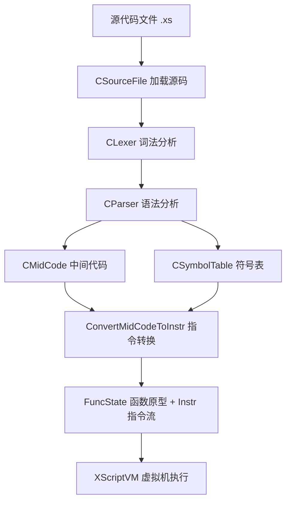
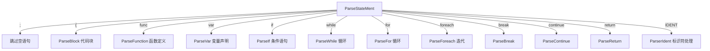
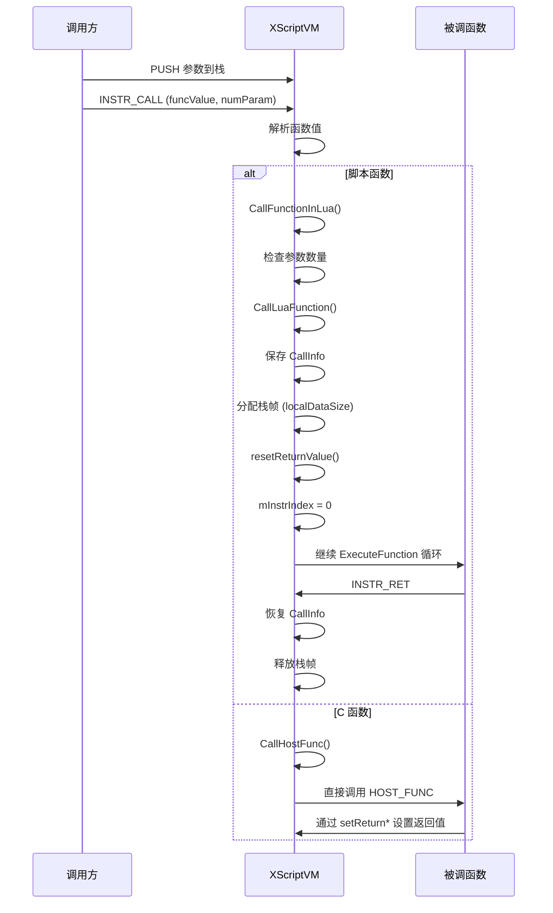
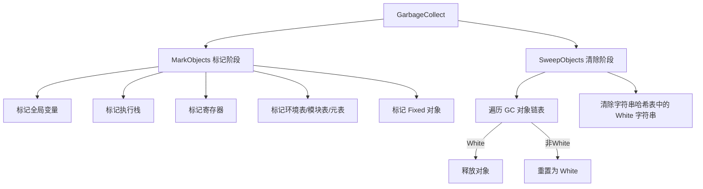

[读取文件中]
[读取文件中]
[读取文件中]
[查找文件中]
[查找文件中]
[查找文件中]
[读取文件中]
[读取文件中]
[读取文件中]
[读取文件中]
[读取文件中]
[读取文件中]
[读取文件中]
[查找文件中]
[查找文件中]
[查找文件中]
[读取文件中]
[读取文件中]
[读取文件中]
[读取文件中]
[读取文件中]
[查找文件中]
[查找文件中]
[读取文件中]
[读取文件中]
Now I have enough information to write a comprehensive documentation. Let me also check the SourceFile class briefly and the ParseExpr function for completeness.
[查找文件中]
[读取文件中]
[读取文件中]
Now I have comprehensive understanding of the entire system. Let me write the detailed documentation.

以下是 XScript 脚本系统的详细技术文档，涵盖从脚本解析到虚拟机运行的完整流程。

---

# XScript 脚本系统技术文档

## 1. 系统总体架构

XScript 是一个类 Lua 的动态脚本语言系统，采用**编译+虚拟机执行**的架构。整体流程如下：



核心组件：

| 组件 | 类名 | 职责 |
|------|------|------|
| 源文件加载器 | [`CSourceFile`](command:gongfeng.gongfeng-copilot.chat.open-symbol-in-file?%5B%7B%22%24mid%22%3A1%2C%22fsPath%22%3A%22c%3A%5C%5CProjects%5C%5CXScriptSVN%5C%5Ctrunk%5C%5CXScript%5C%5CParser.cpp%22%2C%22_sep%22%3A1%2C%22external%22%3A%22file%3A%2F%2F%2Fc%253A%2FProjects%2FXScriptSVN%2Ftrunk%2FXScript%2FParser.cpp%22%2C%22path%22%3A%22%2Fc%3A%2FProjects%2FXScriptSVN%2Ftrunk%2FXScript%2FParser.cpp%22%2C%22scheme%22%3A%22file%22%7D%2C%22CSourceFile%22%2C%5B%7B%22line%22%3A336%2C%22character%22%3A25%7D%2C%7B%22line%22%3A336%2C%22character%22%3A36%7D%5D%5D) | 按行加载源码，提供逐字符读取接口 |
| 词法分析器 | [`CLexer`](command:gongfeng.gongfeng-copilot.chat.open-symbol-in-file?%5B%7B%22%24mid%22%3A1%2C%22fsPath%22%3A%22c%3A%5C%5CProjects%5C%5CXScriptSVN%5C%5Ctrunk%5C%5CXScript%5C%5CParser.cpp%22%2C%22_sep%22%3A1%2C%22external%22%3A%22file%3A%2F%2F%2Fc%253A%2FProjects%2FXScriptSVN%2Ftrunk%2FXScript%2FParser.cpp%22%2C%22path%22%3A%22%2Fc%3A%2FProjects%2FXScriptSVN%2Ftrunk%2FXScript%2FParser.cpp%22%2C%22scheme%22%3A%22file%22%7D%2C%22CLexer%22%2C%5B%7B%22line%22%3A338%2C%22character%22%3A1%7D%2C%7B%22line%22%3A338%2C%22character%22%3A7%7D%5D%5D) | 将字符流转换为 Token 流 |
| 语法分析器 | [`CParser`](command:gongfeng.gongfeng-copilot.chat.open-symbol-in-file?%5B%7B%22%24mid%22%3A1%2C%22fsPath%22%3A%22c%3A%5C%5CProjects%5C%5CXScriptSVN%5C%5Ctrunk%5C%5CXScript%5C%5CParser.cpp%22%2C%22_sep%22%3A1%2C%22external%22%3A%22file%3A%2F%2F%2Fc%253A%2FProjects%2FXScriptSVN%2Ftrunk%2FXScript%2FParser.cpp%22%2C%22path%22%3A%22%2Fc%3A%2FProjects%2FXScriptSVN%2Ftrunk%2FXScript%2FParser.cpp%22%2C%22scheme%22%3A%22file%22%7D%2C%22CParser%22%2C%5B%7B%22line%22%3A11%2C%22character%22%3A0%7D%2C%7B%22line%22%3A11%2C%22character%22%3A7%7D%5D%5D) | 递归下降解析，生成中间代码 |
| 中间代码 | [`CMidCode`](command:gongfeng.gongfeng-copilot.chat.open-symbol-in-file?%5B%7B%22%24mid%22%3A1%2C%22fsPath%22%3A%22c%3A%5C%5CProjects%5C%5CXScriptSVN%5C%5Ctrunk%5C%5CXScript%5C%5CParser.cpp%22%2C%22_sep%22%3A1%2C%22external%22%3A%22file%3A%2F%2F%2Fc%253A%2FProjects%2FXScriptSVN%2Ftrunk%2FXScript%2FParser.cpp%22%2C%22path%22%3A%22%2Fc%3A%2FProjects%2FXScriptSVN%2Ftrunk%2FXScript%2FParser.cpp%22%2C%22scheme%22%3A%22file%22%7D%2C%22CMidCode%22%2C%5B%7B%22line%22%3A336%2C%22character%22%3A64%7D%2C%7B%22line%22%3A336%2C%22character%22%3A72%7D%5D%5D) | 存储解析阶段生成的指令和跳转目标 |
| 符号表 | [`CSymbolTable`](command:gongfeng.gongfeng-copilot.chat.open-symbol-in-file?%5B%7B%22%24mid%22%3A1%2C%22fsPath%22%3A%22c%3A%5C%5CProjects%5C%5CXScriptSVN%5C%5Ctrunk%5C%5CXScript%5C%5CParser.cpp%22%2C%22_sep%22%3A1%2C%22external%22%3A%22file%3A%2F%2F%2Fc%253A%2FProjects%2FXScriptSVN%2Ftrunk%2FXScript%2FParser.cpp%22%2C%22path%22%3A%22%2Fc%3A%2FProjects%2FXScriptSVN%2Ftrunk%2FXScript%2FParser.cpp%22%2C%22scheme%22%3A%22file%22%7D%2C%22CSymbolTable%22%2C%5B%7B%22line%22%3A336%2C%22character%22%3A83%7D%2C%7B%22line%22%3A336%2C%22character%22%3A95%7D%5D%5D) | 管理变量、函数、字符串符号 |
| 虚拟机 | [`XScriptVM`](command:gongfeng.gongfeng-copilot.chat.open-symbol-in-file?%5B%7B%22%24mid%22%3A1%2C%22fsPath%22%3A%22c%3A%5C%5CProjects%5C%5CXScriptSVN%5C%5Ctrunk%5C%5CXScript%5C%5CParser.cpp%22%2C%22_sep%22%3A1%2C%22external%22%3A%22file%3A%2F%2F%2Fc%253A%2FProjects%2FXScriptSVN%2Ftrunk%2FXScript%2FParser.cpp%22%2C%22path%22%3A%22%2Fc%3A%2FProjects%2FXScriptSVN%2Ftrunk%2FXScript%2FParser.cpp%22%2C%22scheme%22%3A%22file%22%7D%2C%22XScriptVM%22%2C%5B%7B%22line%22%3A7%2C%22character%22%3A10%7D%2C%7B%22line%22%3A7%2C%22character%22%3A19%7D%5D%5D) | 执行指令，管理运行时状态 |

---

## 2. 编译阶段

### 2.1 入口流程 (`doFile` / `CompileFile`)

```cpp
// XScriptVM.cpp
FuncState* XScriptVM::CompileFile(const std::string& fileName)
{
    CParser parser;
    CMidCode midCode;
    CSymbolTable symbolTable;
    symbolTable.AddFunction("_Main", 0, -1);  // 添加主函数

    CSourceFile sourefile;
    sourefile.LoadSourceFile(fileName.c_str());  // 加载源码

    parser.ParseFile(&sourefile, this, &midCode, &symbolTable);  // 解析

    RegisterGlobalValues(symbolTable);  // 注册全局变量

    map<int, FuncState*> FuncMap;
    ConvertMidCodeToInstr(symbolTable, midCode, fileName, FuncMap);  // 转换为VM指令

    return FuncMap.begin()->second;  // 返回主函数
}
```

### 2.2 源文件加载 ([`CSourceFile`](command:gongfeng.gongfeng-copilot.chat.open-symbol-in-file?%5B%7B%22%24mid%22%3A1%2C%22fsPath%22%3A%22c%3A%5C%5CProjects%5C%5CXScriptSVN%5C%5Ctrunk%5C%5CXScript%5C%5CParser.cpp%22%2C%22_sep%22%3A1%2C%22external%22%3A%22file%3A%2F%2F%2Fc%253A%2FProjects%2FXScriptSVN%2Ftrunk%2FXScript%2FParser.cpp%22%2C%22path%22%3A%22%2Fc%3A%2FProjects%2FXScriptSVN%2Ftrunk%2FXScript%2FParser.cpp%22%2C%22scheme%22%3A%22file%22%7D%2C%22CSourceFile%22%2C%5B%7B%22line%22%3A336%2C%22character%22%3A25%7D%2C%7B%22line%22%3A336%2C%22character%22%3A36%7D%5D%5D))

[`CSourceFile`](command:gongfeng.gongfeng-copilot.chat.open-symbol-in-file?%5B%7B%22%24mid%22%3A1%2C%22fsPath%22%3A%22c%3A%5C%5CProjects%5C%5CXScriptSVN%5C%5Ctrunk%5C%5CXScript%5C%5CParser.cpp%22%2C%22_sep%22%3A1%2C%22external%22%3A%22file%3A%2F%2F%2Fc%253A%2FProjects%2FXScriptSVN%2Ftrunk%2FXScript%2FParser.cpp%22%2C%22path%22%3A%22%2Fc%3A%2FProjects%2FXScriptSVN%2Ftrunk%2FXScript%2FParser.cpp%22%2C%22scheme%22%3A%22file%22%7D%2C%22CSourceFile%22%2C%5B%7B%22line%22%3A336%2C%22character%22%3A25%7D%2C%7B%22line%22%3A336%2C%22character%22%3A36%7D%5D%5D) 将源码文件按行存储，提供逐字符读取接口：

```cpp
class CSourceFile {
    std::vector<LineSourceCode> mSourceFileDataList;  // 按行存储源码
    int m_iCurChar;   // 当前字符位置
    int m_iCurLine;   // 当前行号

    char GetNextChar();    // 获取下一个字符
    char LookNextChar();   // 预览下一个字符（不消耗）
    void ReWindChar();     // 回退一个字符
};
```

---

## 3. 词法分析 ([`CLexer`](command:gongfeng.gongfeng-copilot.chat.open-symbol-in-file?%5B%7B%22%24mid%22%3A1%2C%22fsPath%22%3A%22c%3A%5C%5CProjects%5C%5CXScriptSVN%5C%5Ctrunk%5C%5CXScript%5C%5CParser.cpp%22%2C%22_sep%22%3A1%2C%22external%22%3A%22file%3A%2F%2F%2Fc%253A%2FProjects%2FXScriptSVN%2Ftrunk%2FXScript%2FParser.cpp%22%2C%22path%22%3A%22%2Fc%3A%2FProjects%2FXScriptSVN%2Ftrunk%2FXScript%2FParser.cpp%22%2C%22scheme%22%3A%22file%22%7D%2C%22CLexer%22%2C%5B%7B%22line%22%3A338%2C%22character%22%3A1%7D%2C%7B%22line%22%3A338%2C%22character%22%3A7%7D%5D%5D))

### 3.1 Token 类型

词法分析器将源码字符流转换为 Token 流。支持的 Token 类型：

| 类别 | Token | 示例 |
|------|-------|------|
| 字面量 | [`TOKEN_TYPE_INT`](command:gongfeng.gongfeng-copilot.chat.open-symbol-in-file?%5B%7B%22%24mid%22%3A1%2C%22fsPath%22%3A%22c%3A%5C%5CProjects%5C%5CXScriptSVN%5C%5Ctrunk%5C%5CXScript%5C%5CParser.cpp%22%2C%22_sep%22%3A1%2C%22external%22%3A%22file%3A%2F%2F%2Fc%253A%2FProjects%2FXScriptSVN%2Ftrunk%2FXScript%2FParser.cpp%22%2C%22path%22%3A%22%2Fc%3A%2FProjects%2FXScriptSVN%2Ftrunk%2FXScript%2FParser.cpp%22%2C%22scheme%22%3A%22file%22%7D%2C%22TOKEN_TYPE_INT%22%2C%5B%7B%22line%22%3A1095%2C%22character%22%3A6%7D%2C%7B%22line%22%3A1095%2C%22character%22%3A20%7D%5D%5D), [`TOKEN_TYPE_FLOAT`](command:gongfeng.gongfeng-copilot.chat.open-symbol-in-file?%5B%7B%22%24mid%22%3A1%2C%22fsPath%22%3A%22c%3A%5C%5CProjects%5C%5CXScriptSVN%5C%5Ctrunk%5C%5CXScript%5C%5CParser.cpp%22%2C%22_sep%22%3A1%2C%22external%22%3A%22file%3A%2F%2F%2Fc%253A%2FProjects%2FXScriptSVN%2Ftrunk%2FXScript%2FParser.cpp%22%2C%22path%22%3A%22%2Fc%3A%2FProjects%2FXScriptSVN%2Ftrunk%2FXScript%2FParser.cpp%22%2C%22scheme%22%3A%22file%22%7D%2C%22TOKEN_TYPE_FLOAT%22%2C%5B%7B%22line%22%3A1111%2C%22character%22%3A6%7D%2C%7B%22line%22%3A1111%2C%22character%22%3A22%7D%5D%5D), [`TOKEN_TYPE_STRING`](command:gongfeng.gongfeng-copilot.chat.open-symbol-in-file?%5B%7B%22%24mid%22%3A1%2C%22fsPath%22%3A%22c%3A%5C%5CProjects%5C%5CXScriptSVN%5C%5Ctrunk%5C%5CXScript%5C%5CParser.cpp%22%2C%22_sep%22%3A1%2C%22external%22%3A%22file%3A%2F%2F%2Fc%253A%2FProjects%2FXScriptSVN%2Ftrunk%2FXScript%2FParser.cpp%22%2C%22path%22%3A%22%2Fc%3A%2FProjects%2FXScriptSVN%2Ftrunk%2FXScript%2FParser.cpp%22%2C%22scheme%22%3A%22file%22%7D%2C%22TOKEN_TYPE_STRING%22%2C%5B%7B%22line%22%3A1129%2C%22character%22%3A6%7D%2C%7B%22line%22%3A1129%2C%22character%22%3A23%7D%5D%5D) | `42`, `3.14`, `"hello"` |
| 标识符 | [`TOKEN_TYPE_IDENT`](command:gongfeng.gongfeng-copilot.chat.open-symbol-in-file?%5B%7B%22%24mid%22%3A1%2C%22fsPath%22%3A%22c%3A%5C%5CProjects%5C%5CXScriptSVN%5C%5Ctrunk%5C%5CXScript%5C%5CParser.cpp%22%2C%22_sep%22%3A1%2C%22external%22%3A%22file%3A%2F%2F%2Fc%253A%2FProjects%2FXScriptSVN%2Ftrunk%2FXScript%2FParser.cpp%22%2C%22path%22%3A%22%2Fc%3A%2FProjects%2FXScriptSVN%2Ftrunk%2FXScript%2FParser.cpp%22%2C%22scheme%22%3A%22file%22%7D%2C%22TOKEN_TYPE_IDENT%22%2C%5B%7B%22line%22%3A433%2C%22character%22%3A6%7D%2C%7B%22line%22%3A433%2C%22character%22%3A22%7D%5D%5D) | `myVar`, [`funcName`](command:gongfeng.gongfeng-copilot.chat.open-symbol-in-file?%5B%7B%22%24mid%22%3A1%2C%22fsPath%22%3A%22c%3A%5C%5CProjects%5C%5CXScriptSVN%5C%5Ctrunk%5C%5CXScript%5C%5CParser.cpp%22%2C%22_sep%22%3A1%2C%22external%22%3A%22file%3A%2F%2F%2Fc%253A%2FProjects%2FXScriptSVN%2Ftrunk%2FXScript%2FParser.cpp%22%2C%22path%22%3A%22%2Fc%3A%2FProjects%2FXScriptSVN%2Ftrunk%2FXScript%2FParser.cpp%22%2C%22scheme%22%3A%22file%22%7D%2C%22funcName%22%2C%5B%7B%22line%22%3A626%2C%22character%22%3A13%7D%2C%7B%22line%22%3A626%2C%22character%22%3A21%7D%5D%5D) |
| 关键字 | `TOKEN_TYPE_RSRVD_*` | [`var`](command:gongfeng.gongfeng-copilot.chat.open-symbol-in-file?%5B%7B%22%24mid%22%3A1%2C%22fsPath%22%3A%22c%3A%5C%5CProjects%5C%5CXScriptSVN%5C%5Ctrunk%5C%5CXScript%5C%5CParser.cpp%22%2C%22_sep%22%3A1%2C%22external%22%3A%22file%3A%2F%2F%2Fc%253A%2FProjects%2FXScriptSVN%2Ftrunk%2FXScript%2FParser.cpp%22%2C%22path%22%3A%22%2Fc%3A%2FProjects%2FXScriptSVN%2Ftrunk%2FXScript%2FParser.cpp%22%2C%22scheme%22%3A%22file%22%7D%2C%22var%22%2C%5B%7B%22line%22%3A582%2C%22character%22%3A44%7D%2C%7B%22line%22%3A582%2C%22character%22%3A47%7D%5D%5D), [`func`](command:gongfeng.gongfeng-copilot.chat.open-symbol-in-file?%5B%7B%22%24mid%22%3A1%2C%22fsPath%22%3A%22c%3A%5C%5CProjects%5C%5CXScriptSVN%5C%5Ctrunk%5C%5CXScript%5C%5CParser.cpp%22%2C%22_sep%22%3A1%2C%22external%22%3A%22file%3A%2F%2F%2Fc%253A%2FProjects%2FXScriptSVN%2Ftrunk%2FXScript%2FParser.cpp%22%2C%22path%22%3A%22%2Fc%3A%2FProjects%2FXScriptSVN%2Ftrunk%2FXScript%2FParser.cpp%22%2C%22scheme%22%3A%22file%22%7D%2C%22func%22%2C%5B%7B%22line%22%3A2649%2C%22character%22%3A14%7D%2C%7B%22line%22%3A2649%2C%22character%22%3A18%7D%5D%5D), [`if`](command:gongfeng.gongfeng-copilot.chat.open-symbol-in-file?%5B%7B%22%24mid%22%3A1%2C%22fsPath%22%3A%22c%3A%5C%5CProjects%5C%5CXScriptSVN%5C%5Ctrunk%5C%5CXScript%5C%5CParser.cpp%22%2C%22_sep%22%3A1%2C%22external%22%3A%22file%3A%2F%2F%2Fc%253A%2FProjects%2FXScriptSVN%2Ftrunk%2FXScript%2FParser.cpp%22%2C%22path%22%3A%22%2Fc%3A%2FProjects%2FXScriptSVN%2Ftrunk%2FXScript%2FParser.cpp%22%2C%22scheme%22%3A%22file%22%7D%2C%22if%22%2C%5B%7B%22line%22%3A24%2C%22character%22%3A2%7D%2C%7B%22line%22%3A24%2C%22character%22%3A4%7D%5D%5D), [`else`](command:gongfeng.gongfeng-copilot.chat.open-symbol-in-file?%5B%7B%22%24mid%22%3A1%2C%22fsPath%22%3A%22c%3A%5C%5CProjects%5C%5CXScriptSVN%5C%5Ctrunk%5C%5CXScript%5C%5CParser.cpp%22%2C%22_sep%22%3A1%2C%22external%22%3A%22file%3A%2F%2F%2Fc%253A%2FProjects%2FXScriptSVN%2Ftrunk%2FXScript%2FParser.cpp%22%2C%22path%22%3A%22%2Fc%3A%2FProjects%2FXScriptSVN%2Ftrunk%2FXScript%2FParser.cpp%22%2C%22scheme%22%3A%22file%22%7D%2C%22else%22%2C%5B%7B%22line%22%3A55%2C%22character%22%3A1%7D%2C%7B%22line%22%3A55%2C%22character%22%3A5%7D%5D%5D), [`while`](command:gongfeng.gongfeng-copilot.chat.open-symbol-in-file?%5B%7B%22%24mid%22%3A1%2C%22fsPath%22%3A%22c%3A%5C%5CProjects%5C%5CXScriptSVN%5C%5Ctrunk%5C%5CXScript%5C%5CParser.cpp%22%2C%22_sep%22%3A1%2C%22external%22%3A%22file%3A%2F%2F%2Fc%253A%2FProjects%2FXScriptSVN%2Ftrunk%2FXScript%2FParser.cpp%22%2C%22path%22%3A%22%2Fc%3A%2FProjects%2FXScriptSVN%2Ftrunk%2FXScript%2FParser.cpp%22%2C%22scheme%22%3A%22file%22%7D%2C%22while%22%2C%5B%7B%22line%22%3A365%2C%22character%22%3A1%7D%2C%7B%22line%22%3A365%2C%22character%22%3A6%7D%5D%5D), [`for`](command:gongfeng.gongfeng-copilot.chat.open-symbol-in-file?%5B%7B%22%24mid%22%3A1%2C%22fsPath%22%3A%22c%3A%5C%5CProjects%5C%5CXScriptSVN%5C%5Ctrunk%5C%5CXScript%5C%5CParser.cpp%22%2C%22_sep%22%3A1%2C%22external%22%3A%22file%3A%2F%2F%2Fc%253A%2FProjects%2FXScriptSVN%2Ftrunk%2FXScript%2FParser.cpp%22%2C%22path%22%3A%22%2Fc%3A%2FProjects%2FXScriptSVN%2Ftrunk%2FXScript%2FParser.cpp%22%2C%22scheme%22%3A%22file%22%7D%2C%22for%22%2C%5B%7B%22line%22%3A22%2C%22character%22%3A1%7D%2C%7B%22line%22%3A22%2C%22character%22%3A4%7D%5D%5D), [`foreach`](command:gongfeng.gongfeng-copilot.chat.open-symbol-in-file?%5B%7B%22%24mid%22%3A1%2C%22fsPath%22%3A%22c%3A%5C%5CProjects%5C%5CXScriptSVN%5C%5Ctrunk%5C%5CXScript%5C%5CParser.cpp%22%2C%22_sep%22%3A1%2C%22external%22%3A%22file%3A%2F%2F%2Fc%253A%2FProjects%2FXScriptSVN%2Ftrunk%2FXScript%2FParser.cpp%22%2C%22path%22%3A%22%2Fc%3A%2FProjects%2FXScriptSVN%2Ftrunk%2FXScript%2FParser.cpp%22%2C%22scheme%22%3A%22file%22%7D%2C%22foreach%22%2C%5B%7B%22line%22%3A2044%2C%22character%22%3A1%7D%2C%7B%22line%22%3A2044%2C%22character%22%3A8%7D%5D%5D), [`return`](command:gongfeng.gongfeng-copilot.chat.open-symbol-in-file?%5B%7B%22%24mid%22%3A1%2C%22fsPath%22%3A%22c%3A%5C%5CProjects%5C%5CXScriptSVN%5C%5Ctrunk%5C%5CXScript%5C%5CParser.cpp%22%2C%22_sep%22%3A1%2C%22external%22%3A%22file%3A%2F%2F%2Fc%253A%2FProjects%2FXScriptSVN%2Ftrunk%2FXScript%2FParser.cpp%22%2C%22path%22%3A%22%2Fc%3A%2FProjects%2FXScriptSVN%2Ftrunk%2FXScript%2FParser.cpp%22%2C%22scheme%22%3A%22file%22%7D%2C%22return%22%2C%5B%7B%22line%22%3A26%2C%22character%22%3A3%7D%2C%7B%22line%22%3A26%2C%22character%22%3A9%7D%5D%5D), [`break`](command:gongfeng.gongfeng-copilot.chat.open-symbol-in-file?%5B%7B%22%24mid%22%3A1%2C%22fsPath%22%3A%22c%3A%5C%5CProjects%5C%5CXScriptSVN%5C%5Ctrunk%5C%5CXScript%5C%5CParser.cpp%22%2C%22_sep%22%3A1%2C%22external%22%3A%22file%3A%2F%2F%2Fc%253A%2FProjects%2FXScriptSVN%2Ftrunk%2FXScript%2FParser.cpp%22%2C%22path%22%3A%22%2Fc%3A%2FProjects%2FXScriptSVN%2Ftrunk%2FXScript%2FParser.cpp%22%2C%22scheme%22%3A%22file%22%7D%2C%22break%22%2C%5B%7B%22line%22%3A386%2C%22character%22%3A3%7D%2C%7B%22line%22%3A386%2C%22character%22%3A8%7D%5D%5D), [`continue`](command:gongfeng.gongfeng-copilot.chat.open-symbol-in-file?%5B%7B%22%24mid%22%3A1%2C%22fsPath%22%3A%22c%3A%5C%5CProjects%5C%5CXScriptSVN%5C%5Ctrunk%5C%5CXScript%5C%5CParser.cpp%22%2C%22_sep%22%3A1%2C%22external%22%3A%22file%3A%2F%2F%2Fc%253A%2FProjects%2FXScriptSVN%2Ftrunk%2FXScript%2FParser.cpp%22%2C%22path%22%3A%22%2Fc%3A%2FProjects%2FXScriptSVN%2Ftrunk%2FXScript%2FParser.cpp%22%2C%22scheme%22%3A%22file%22%7D%2C%22continue%22%2C%5B%7B%22line%22%3A439%2C%22character%22%3A43%7D%2C%7B%22line%22%3A439%2C%22character%22%3A51%7D%5D%5D), [`nil`](command:gongfeng.gongfeng-copilot.chat.open-symbol-in-file?%5B%7B%22%24mid%22%3A1%2C%22fsPath%22%3A%22c%3A%5C%5CProjects%5C%5CXScriptSVN%5C%5Ctrunk%5C%5CXScript%5C%5CParser.cpp%22%2C%22_sep%22%3A1%2C%22external%22%3A%22file%3A%2F%2F%2Fc%253A%2FProjects%2FXScriptSVN%2Ftrunk%2FXScript%2FParser.cpp%22%2C%22path%22%3A%22%2Fc%3A%2FProjects%2FXScriptSVN%2Ftrunk%2FXScript%2FParser.cpp%22%2C%22scheme%22%3A%22file%22%7D%2C%22nil%22%2C%5B%7B%22line%22%3A347%2C%22character%22%3A45%7D%2C%7B%22line%22%3A347%2C%22character%22%3A48%7D%5D%5D), [`true`](command:gongfeng.gongfeng-copilot.chat.open-symbol-in-file?%5B%7B%22%24mid%22%3A1%2C%22fsPath%22%3A%22c%3A%5C%5CProjects%5C%5CXScriptSVN%5C%5Ctrunk%5C%5CXScript%5C%5CParser.cpp%22%2C%22_sep%22%3A1%2C%22external%22%3A%22file%3A%2F%2F%2Fc%253A%2FProjects%2FXScriptSVN%2Ftrunk%2FXScript%2FParser.cpp%22%2C%22path%22%3A%22%2Fc%3A%2FProjects%2FXScriptSVN%2Ftrunk%2FXScript%2FParser.cpp%22%2C%22scheme%22%3A%22file%22%7D%2C%22true%22%2C%5B%7B%22line%22%3A26%2C%22character%22%3A10%7D%2C%7B%22line%22%3A26%2C%22character%22%3A14%7D%5D%5D), [`false`](command:gongfeng.gongfeng-copilot.chat.open-symbol-in-file?%5B%7B%22%24mid%22%3A1%2C%22fsPath%22%3A%22c%3A%5C%5CProjects%5C%5CXScriptSVN%5C%5Ctrunk%5C%5CXScript%5C%5CParser.cpp%22%2C%22_sep%22%3A1%2C%22external%22%3A%22file%3A%2F%2F%2Fc%253A%2FProjects%2FXScriptSVN%2Ftrunk%2FXScript%2FParser.cpp%22%2C%22path%22%3A%22%2Fc%3A%2FProjects%2FXScriptSVN%2Ftrunk%2FXScript%2FParser.cpp%22%2C%22scheme%22%3A%22file%22%7D%2C%22false%22%2C%5B%7B%22line%22%3A30%2C%22character%22%3A8%7D%2C%7B%22line%22%3A30%2C%22character%22%3A13%7D%5D%5D), `lambda`, [`in`](command:gongfeng.gongfeng-copilot.chat.open-symbol-in-file?%5B%7B%22%24mid%22%3A1%2C%22fsPath%22%3A%22c%3A%5C%5CProjects%5C%5CXScriptSVN%5C%5Ctrunk%5C%5CXScript%5C%5CParser.cpp%22%2C%22_sep%22%3A1%2C%22external%22%3A%22file%3A%2F%2F%2Fc%253A%2FProjects%2FXScriptSVN%2Ftrunk%2FXScript%2FParser.cpp%22%2C%22path%22%3A%22%2Fc%3A%2FProjects%2FXScriptSVN%2Ftrunk%2FXScript%2FParser.cpp%22%2C%22scheme%22%3A%22file%22%7D%2C%22in%22%2C%5B%7B%22line%22%3A2024%2C%22character%22%3A45%7D%2C%7B%22line%22%3A2024%2C%22character%22%3A47%7D%5D%5D), `or` |
| 运算符 | [`TOKEN_TYPE_OP`](command:gongfeng.gongfeng-copilot.chat.open-symbol-in-file?%5B%7B%22%24mid%22%3A1%2C%22fsPath%22%3A%22c%3A%5C%5CProjects%5C%5CXScriptSVN%5C%5Ctrunk%5C%5CXScript%5C%5CParser.cpp%22%2C%22_sep%22%3A1%2C%22external%22%3A%22file%3A%2F%2F%2Fc%253A%2FProjects%2FXScriptSVN%2Ftrunk%2FXScript%2FParser.cpp%22%2C%22path%22%3A%22%2Fc%3A%2FProjects%2FXScriptSVN%2Ftrunk%2FXScript%2FParser.cpp%22%2C%22scheme%22%3A%22file%22%7D%2C%22TOKEN_TYPE_OP%22%2C%5B%7B%22line%22%3A464%2C%22character%22%3A22%7D%2C%7B%22line%22%3A464%2C%22character%22%3A35%7D%5D%5D) | `+`, `-`, `*`, [`/`](command:gongfeng.gongfeng-copilot.chat.open-relative-path?%7B%22%24mid%22%3A1%2C%22fsPath%22%3A%22c%3A%5C%5CProjects%5C%5CXScriptSVN%5C%5Ctrunk%5C%5CXScript%5C%5C%22%2C%22_sep%22%3A1%2C%22path%22%3A%22%2FC%3A%2FProjects%2FXScriptSVN%2Ftrunk%2FXScript%2F%22%2C%22scheme%22%3A%22file%22%7D), `%`, `^`, `$`, `==`, `!=`, `<`, `>`, `&&`, `||`, `!`, `++`, `--`, `+=`, `-=` 等 |
| 分隔符 | `TOKEN_TYPE_DELIM_*` | `,`, `(`, `)`, `[`, `]`, `{`, `}`, `;`, `:`, `?`, [`.`](command:gongfeng.gongfeng-copilot.chat.open-relative-path?%7B%22%24mid%22%3A1%2C%22fsPath%22%3A%22c%3A%5C%5CProjects%5C%5CXScriptSVN%5C%5Ctrunk%5C%5CXScript%22%2C%22_sep%22%3A1%2C%22external%22%3A%22file%3A%2F%2F%2Fc%253A%2FProjects%2FXScriptSVN%2Ftrunk%2FXScript%22%2C%22path%22%3A%22%2FC%3A%2FProjects%2FXScriptSVN%2Ftrunk%2FXScript%22%2C%22scheme%22%3A%22file%22%7D), `...` |
| 结束 | [`TOKEN_TYPE_END_OF_STREAM`](command:gongfeng.gongfeng-copilot.chat.open-symbol-in-file?%5B%7B%22%24mid%22%3A1%2C%22fsPath%22%3A%22c%3A%5C%5CProjects%5C%5CXScriptSVN%5C%5Ctrunk%5C%5CXScript%5C%5CParser.cpp%22%2C%22_sep%22%3A1%2C%22external%22%3A%22file%3A%2F%2F%2Fc%253A%2FProjects%2FXScriptSVN%2Ftrunk%2FXScript%2FParser.cpp%22%2C%22path%22%3A%22%2Fc%3A%2FProjects%2FXScriptSVN%2Ftrunk%2FXScript%2FParser.cpp%22%2C%22scheme%22%3A%22file%22%7D%2C%22TOKEN_TYPE_END_OF_STREAM%22%2C%5B%7B%22line%22%3A365%2C%22character%22%3A33%7D%2C%7B%22line%22%3A365%2C%22character%22%3A57%7D%5D%5D) | 文件结束 |

### 3.2 词法分析状态机

词法分析器使用状态机逐字符扫描：

```
LEX_STATE_START → 根据首字符判断：
  ├─ 数字 → LEX_STATE_INT → 遇到'.' → LEX_STATE_FLOAT
  ├─ 字母/下划线 → LEX_STATE_IDENT → 检查是否为保留字
  ├─ '"' → LEX_STATE_STRING → 处理转义 → LEX_STATE_STRING_CLOSE_QUOTE
  ├─ 运算符字符 → LEX_STATE_OP → 判断单/双字符运算符
  ├─ 分隔符 → LEX_STATE_DELIM
  ├─ '.' → LEX_STATE_POINT → '..' → LEX_STATE_TWO_POINT → '...' → LEX_STATE_THREE_POINT
  └─ '//' → LEX_STATE_LINE_COMMENT / '/* */' → LEX_STATE_SEGMENT_COMMENT
```

### 3.3 运算符优先级

词法分析器维护运算符优先级表（数值越小优先级越高）：

| 优先级 | 运算符 |
|--------|--------|
| 3 | `*`, [`/`](command:gongfeng.gongfeng-copilot.chat.open-relative-path?%7B%22%24mid%22%3A1%2C%22fsPath%22%3A%22c%3A%5C%5CProjects%5C%5CXScriptSVN%5C%5Ctrunk%5C%5CXScript%5C%5C%22%2C%22_sep%22%3A1%2C%22path%22%3A%22%2FC%3A%2FProjects%2FXScriptSVN%2Ftrunk%2FXScript%2F%22%2C%22scheme%22%3A%22file%22%7D), `%`, `^` |
| 4 | `+`, `-`, `$`(字符串拼接) |
| 5 | `<<`, `>>` |
| 6 | `<`, `>`, `<=`, `>=` |
| 7 | `==`, `!=` |
| 8 | `&` (位与) |
| 9 | `#` (位异或) |
| 10 | `\|` (位或) |
| 11 | `&&` (逻辑与) |
| 12 | `\|\|` (逻辑或) |

### 3.4 Token 录制/回放机制

词法分析器支持 Token 录制和回放（用于 [`for`](command:gongfeng.gongfeng-copilot.chat.open-symbol-in-file?%5B%7B%22%24mid%22%3A1%2C%22fsPath%22%3A%22c%3A%5C%5CProjects%5C%5CXScriptSVN%5C%5Ctrunk%5C%5CXScript%5C%5CParser.cpp%22%2C%22_sep%22%3A1%2C%22external%22%3A%22file%3A%2F%2F%2Fc%253A%2FProjects%2FXScriptSVN%2Ftrunk%2FXScript%2FParser.cpp%22%2C%22path%22%3A%22%2Fc%3A%2FProjects%2FXScriptSVN%2Ftrunk%2FXScript%2FParser.cpp%22%2C%22scheme%22%3A%22file%22%7D%2C%22for%22%2C%5B%7B%22line%22%3A22%2C%22character%22%3A1%7D%2C%7B%22line%22%3A22%2C%22character%22%3A4%7D%5D%5D) 循环等需要多次解析同一段代码的场景）：

```cpp
void beginRecordToken();       // 开始录制
void endRecordToken();         // 结束录制
void beginReadTokenFromRecord(); // 从录制缓冲区回放
void endReadTokenFromRecord();   // 结束回放
```

支持最多 `MAX_RECORD_DEPTH = 7` 层嵌套录制。

---

## 4. 语法分析 ([`CParser`](command:gongfeng.gongfeng-copilot.chat.open-symbol-in-file?%5B%7B%22%24mid%22%3A1%2C%22fsPath%22%3A%22c%3A%5C%5CProjects%5C%5CXScriptSVN%5C%5Ctrunk%5C%5CXScript%5C%5CParser.cpp%22%2C%22_sep%22%3A1%2C%22external%22%3A%22file%3A%2F%2F%2Fc%253A%2FProjects%2FXScriptSVN%2Ftrunk%2FXScript%2FParser.cpp%22%2C%22path%22%3A%22%2Fc%3A%2FProjects%2FXScriptSVN%2Ftrunk%2FXScript%2FParser.cpp%22%2C%22scheme%22%3A%22file%22%7D%2C%22CParser%22%2C%5B%7B%22line%22%3A11%2C%22character%22%3A0%7D%2C%7B%22line%22%3A11%2C%22character%22%3A7%7D%5D%5D))

### 4.1 解析入口 ([`ParseFile`](command:gongfeng.gongfeng-copilot.chat.open-symbol-in-file?%5B%7B%22%24mid%22%3A1%2C%22fsPath%22%3A%22c%3A%5C%5CProjects%5C%5CXScriptSVN%5C%5Ctrunk%5C%5CXScript%5C%5CParser.cpp%22%2C%22_sep%22%3A1%2C%22external%22%3A%22file%3A%2F%2F%2Fc%253A%2FProjects%2FXScriptSVN%2Ftrunk%2FXScript%2FParser.cpp%22%2C%22path%22%3A%22%2Fc%3A%2FProjects%2FXScriptSVN%2Ftrunk%2FXScript%2FParser.cpp%22%2C%22scheme%22%3A%22file%22%7D%2C%22ParseFile%22%2C%5B%7B%22line%22%3A336%2C%22character%22%3A15%7D%2C%7B%22line%22%3A336%2C%22character%22%3A24%7D%5D%5D))

```cpp
bool CParser::ParseFile(CSourceFile* sourefile, XScriptVM* vm, CMidCode* midCode, CSymbolTable* symbol)
{
    CLexer lexer(sourefile);
    // 初始化...
    
    // 注册 nil 符号和 16 个寄存器变量 (_R0 ~ _R15)
    mNilSymbolIndex = mSymbolTable->AddVariant("nil", -1, 0, IDENT_TYPE_INTERNAL_VAR);
    for (int i = 0; i < MAX_REG_NUM; i++) {
        mReg[i].mVarIndex = mSymbolTable->AddVariant("_Ri", -1, 0, IDENT_TYPE_INTERNAL_VAR);
    }

    // 主循环：逐条解析语句
    while (lexer.LookNextToken() != TOKEN_TYPE_END_OF_STREAM) {
        ParseStateMent();
    }

    // 添加隐式 RET 指令
    mMidCode->AddInstr(INSTR_RET);

    // 后处理
    mSymbolTable->computeParmamStackIndex();  // 计算参数栈偏移
    optimizeCode();                           // 代码优化
    insertSaveRegCode();                      // 插入寄存器保存代码
}
```

### 4.2 语句解析 ([`ParseStateMent`](command:gongfeng.gongfeng-copilot.chat.open-symbol-in-file?%5B%7B%22%24mid%22%3A1%2C%22fsPath%22%3A%22c%3A%5C%5CProjects%5C%5CXScriptSVN%5C%5Ctrunk%5C%5CXScript%5C%5CParser.cpp%22%2C%22_sep%22%3A1%2C%22external%22%3A%22file%3A%2F%2F%2Fc%253A%2FProjects%2FXScriptSVN%2Ftrunk%2FXScript%2FParser.cpp%22%2C%22path%22%3A%22%2Fc%3A%2FProjects%2FXScriptSVN%2Ftrunk%2FXScript%2FParser.cpp%22%2C%22scheme%22%3A%22file%22%7D%2C%22ParseStateMent%22%2C%5B%7B%22line%22%3A367%2C%22character%22%3A2%7D%2C%7B%22line%22%3A367%2C%22character%22%3A16%7D%5D%5D))

采用**递归下降**方式，根据前瞻 Token 分发到对应的解析函数：



### 4.3 标识符处理 ([`ParserIdent`](command:gongfeng.gongfeng-copilot.chat.open-symbol-in-file?%5B%7B%22%24mid%22%3A1%2C%22fsPath%22%3A%22c%3A%5C%5CProjects%5C%5CXScriptSVN%5C%5Ctrunk%5C%5CXScript%5C%5CParser.cpp%22%2C%22_sep%22%3A1%2C%22external%22%3A%22file%3A%2F%2F%2Fc%253A%2FProjects%2FXScriptSVN%2Ftrunk%2FXScript%2FParser.cpp%22%2C%22path%22%3A%22%2Fc%3A%2FProjects%2FXScriptSVN%2Ftrunk%2FXScript%2FParser.cpp%22%2C%22scheme%22%3A%22file%22%7D%2C%22ParserIdent%22%2C%5B%7B%22line%22%3A435%2C%22character%22%3A3%7D%2C%7B%22line%22%3A435%2C%22character%22%3A14%7D%5D%5D))

标识符可能是：
1. **变量赋值**：`a = expr`
2. **复合赋值**：`a += expr`
3. **函数调用**：`foo(args)`
4. **链式访问**：`a.b.c = expr` 或 `ai`
5. **多重赋值**：`a, b, c = expr1, expr2, expr3`

```cpp
void CParser::ParserIdent() {
    ChainedAccess access;
    ParserVariableAndFunction(access);  // 解析变量/函数调用链

    if (LookNextToken() == COMMA) {
        // 多重赋值: a, b = expr1, expr2
        MultiAssignment(retVec, varVec);
    } else if (LookNextToken() == OP) {
        // 赋值/复合赋值: a = expr 或 a += expr
        ParserAssignRight(access, true);
    }
}
```

### 4.4 表达式解析 ([`ParseExpr`](command:gongfeng.gongfeng-copilot.chat.open-symbol-in-file?%5B%7B%22%24mid%22%3A1%2C%22fsPath%22%3A%22c%3A%5C%5CProjects%5C%5CXScriptSVN%5C%5Ctrunk%5C%5CXScript%5C%5CParser.cpp%22%2C%22_sep%22%3A1%2C%22external%22%3A%22file%3A%2F%2F%2Fc%253A%2FProjects%2FXScriptSVN%2Ftrunk%2FXScript%2FParser.cpp%22%2C%22path%22%3A%22%2Fc%3A%2FProjects%2FXScriptSVN%2Ftrunk%2FXScript%2FParser.cpp%22%2C%22scheme%22%3A%22file%22%7D%2C%22ParseExpr%22%2C%5B%7B%22line%22%3A493%2C%22character%22%3A15%7D%2C%7B%22line%22%3A493%2C%22character%22%3A24%7D%5D%5D) / [`ParseSubExpr`](command:gongfeng.gongfeng-copilot.chat.open-symbol-in-file?%5B%7B%22%24mid%22%3A1%2C%22fsPath%22%3A%22c%3A%5C%5CProjects%5C%5CXScriptSVN%5C%5Ctrunk%5C%5CXScript%5C%5CParser.cpp%22%2C%22_sep%22%3A1%2C%22external%22%3A%22file%3A%2F%2F%2Fc%253A%2FProjects%2FXScriptSVN%2Ftrunk%2FXScript%2FParser.cpp%22%2C%22path%22%3A%22%2Fc%3A%2FProjects%2FXScriptSVN%2Ftrunk%2FXScript%2FParser.cpp%22%2C%22scheme%22%3A%22file%22%7D%2C%22ParseSubExpr%22%2C%5B%7B%22line%22%3A1403%2C%22character%22%3A23%7D%2C%7B%22line%22%3A1403%2C%22character%22%3A35%7D%5D%5D))

表达式解析采用**运算符优先级爬升**算法：

```cpp
Factor CParser::ParseExpr(bool push, bool noTable) {
    // 1. 解析第一个子表达式
    // 2. 循环检查运算符
    // 3. 根据优先级决定是否继续解析右侧
    // 4. 尝试常量折叠优化
    // 5. 生成运算指令
}
```

**常量折叠优化**：编译期直接计算常量表达式的结果：
```cpp
Factor CParser::ComputeFactors(int computeWay, Factor const& factor1, Factor const& factor2) {
    // 如果两个操作数都是常量（INT/FLOAT），直接计算结果
    // 例如: 2 + 3 → 直接生成 FACTOR_INT(5)
}
```

### 4.5 变量作用域与 UpValue

变量查找顺序：
1. **局部变量** ([`VLOCAL`](command:gongfeng.gongfeng-copilot.chat.open-symbol-in-file?%5B%7B%22%24mid%22%3A1%2C%22fsPath%22%3A%22c%3A%5C%5CProjects%5C%5CXScriptSVN%5C%5Ctrunk%5C%5CXScript%5C%5CParser.cpp%22%2C%22_sep%22%3A1%2C%22external%22%3A%22file%3A%2F%2F%2Fc%253A%2FProjects%2FXScriptSVN%2Ftrunk%2FXScript%2FParser.cpp%22%2C%22path%22%3A%22%2Fc%3A%2FProjects%2FXScriptSVN%2Ftrunk%2FXScript%2FParser.cpp%22%2C%22scheme%22%3A%22file%22%7D%2C%22VLOCAL%22%2C%5B%7B%22line%22%3A2672%2C%22character%22%3A43%7D%2C%7B%22line%22%3A2672%2C%22character%22%3A49%7D%5D%5D))：当前函数作用域内
2. **UpValue** (`VUPVALUE`)：外层函数的局部变量（闭包捕获）
3. **全局变量** (`VGLOBAL`)：全局作用域

```cpp
int CSymbolTable::SearchUpValue(const char* pVarName, int iScope, int& index) {
    // 1. 在当前作用域查找 → VLOCAL
    // 2. 递归到父函数查找 → 找到则创建 UpValue 链 → VUPVALUE
    // 3. 到达顶层仍未找到 → 创建全局变量 → VGLOBAL
}
```

UpValue 在符号表中用 `UPVALMASK (0x1000000)` 标记：
```cpp
int symbolIndex = mSymbolTable->SearchValue(varName, mCurFuncIndex);
// 如果 symbolIndex & UPVALMASK != 0，则为 UpValue
```

### 4.6 [`ChainedAccess`](command:gongfeng.gongfeng-copilot.chat.open-symbol-in-file?%5B%7B%22%24mid%22%3A1%2C%22fsPath%22%3A%22c%3A%5C%5CProjects%5C%5CXScriptSVN%5C%5Ctrunk%5C%5CXScript%5C%5CParser.cpp%22%2C%22_sep%22%3A1%2C%22external%22%3A%22file%3A%2F%2F%2Fc%253A%2FProjects%2FXScriptSVN%2Ftrunk%2FXScript%2FParser.cpp%22%2C%22path%22%3A%22%2Fc%3A%2FProjects%2FXScriptSVN%2Ftrunk%2FXScript%2FParser.cpp%22%2C%22scheme%22%3A%22file%22%7D%2C%22ChainedAccess%22%2C%5B%7B%22line%22%3A76%2C%22character%22%3A29%7D%2C%7B%22line%22%3A76%2C%22character%22%3A42%7D%5D%5D) 结构

用于表示链式访问表达式（如 [`a.b[c]`](command:gongfeng.gongfeng-copilot.chat.open-symbol-in-file?%5B%7B%22%24mid%22%3A1%2C%22fsPath%22%3A%22c%3A%5C%5CProjects%5C%5CXScriptSVN%5C%5Ctrunk%5C%5CXScript%5C%5CParser.cpp%22%2C%22_sep%22%3A1%2C%22external%22%3A%22file%3A%2F%2F%2Fc%253A%2FProjects%2FXScriptSVN%2Ftrunk%2FXScript%2FParser.cpp%22%2C%22path%22%3A%22%2Fc%3A%2FProjects%2FXScriptSVN%2Ftrunk%2FXScript%2FParser.cpp%22%2C%22scheme%22%3A%22file%22%7D%2C%22a.b%5Bc%5D%22%2C%5B%7B%22line%22%3A1725%2C%22character%22%3A9%7D%2C%7B%22line%22%3A1725%2C%22character%22%3A10%7D%5D%5D)）：

```cpp
struct ChainedAccess {
    Factor subject;   // 被访问的主体（变量/函数返回值）
    Factor accessor;  // 索引键（FACTOR_INVALID 表示无索引）
};
```

### 4.7 寄存器分配

Parser 使用 16 个虚拟寄存器 (`_R0` ~ `_R15`) 存储临时值：

```cpp
int CParser::GetFreeReg() {
    // 找到最近释放的空闲寄存器
    // 标记为已使用
    // 返回寄存器对应的符号索引
}

void CParser::FreeReg(int reg) {
    // 标记寄存器为空闲
}
```

---

## 5. 中间代码 ([`CMidCode`](command:gongfeng.gongfeng-copilot.chat.open-symbol-in-file?%5B%7B%22%24mid%22%3A1%2C%22fsPath%22%3A%22c%3A%5C%5CProjects%5C%5CXScriptSVN%5C%5Ctrunk%5C%5CXScript%5C%5CParser.cpp%22%2C%22_sep%22%3A1%2C%22external%22%3A%22file%3A%2F%2F%2Fc%253A%2FProjects%2FXScriptSVN%2Ftrunk%2FXScript%2FParser.cpp%22%2C%22path%22%3A%22%2Fc%3A%2FProjects%2FXScriptSVN%2Ftrunk%2FXScript%2FParser.cpp%22%2C%22scheme%22%3A%22file%22%7D%2C%22CMidCode%22%2C%5B%7B%22line%22%3A336%2C%22character%22%3A64%7D%2C%7B%22line%22%3A336%2C%22character%22%3A72%7D%5D%5D))

### 5.1 中间代码结构

```cpp
struct ICode {
    int iCodeType;    // INSTR_TYPE_CODE 或 INSTR_TYPE_JUMPTARGET
    Code code;        // 指令操作码 + 操作数列表
    int JumpIndex;    // 跳转目标索引
    int lineIndex;    // 源码行号（用于调试）
};

struct Code {
    int iCodeOpr;              // 指令操作码 (InstrCode 枚举)
    std::vector<Operand> oprList;  // 操作数列表
};
```

### 5.2 操作数类型 (`ParseOperandType`)

| 类型 | 说明 | 示例 |
|------|------|------|
| [`PST_Int`](command:gongfeng.gongfeng-copilot.chat.open-symbol-in-file?%5B%7B%22%24mid%22%3A1%2C%22fsPath%22%3A%22c%3A%5C%5CProjects%5C%5CXScriptSVN%5C%5Ctrunk%5C%5CXScript%5C%5CParser.cpp%22%2C%22_sep%22%3A1%2C%22external%22%3A%22file%3A%2F%2F%2Fc%253A%2FProjects%2FXScriptSVN%2Ftrunk%2FXScript%2FParser.cpp%22%2C%22path%22%3A%22%2Fc%3A%2FProjects%2FXScriptSVN%2Ftrunk%2FXScript%2FParser.cpp%22%2C%22scheme%22%3A%22file%22%7D%2C%22PST_Int%22%2C%5B%7B%22line%22%3A2561%2C%22character%22%3A29%7D%2C%7B%22line%22%3A2561%2C%22character%22%3A36%7D%5D%5D) | 整数常量 | `42` |
| [`PST_Float`](command:gongfeng.gongfeng-copilot.chat.open-symbol-in-file?%5B%7B%22%24mid%22%3A1%2C%22fsPath%22%3A%22c%3A%5C%5CProjects%5C%5CXScriptSVN%5C%5Ctrunk%5C%5CXScript%5C%5CParser.cpp%22%2C%22_sep%22%3A1%2C%22external%22%3A%22file%3A%2F%2F%2Fc%253A%2FProjects%2FXScriptSVN%2Ftrunk%2FXScript%2FParser.cpp%22%2C%22path%22%3A%22%2Fc%3A%2FProjects%2FXScriptSVN%2Ftrunk%2FXScript%2FParser.cpp%22%2C%22scheme%22%3A%22file%22%7D%2C%22PST_Float%22%2C%5B%7B%22line%22%3A2570%2C%22character%22%3A34%7D%2C%7B%22line%22%3A2570%2C%22character%22%3A43%7D%5D%5D) | 浮点常量 | `3.14` |
| [`PST_String_Index`](command:gongfeng.gongfeng-copilot.chat.open-symbol-in-file?%5B%7B%22%24mid%22%3A1%2C%22fsPath%22%3A%22c%3A%5C%5CProjects%5C%5CXScriptSVN%5C%5Ctrunk%5C%5CXScript%5C%5CParser.cpp%22%2C%22_sep%22%3A1%2C%22external%22%3A%22file%3A%2F%2F%2Fc%253A%2FProjects%2FXScriptSVN%2Ftrunk%2FXScript%2FParser.cpp%22%2C%22path%22%3A%22%2Fc%3A%2FProjects%2FXScriptSVN%2Ftrunk%2FXScript%2FParser.cpp%22%2C%22scheme%22%3A%22file%22%7D%2C%22PST_String_Index%22%2C%5B%7B%22line%22%3A2579%2C%22character%22%3A34%7D%2C%7B%22line%22%3A2579%2C%22character%22%3A50%7D%5D%5D) | 字符串表索引 | `"hello"` → 索引 |
| [`PST_Var_Index`](command:gongfeng.gongfeng-copilot.chat.open-symbol-in-file?%5B%7B%22%24mid%22%3A1%2C%22fsPath%22%3A%22c%3A%5C%5CProjects%5C%5CXScriptSVN%5C%5Ctrunk%5C%5CXScript%5C%5CParser.cpp%22%2C%22_sep%22%3A1%2C%22external%22%3A%22file%3A%2F%2F%2Fc%253A%2FProjects%2FXScriptSVN%2Ftrunk%2FXScript%2FParser.cpp%22%2C%22path%22%3A%22%2Fc%3A%2FProjects%2FXScriptSVN%2Ftrunk%2FXScript%2FParser.cpp%22%2C%22scheme%22%3A%22file%22%7D%2C%22PST_Var_Index%22%2C%5B%7B%22line%22%3A2583%2C%22character%22%3A34%7D%2C%7B%22line%22%3A2583%2C%22character%22%3A47%7D%5D%5D) | 变量符号索引 | 局部/全局变量 |
| [`PST_JumpTarget_Index`](command:gongfeng.gongfeng-copilot.chat.open-symbol-in-file?%5B%7B%22%24mid%22%3A1%2C%22fsPath%22%3A%22c%3A%5C%5CProjects%5C%5CXScriptSVN%5C%5Ctrunk%5C%5CXScript%5C%5CParser.cpp%22%2C%22_sep%22%3A1%2C%22external%22%3A%22file%3A%2F%2F%2Fc%253A%2FProjects%2FXScriptSVN%2Ftrunk%2FXScript%2FParser.cpp%22%2C%22path%22%3A%22%2Fc%3A%2FProjects%2FXScriptSVN%2Ftrunk%2FXScript%2FParser.cpp%22%2C%22scheme%22%3A%22file%22%7D%2C%22PST_JumpTarget_Index%22%2C%5B%7B%22line%22%3A2629%2C%22character%22%3A34%7D%2C%7B%22line%22%3A2629%2C%22character%22%3A54%7D%5D%5D) | 跳转目标索引 | [`if`](command:gongfeng.gongfeng-copilot.chat.open-symbol-in-file?%5B%7B%22%24mid%22%3A1%2C%22fsPath%22%3A%22c%3A%5C%5CProjects%5C%5CXScriptSVN%5C%5Ctrunk%5C%5CXScript%5C%5CParser.cpp%22%2C%22_sep%22%3A1%2C%22external%22%3A%22file%3A%2F%2F%2Fc%253A%2FProjects%2FXScriptSVN%2Ftrunk%2FXScript%2FParser.cpp%22%2C%22path%22%3A%22%2Fc%3A%2FProjects%2FXScriptSVN%2Ftrunk%2FXScript%2FParser.cpp%22%2C%22scheme%22%3A%22file%22%7D%2C%22if%22%2C%5B%7B%22line%22%3A24%2C%22character%22%3A2%7D%2C%7B%22line%22%3A24%2C%22character%22%3A4%7D%5D%5D)/[`while`](command:gongfeng.gongfeng-copilot.chat.open-symbol-in-file?%5B%7B%22%24mid%22%3A1%2C%22fsPath%22%3A%22c%3A%5C%5CProjects%5C%5CXScriptSVN%5C%5Ctrunk%5C%5CXScript%5C%5CParser.cpp%22%2C%22_sep%22%3A1%2C%22external%22%3A%22file%3A%2F%2F%2Fc%253A%2FProjects%2FXScriptSVN%2Ftrunk%2FXScript%2FParser.cpp%22%2C%22path%22%3A%22%2Fc%3A%2FProjects%2FXScriptSVN%2Ftrunk%2FXScript%2FParser.cpp%22%2C%22scheme%22%3A%22file%22%7D%2C%22while%22%2C%5B%7B%22line%22%3A365%2C%22character%22%3A1%7D%2C%7B%22line%22%3A365%2C%22character%22%3A6%7D%5D%5D) 跳转 |
| [`PST_FuncIndex`](command:gongfeng.gongfeng-copilot.chat.open-symbol-in-file?%5B%7B%22%24mid%22%3A1%2C%22fsPath%22%3A%22c%3A%5C%5CProjects%5C%5CXScriptSVN%5C%5Ctrunk%5C%5CXScript%5C%5CParser.cpp%22%2C%22_sep%22%3A1%2C%22external%22%3A%22file%3A%2F%2F%2Fc%253A%2FProjects%2FXScriptSVN%2Ftrunk%2FXScript%2FParser.cpp%22%2C%22path%22%3A%22%2Fc%3A%2FProjects%2FXScriptSVN%2Ftrunk%2FXScript%2FParser.cpp%22%2C%22scheme%22%3A%22file%22%7D%2C%22PST_FuncIndex%22%2C%5B%7B%22line%22%3A2633%2C%22character%22%3A34%7D%2C%7B%22line%22%3A2633%2C%22character%22%3A47%7D%5D%5D) | 函数索引 | 函数调用 |
| [`PST_Reg`](command:gongfeng.gongfeng-copilot.chat.open-symbol-in-file?%5B%7B%22%24mid%22%3A1%2C%22fsPath%22%3A%22c%3A%5C%5CProjects%5C%5CXScriptSVN%5C%5Ctrunk%5C%5CXScript%5C%5CParser.cpp%22%2C%22_sep%22%3A1%2C%22external%22%3A%22file%3A%2F%2F%2Fc%253A%2FProjects%2FXScriptSVN%2Ftrunk%2FXScript%2FParser.cpp%22%2C%22path%22%3A%22%2Fc%3A%2FProjects%2FXScriptSVN%2Ftrunk%2FXScript%2FParser.cpp%22%2C%22scheme%22%3A%22file%22%7D%2C%22PST_Reg%22%2C%5B%7B%22line%22%3A2637%2C%22character%22%3A34%7D%2C%7B%22line%22%3A2637%2C%22character%22%3A41%7D%5D%5D) | 寄存器索引 | 函数返回值 |
| [`PST_Table`](command:gongfeng.gongfeng-copilot.chat.open-symbol-in-file?%5B%7B%22%24mid%22%3A1%2C%22fsPath%22%3A%22c%3A%5C%5CProjects%5C%5CXScriptSVN%5C%5Ctrunk%5C%5CXScript%5C%5CParser.cpp%22%2C%22_sep%22%3A1%2C%22external%22%3A%22file%3A%2F%2F%2Fc%253A%2FProjects%2FXScriptSVN%2Ftrunk%2FXScript%2FParser.cpp%22%2C%22path%22%3A%22%2Fc%3A%2FProjects%2FXScriptSVN%2Ftrunk%2FXScript%2FParser.cpp%22%2C%22scheme%22%3A%22file%22%7D%2C%22PST_Table%22%2C%5B%7B%22line%22%3A2588%2C%22character%22%3A34%7D%2C%7B%22line%22%3A2588%2C%22character%22%3A43%7D%5D%5D) | 表访问 | `a[key]` |

### 5.3 跳转目标管理

跳转使用间接索引：
```cpp
int jumpIndex = mMidCode->GetNextJumpIndex();  // 分配跳转ID
mMidCode->AddJumpTarget(jumpIndex);            // 在当前位置放置跳转目标
mMidCode->AddJumpIndexOperand(instrIndex, jumpIndex);  // 引用跳转目标
```

### 5.4 指令集 (45 条指令)

#### 数据操作
| 指令 | 格式 | 说明 |
|------|------|------|
| [`INSTR_MOV`](command:gongfeng.gongfeng-copilot.chat.open-symbol-in-file?%5B%7B%22%24mid%22%3A1%2C%22fsPath%22%3A%22c%3A%5C%5CProjects%5C%5CXScriptSVN%5C%5Ctrunk%5C%5CXScript%5C%5CParser.cpp%22%2C%22_sep%22%3A1%2C%22external%22%3A%22file%3A%2F%2F%2Fc%253A%2FProjects%2FXScriptSVN%2Ftrunk%2FXScript%2FParser.cpp%22%2C%22path%22%3A%22%2Fc%3A%2FProjects%2FXScriptSVN%2Ftrunk%2FXScript%2FParser.cpp%22%2C%22scheme%22%3A%22file%22%7D%2C%22INSTR_MOV%22%2C%5B%7B%22line%22%3A67%2C%22character%22%3A38%7D%2C%7B%22line%22%3A67%2C%22character%22%3A47%7D%5D%5D) | `MOV dest, src` | 赋值 |
| [`INSTR_LOADNIL`](command:gongfeng.gongfeng-copilot.chat.open-symbol-in-file?%5B%7B%22%24mid%22%3A1%2C%22fsPath%22%3A%22c%3A%5C%5CProjects%5C%5CXScriptSVN%5C%5Ctrunk%5C%5CXScript%5C%5CParser.cpp%22%2C%22_sep%22%3A1%2C%22external%22%3A%22file%3A%2F%2F%2Fc%253A%2FProjects%2FXScriptSVN%2Ftrunk%2FXScript%2FParser.cpp%22%2C%22path%22%3A%22%2Fc%3A%2FProjects%2FXScriptSVN%2Ftrunk%2FXScript%2FParser.cpp%22%2C%22scheme%22%3A%22file%22%7D%2C%22INSTR_LOADNIL%22%2C%5B%7B%22line%22%3A547%2C%22character%22%3A42%7D%2C%7B%22line%22%3A547%2C%22character%22%3A55%7D%5D%5D) | `LOADNIL dest` | 加载 nil |
| [`INSTR_TYPE`](command:gongfeng.gongfeng-copilot.chat.open-symbol-in-file?%5B%7B%22%24mid%22%3A1%2C%22fsPath%22%3A%22c%3A%5C%5CProjects%5C%5CXScriptSVN%5C%5Ctrunk%5C%5CXScript%5C%5CParser.cpp%22%2C%22_sep%22%3A1%2C%22external%22%3A%22file%3A%2F%2F%2Fc%253A%2FProjects%2FXScriptSVN%2Ftrunk%2FXScript%2FParser.cpp%22%2C%22path%22%3A%22%2Fc%3A%2FProjects%2FXScriptSVN%2Ftrunk%2FXScript%2FParser.cpp%22%2C%22scheme%22%3A%22file%22%7D%2C%22INSTR_TYPE%22%2C%5B%7B%22line%22%3A2206%2C%22character%22%3A33%7D%2C%7B%22line%22%3A2206%2C%22character%22%3A43%7D%5D%5D) | `TYPE dest, type` | 创建指定类型对象 |
| [`INSTR_FUNC`](command:gongfeng.gongfeng-copilot.chat.open-symbol-in-file?%5B%7B%22%24mid%22%3A1%2C%22fsPath%22%3A%22c%3A%5C%5CProjects%5C%5CXScriptSVN%5C%5Ctrunk%5C%5CXScript%5C%5CParser.cpp%22%2C%22_sep%22%3A1%2C%22external%22%3A%22file%3A%2F%2F%2Fc%253A%2FProjects%2FXScriptSVN%2Ftrunk%2FXScript%2FParser.cpp%22%2C%22path%22%3A%22%2Fc%3A%2FProjects%2FXScriptSVN%2Ftrunk%2FXScript%2FParser.cpp%22%2C%22scheme%22%3A%22file%22%7D%2C%22INSTR_FUNC%22%2C%5B%7B%22line%22%3A683%2C%22character%22%3A34%7D%2C%7B%22line%22%3A683%2C%22character%22%3A44%7D%5D%5D) | `FUNC dest, funcIndex` | 创建函数闭包 |

#### 算术运算
| 指令 | 格式 | 说明 |
|------|------|------|
| [`INSTR_ADD`](command:gongfeng.gongfeng-copilot.chat.open-symbol-in-file?%5B%7B%22%24mid%22%3A1%2C%22fsPath%22%3A%22c%3A%5C%5CProjects%5C%5CXScriptSVN%5C%5Ctrunk%5C%5CXScript%5C%5CParser.cpp%22%2C%22_sep%22%3A1%2C%22external%22%3A%22file%3A%2F%2F%2Fc%253A%2FProjects%2FXScriptSVN%2Ftrunk%2FXScript%2FParser.cpp%22%2C%22path%22%3A%22%2Fc%3A%2FProjects%2FXScriptSVN%2Ftrunk%2FXScript%2FParser.cpp%22%2C%22scheme%22%3A%22file%22%7D%2C%22INSTR_ADD%22%2C%5B%7B%22line%22%3A949%2C%22character%22%3A11%7D%2C%7B%22line%22%3A949%2C%22character%22%3A20%7D%5D%5D) | `ADD dest, src` | dest = dest + src |
| [`INSTR_SUB`](command:gongfeng.gongfeng-copilot.chat.open-symbol-in-file?%5B%7B%22%24mid%22%3A1%2C%22fsPath%22%3A%22c%3A%5C%5CProjects%5C%5CXScriptSVN%5C%5Ctrunk%5C%5CXScript%5C%5CParser.cpp%22%2C%22_sep%22%3A1%2C%22external%22%3A%22file%3A%2F%2F%2Fc%253A%2FProjects%2FXScriptSVN%2Ftrunk%2FXScript%2FParser.cpp%22%2C%22path%22%3A%22%2Fc%3A%2FProjects%2FXScriptSVN%2Ftrunk%2FXScript%2FParser.cpp%22%2C%22scheme%22%3A%22file%22%7D%2C%22INSTR_SUB%22%2C%5B%7B%22line%22%3A952%2C%22character%22%3A11%7D%2C%7B%22line%22%3A952%2C%22character%22%3A20%7D%5D%5D) | `SUB dest, src` | dest = dest - src |
| [`INSTR_MUL`](command:gongfeng.gongfeng-copilot.chat.open-symbol-in-file?%5B%7B%22%24mid%22%3A1%2C%22fsPath%22%3A%22c%3A%5C%5CProjects%5C%5CXScriptSVN%5C%5Ctrunk%5C%5CXScript%5C%5CParser.cpp%22%2C%22_sep%22%3A1%2C%22external%22%3A%22file%3A%2F%2F%2Fc%253A%2FProjects%2FXScriptSVN%2Ftrunk%2FXScript%2FParser.cpp%22%2C%22path%22%3A%22%2Fc%3A%2FProjects%2FXScriptSVN%2Ftrunk%2FXScript%2FParser.cpp%22%2C%22scheme%22%3A%22file%22%7D%2C%22INSTR_MUL%22%2C%5B%7B%22line%22%3A967%2C%22character%22%3A11%7D%2C%7B%22line%22%3A967%2C%22character%22%3A20%7D%5D%5D) | `MUL dest, src` | dest = dest * src |
| [`INSTR_DIV`](command:gongfeng.gongfeng-copilot.chat.open-symbol-in-file?%5B%7B%22%24mid%22%3A1%2C%22fsPath%22%3A%22c%3A%5C%5CProjects%5C%5CXScriptSVN%5C%5Ctrunk%5C%5CXScript%5C%5CParser.cpp%22%2C%22_sep%22%3A1%2C%22external%22%3A%22file%3A%2F%2F%2Fc%253A%2FProjects%2FXScriptSVN%2Ftrunk%2FXScript%2FParser.cpp%22%2C%22path%22%3A%22%2Fc%3A%2FProjects%2FXScriptSVN%2Ftrunk%2FXScript%2FParser.cpp%22%2C%22scheme%22%3A%22file%22%7D%2C%22INSTR_DIV%22%2C%5B%7B%22line%22%3A970%2C%22character%22%3A11%7D%2C%7B%22line%22%3A970%2C%22character%22%3A20%7D%5D%5D) | `DIV dest, src` | dest = dest / src |
| [`INSTR_MOD`](command:gongfeng.gongfeng-copilot.chat.open-symbol-in-file?%5B%7B%22%24mid%22%3A1%2C%22fsPath%22%3A%22c%3A%5C%5CProjects%5C%5CXScriptSVN%5C%5Ctrunk%5C%5CXScript%5C%5CParser.cpp%22%2C%22_sep%22%3A1%2C%22external%22%3A%22file%3A%2F%2F%2Fc%253A%2FProjects%2FXScriptSVN%2Ftrunk%2FXScript%2FParser.cpp%22%2C%22path%22%3A%22%2Fc%3A%2FProjects%2FXScriptSVN%2Ftrunk%2FXScript%2FParser.cpp%22%2C%22scheme%22%3A%22file%22%7D%2C%22INSTR_MOD%22%2C%5B%7B%22line%22%3A973%2C%22character%22%3A11%7D%2C%7B%22line%22%3A973%2C%22character%22%3A20%7D%5D%5D) | `MOD dest, src` | dest = dest % src |
| [`INSTR_EXP`](command:gongfeng.gongfeng-copilot.chat.open-symbol-in-file?%5B%7B%22%24mid%22%3A1%2C%22fsPath%22%3A%22c%3A%5C%5CProjects%5C%5CXScriptSVN%5C%5Ctrunk%5C%5CXScript%5C%5CParser.cpp%22%2C%22_sep%22%3A1%2C%22external%22%3A%22file%3A%2F%2F%2Fc%253A%2FProjects%2FXScriptSVN%2Ftrunk%2FXScript%2FParser.cpp%22%2C%22path%22%3A%22%2Fc%3A%2FProjects%2FXScriptSVN%2Ftrunk%2FXScript%2FParser.cpp%22%2C%22scheme%22%3A%22file%22%7D%2C%22INSTR_EXP%22%2C%5B%7B%22line%22%3A976%2C%22character%22%3A11%7D%2C%7B%22line%22%3A976%2C%22character%22%3A20%7D%5D%5D) | `EXP dest, src` | dest = dest ^ src |
| [`INSTR_NEG`](command:gongfeng.gongfeng-copilot.chat.open-symbol-in-file?%5B%7B%22%24mid%22%3A1%2C%22fsPath%22%3A%22c%3A%5C%5CProjects%5C%5CXScriptSVN%5C%5Ctrunk%5C%5CXScript%5C%5CParser.cpp%22%2C%22_sep%22%3A1%2C%22external%22%3A%22file%3A%2F%2F%2Fc%253A%2FProjects%2FXScriptSVN%2Ftrunk%2FXScript%2FParser.cpp%22%2C%22path%22%3A%22%2Fc%3A%2FProjects%2FXScriptSVN%2Ftrunk%2FXScript%2FParser.cpp%22%2C%22scheme%22%3A%22file%22%7D%2C%22INSTR_NEG%22%2C%5B%7B%22line%22%3A1212%2C%22character%22%3A34%7D%2C%7B%22line%22%3A1212%2C%22character%22%3A43%7D%5D%5D) | `NEG dest` | dest = -dest |
| [`INSTR_INC`](command:gongfeng.gongfeng-copilot.chat.open-symbol-in-file?%5B%7B%22%24mid%22%3A1%2C%22fsPath%22%3A%22c%3A%5C%5CProjects%5C%5CXScriptSVN%5C%5Ctrunk%5C%5CXScript%5C%5CParser.cpp%22%2C%22_sep%22%3A1%2C%22external%22%3A%22file%3A%2F%2F%2Fc%253A%2FProjects%2FXScriptSVN%2Ftrunk%2FXScript%2FParser.cpp%22%2C%22path%22%3A%22%2Fc%3A%2FProjects%2FXScriptSVN%2Ftrunk%2FXScript%2FParser.cpp%22%2C%22scheme%22%3A%22file%22%7D%2C%22INSTR_INC%22%2C%5B%7B%22line%22%3A1361%2C%22character%22%3A41%7D%2C%7B%22line%22%3A1361%2C%22character%22%3A50%7D%5D%5D) | `INC dest` | dest++ |
| [`INSTR_DEC`](command:gongfeng.gongfeng-copilot.chat.open-symbol-in-file?%5B%7B%22%24mid%22%3A1%2C%22fsPath%22%3A%22c%3A%5C%5CProjects%5C%5CXScriptSVN%5C%5Ctrunk%5C%5CXScript%5C%5CParser.cpp%22%2C%22_sep%22%3A1%2C%22external%22%3A%22file%3A%2F%2F%2Fc%253A%2FProjects%2FXScriptSVN%2Ftrunk%2FXScript%2FParser.cpp%22%2C%22path%22%3A%22%2Fc%3A%2FProjects%2FXScriptSVN%2Ftrunk%2FXScript%2FParser.cpp%22%2C%22scheme%22%3A%22file%22%7D%2C%22INSTR_DEC%22%2C%5B%7B%22line%22%3A1363%2C%22character%22%3A41%7D%2C%7B%22line%22%3A1363%2C%22character%22%3A50%7D%5D%5D) | `DEC dest` | dest-- |

#### 复合赋值（三操作数形式）
| 指令 | 格式 | 说明 |
|------|------|------|
| [`INSTR_ADD_TO`](command:gongfeng.gongfeng-copilot.chat.open-symbol-in-file?%5B%7B%22%24mid%22%3A1%2C%22fsPath%22%3A%22c%3A%5C%5CProjects%5C%5CXScriptSVN%5C%5Ctrunk%5C%5CXScript%5C%5CParser.cpp%22%2C%22_sep%22%3A1%2C%22external%22%3A%22file%3A%2F%2F%2Fc%253A%2FProjects%2FXScriptSVN%2Ftrunk%2FXScript%2FParser.cpp%22%2C%22path%22%3A%22%2Fc%3A%2FProjects%2FXScriptSVN%2Ftrunk%2FXScript%2FParser.cpp%22%2C%22scheme%22%3A%22file%22%7D%2C%22INSTR_ADD_TO%22%2C%5B%7B%22line%22%3A998%2C%22character%22%3A11%7D%2C%7B%22line%22%3A998%2C%22character%22%3A23%7D%5D%5D) | `ADD_TO dest, src1, src2` | dest = src1 + src2 |
| [`INSTR_SUB_TO`](command:gongfeng.gongfeng-copilot.chat.open-symbol-in-file?%5B%7B%22%24mid%22%3A1%2C%22fsPath%22%3A%22c%3A%5C%5CProjects%5C%5CXScriptSVN%5C%5Ctrunk%5C%5CXScript%5C%5CParser.cpp%22%2C%22_sep%22%3A1%2C%22external%22%3A%22file%3A%2F%2F%2Fc%253A%2FProjects%2FXScriptSVN%2Ftrunk%2FXScript%2FParser.cpp%22%2C%22path%22%3A%22%2Fc%3A%2FProjects%2FXScriptSVN%2Ftrunk%2FXScript%2FParser.cpp%22%2C%22scheme%22%3A%22file%22%7D%2C%22INSTR_SUB_TO%22%2C%5B%7B%22line%22%3A1001%2C%22character%22%3A11%7D%2C%7B%22line%22%3A1001%2C%22character%22%3A23%7D%5D%5D) | `SUB_TO dest, src1, src2` | dest = src1 - src2 |
| [`INSTR_MUL_TO`](command:gongfeng.gongfeng-copilot.chat.open-symbol-in-file?%5B%7B%22%24mid%22%3A1%2C%22fsPath%22%3A%22c%3A%5C%5CProjects%5C%5CXScriptSVN%5C%5Ctrunk%5C%5CXScript%5C%5CParser.cpp%22%2C%22_sep%22%3A1%2C%22external%22%3A%22file%3A%2F%2F%2Fc%253A%2FProjects%2FXScriptSVN%2Ftrunk%2FXScript%2FParser.cpp%22%2C%22path%22%3A%22%2Fc%3A%2FProjects%2FXScriptSVN%2Ftrunk%2FXScript%2FParser.cpp%22%2C%22scheme%22%3A%22file%22%7D%2C%22INSTR_MUL_TO%22%2C%5B%7B%22line%22%3A1016%2C%22character%22%3A11%7D%2C%7B%22line%22%3A1016%2C%22character%22%3A23%7D%5D%5D) | `MUL_TO dest, src1, src2` | dest = src1 * src2 |
| [`INSTR_DIV_TO`](command:gongfeng.gongfeng-copilot.chat.open-symbol-in-file?%5B%7B%22%24mid%22%3A1%2C%22fsPath%22%3A%22c%3A%5C%5CProjects%5C%5CXScriptSVN%5C%5Ctrunk%5C%5CXScript%5C%5CParser.cpp%22%2C%22_sep%22%3A1%2C%22external%22%3A%22file%3A%2F%2F%2Fc%253A%2FProjects%2FXScriptSVN%2Ftrunk%2FXScript%2FParser.cpp%22%2C%22path%22%3A%22%2Fc%3A%2FProjects%2FXScriptSVN%2Ftrunk%2FXScript%2FParser.cpp%22%2C%22scheme%22%3A%22file%22%7D%2C%22INSTR_DIV_TO%22%2C%5B%7B%22line%22%3A1019%2C%22character%22%3A11%7D%2C%7B%22line%22%3A1019%2C%22character%22%3A23%7D%5D%5D) | `DIV_TO dest, src1, src2` | dest = src1 / src2 |
| [`INSTR_CONCAT_TO`](command:gongfeng.gongfeng-copilot.chat.open-symbol-in-file?%5B%7B%22%24mid%22%3A1%2C%22fsPath%22%3A%22c%3A%5C%5CProjects%5C%5CXScriptSVN%5C%5Ctrunk%5C%5CXScript%5C%5CParser.cpp%22%2C%22_sep%22%3A1%2C%22external%22%3A%22file%3A%2F%2F%2Fc%253A%2FProjects%2FXScriptSVN%2Ftrunk%2FXScript%2FParser.cpp%22%2C%22path%22%3A%22%2Fc%3A%2FProjects%2FXScriptSVN%2Ftrunk%2FXScript%2FParser.cpp%22%2C%22scheme%22%3A%22file%22%7D%2C%22INSTR_CONCAT_TO%22%2C%5B%7B%22line%22%3A1004%2C%22character%22%3A11%7D%2C%7B%22line%22%3A1004%2C%22character%22%3A26%7D%5D%5D) | `CONCAT_TO dest, src1, src2` | dest = src1 $ src2 |

#### 位运算
| 指令 | 说明 |
|------|------|
| [`INSTR_AND`](command:gongfeng.gongfeng-copilot.chat.open-symbol-in-file?%5B%7B%22%24mid%22%3A1%2C%22fsPath%22%3A%22c%3A%5C%5CProjects%5C%5CXScriptSVN%5C%5Ctrunk%5C%5CXScript%5C%5CParser.cpp%22%2C%22_sep%22%3A1%2C%22external%22%3A%22file%3A%2F%2F%2Fc%253A%2FProjects%2FXScriptSVN%2Ftrunk%2FXScript%2FParser.cpp%22%2C%22path%22%3A%22%2Fc%3A%2FProjects%2FXScriptSVN%2Ftrunk%2FXScript%2FParser.cpp%22%2C%22scheme%22%3A%22file%22%7D%2C%22INSTR_AND%22%2C%5B%7B%22line%22%3A958%2C%22character%22%3A11%7D%2C%7B%22line%22%3A958%2C%22character%22%3A20%7D%5D%5D) / [`INSTR_AND_TO`](command:gongfeng.gongfeng-copilot.chat.open-symbol-in-file?%5B%7B%22%24mid%22%3A1%2C%22fsPath%22%3A%22c%3A%5C%5CProjects%5C%5CXScriptSVN%5C%5Ctrunk%5C%5CXScript%5C%5CParser.cpp%22%2C%22_sep%22%3A1%2C%22external%22%3A%22file%3A%2F%2F%2Fc%253A%2FProjects%2FXScriptSVN%2Ftrunk%2FXScript%2FParser.cpp%22%2C%22path%22%3A%22%2Fc%3A%2FProjects%2FXScriptSVN%2Ftrunk%2FXScript%2FParser.cpp%22%2C%22scheme%22%3A%22file%22%7D%2C%22INSTR_AND_TO%22%2C%5B%7B%22line%22%3A1007%2C%22character%22%3A11%7D%2C%7B%22line%22%3A1007%2C%22character%22%3A23%7D%5D%5D) | 位与 `&` |
| [`INSTR_OR`](command:gongfeng.gongfeng-copilot.chat.open-symbol-in-file?%5B%7B%22%24mid%22%3A1%2C%22fsPath%22%3A%22c%3A%5C%5CProjects%5C%5CXScriptSVN%5C%5Ctrunk%5C%5CXScript%5C%5CParser.cpp%22%2C%22_sep%22%3A1%2C%22external%22%3A%22file%3A%2F%2F%2Fc%253A%2FProjects%2FXScriptSVN%2Ftrunk%2FXScript%2FParser.cpp%22%2C%22path%22%3A%22%2Fc%3A%2FProjects%2FXScriptSVN%2Ftrunk%2FXScript%2FParser.cpp%22%2C%22scheme%22%3A%22file%22%7D%2C%22INSTR_OR%22%2C%5B%7B%22line%22%3A961%2C%22character%22%3A11%7D%2C%7B%22line%22%3A961%2C%22character%22%3A19%7D%5D%5D) / [`INSTR_OR_TO`](command:gongfeng.gongfeng-copilot.chat.open-symbol-in-file?%5B%7B%22%24mid%22%3A1%2C%22fsPath%22%3A%22c%3A%5C%5CProjects%5C%5CXScriptSVN%5C%5Ctrunk%5C%5CXScript%5C%5CParser.cpp%22%2C%22_sep%22%3A1%2C%22external%22%3A%22file%3A%2F%2F%2Fc%253A%2FProjects%2FXScriptSVN%2Ftrunk%2FXScript%2FParser.cpp%22%2C%22path%22%3A%22%2Fc%3A%2FProjects%2FXScriptSVN%2Ftrunk%2FXScript%2FParser.cpp%22%2C%22scheme%22%3A%22file%22%7D%2C%22INSTR_OR_TO%22%2C%5B%7B%22line%22%3A1010%2C%22character%22%3A11%7D%2C%7B%22line%22%3A1010%2C%22character%22%3A22%7D%5D%5D) | 位或 `\|` |
| [`INSTR_XOR`](command:gongfeng.gongfeng-copilot.chat.open-symbol-in-file?%5B%7B%22%24mid%22%3A1%2C%22fsPath%22%3A%22c%3A%5C%5CProjects%5C%5CXScriptSVN%5C%5Ctrunk%5C%5CXScript%5C%5CParser.cpp%22%2C%22_sep%22%3A1%2C%22external%22%3A%22file%3A%2F%2F%2Fc%253A%2FProjects%2FXScriptSVN%2Ftrunk%2FXScript%2FParser.cpp%22%2C%22path%22%3A%22%2Fc%3A%2FProjects%2FXScriptSVN%2Ftrunk%2FXScript%2FParser.cpp%22%2C%22scheme%22%3A%22file%22%7D%2C%22INSTR_XOR%22%2C%5B%7B%22line%22%3A964%2C%22character%22%3A11%7D%2C%7B%22line%22%3A964%2C%22character%22%3A20%7D%5D%5D) / [`INSTR_XOR_TO`](command:gongfeng.gongfeng-copilot.chat.open-symbol-in-file?%5B%7B%22%24mid%22%3A1%2C%22fsPath%22%3A%22c%3A%5C%5CProjects%5C%5CXScriptSVN%5C%5Ctrunk%5C%5CXScript%5C%5CParser.cpp%22%2C%22_sep%22%3A1%2C%22external%22%3A%22file%3A%2F%2F%2Fc%253A%2FProjects%2FXScriptSVN%2Ftrunk%2FXScript%2FParser.cpp%22%2C%22path%22%3A%22%2Fc%3A%2FProjects%2FXScriptSVN%2Ftrunk%2FXScript%2FParser.cpp%22%2C%22scheme%22%3A%22file%22%7D%2C%22INSTR_XOR_TO%22%2C%5B%7B%22line%22%3A1013%2C%22character%22%3A11%7D%2C%7B%22line%22%3A1013%2C%22character%22%3A23%7D%5D%5D) | 位异或 `#` |
| [`INSTR_SHL`](command:gongfeng.gongfeng-copilot.chat.open-symbol-in-file?%5B%7B%22%24mid%22%3A1%2C%22fsPath%22%3A%22c%3A%5C%5CProjects%5C%5CXScriptSVN%5C%5Ctrunk%5C%5CXScript%5C%5CParser.cpp%22%2C%22_sep%22%3A1%2C%22external%22%3A%22file%3A%2F%2F%2Fc%253A%2FProjects%2FXScriptSVN%2Ftrunk%2FXScript%2FParser.cpp%22%2C%22path%22%3A%22%2Fc%3A%2FProjects%2FXScriptSVN%2Ftrunk%2FXScript%2FParser.cpp%22%2C%22scheme%22%3A%22file%22%7D%2C%22INSTR_SHL%22%2C%5B%7B%22line%22%3A979%2C%22character%22%3A11%7D%2C%7B%22line%22%3A979%2C%22character%22%3A20%7D%5D%5D) / [`INSTR_SHL_TO`](command:gongfeng.gongfeng-copilot.chat.open-symbol-in-file?%5B%7B%22%24mid%22%3A1%2C%22fsPath%22%3A%22c%3A%5C%5CProjects%5C%5CXScriptSVN%5C%5Ctrunk%5C%5CXScript%5C%5CParser.cpp%22%2C%22_sep%22%3A1%2C%22external%22%3A%22file%3A%2F%2F%2Fc%253A%2FProjects%2FXScriptSVN%2Ftrunk%2FXScript%2FParser.cpp%22%2C%22path%22%3A%22%2Fc%3A%2FProjects%2FXScriptSVN%2Ftrunk%2FXScript%2FParser.cpp%22%2C%22scheme%22%3A%22file%22%7D%2C%22INSTR_SHL_TO%22%2C%5B%7B%22line%22%3A1028%2C%22character%22%3A11%7D%2C%7B%22line%22%3A1028%2C%22character%22%3A23%7D%5D%5D) | 左移 `<<` |
| [`INSTR_SHR`](command:gongfeng.gongfeng-copilot.chat.open-symbol-in-file?%5B%7B%22%24mid%22%3A1%2C%22fsPath%22%3A%22c%3A%5C%5CProjects%5C%5CXScriptSVN%5C%5Ctrunk%5C%5CXScript%5C%5CParser.cpp%22%2C%22_sep%22%3A1%2C%22external%22%3A%22file%3A%2F%2F%2Fc%253A%2FProjects%2FXScriptSVN%2Ftrunk%2FXScript%2FParser.cpp%22%2C%22path%22%3A%22%2Fc%3A%2FProjects%2FXScriptSVN%2Ftrunk%2FXScript%2FParser.cpp%22%2C%22scheme%22%3A%22file%22%7D%2C%22INSTR_SHR%22%2C%5B%7B%22line%22%3A982%2C%22character%22%3A11%7D%2C%7B%22line%22%3A982%2C%22character%22%3A20%7D%5D%5D) / [`INSTR_SHR_TO`](command:gongfeng.gongfeng-copilot.chat.open-symbol-in-file?%5B%7B%22%24mid%22%3A1%2C%22fsPath%22%3A%22c%3A%5C%5CProjects%5C%5CXScriptSVN%5C%5Ctrunk%5C%5CXScript%5C%5CParser.cpp%22%2C%22_sep%22%3A1%2C%22external%22%3A%22file%3A%2F%2F%2Fc%253A%2FProjects%2FXScriptSVN%2Ftrunk%2FXScript%2FParser.cpp%22%2C%22path%22%3A%22%2Fc%3A%2FProjects%2FXScriptSVN%2Ftrunk%2FXScript%2FParser.cpp%22%2C%22scheme%22%3A%22file%22%7D%2C%22INSTR_SHR_TO%22%2C%5B%7B%22line%22%3A1031%2C%22character%22%3A11%7D%2C%7B%22line%22%3A1031%2C%22character%22%3A23%7D%5D%5D) | 右移 `>>` |

#### 逻辑运算
| 指令 | 说明 |
|------|------|
| [`INSTR_LOGIC_NOT`](command:gongfeng.gongfeng-copilot.chat.open-symbol-in-file?%5B%7B%22%24mid%22%3A1%2C%22fsPath%22%3A%22c%3A%5C%5CProjects%5C%5CXScriptSVN%5C%5Ctrunk%5C%5CXScript%5C%5CParser.cpp%22%2C%22_sep%22%3A1%2C%22external%22%3A%22file%3A%2F%2F%2Fc%253A%2FProjects%2FXScriptSVN%2Ftrunk%2FXScript%2FParser.cpp%22%2C%22path%22%3A%22%2Fc%3A%2FProjects%2FXScriptSVN%2Ftrunk%2FXScript%2FParser.cpp%22%2C%22scheme%22%3A%22file%22%7D%2C%22INSTR_LOGIC_NOT%22%2C%5B%7B%22line%22%3A1242%2C%22character%22%3A40%7D%2C%7B%22line%22%3A1242%2C%22character%22%3A55%7D%5D%5D) | 逻辑非 `!` |
| [`INSTR_LOGIC_AND`](command:gongfeng.gongfeng-copilot.chat.open-symbol-in-file?%5B%7B%22%24mid%22%3A1%2C%22fsPath%22%3A%22c%3A%5C%5CProjects%5C%5CXScriptSVN%5C%5Ctrunk%5C%5CXScript%5C%5CParser.cpp%22%2C%22_sep%22%3A1%2C%22external%22%3A%22file%3A%2F%2F%2Fc%253A%2FProjects%2FXScriptSVN%2Ftrunk%2FXScript%2FParser.cpp%22%2C%22path%22%3A%22%2Fc%3A%2FProjects%2FXScriptSVN%2Ftrunk%2FXScript%2FParser.cpp%22%2C%22scheme%22%3A%22file%22%7D%2C%22INSTR_LOGIC_AND%22%2C%5B%7B%22line%22%3A1052%2C%22character%22%3A14%7D%2C%7B%22line%22%3A1052%2C%22character%22%3A29%7D%5D%5D) | 逻辑与 `&&`（短路求值） |
| [`INSTR_LOGIC_OR`](command:gongfeng.gongfeng-copilot.chat.open-symbol-in-file?%5B%7B%22%24mid%22%3A1%2C%22fsPath%22%3A%22c%3A%5C%5CProjects%5C%5CXScriptSVN%5C%5Ctrunk%5C%5CXScript%5C%5CParser.cpp%22%2C%22_sep%22%3A1%2C%22external%22%3A%22file%3A%2F%2F%2Fc%253A%2FProjects%2FXScriptSVN%2Ftrunk%2FXScript%2FParser.cpp%22%2C%22path%22%3A%22%2Fc%3A%2FProjects%2FXScriptSVN%2Ftrunk%2FXScript%2FParser.cpp%22%2C%22scheme%22%3A%22file%22%7D%2C%22INSTR_LOGIC_OR%22%2C%5B%7B%22line%22%3A1055%2C%22character%22%3A14%7D%2C%7B%22line%22%3A1055%2C%22character%22%3A28%7D%5D%5D) | 逻辑或 `\|\|`（短路求值） |

#### 比较与跳转
| 指令 | 说明 |
|------|------|
| [`INSTR_JMP`](command:gongfeng.gongfeng-copilot.chat.open-symbol-in-file?%5B%7B%22%24mid%22%3A1%2C%22fsPath%22%3A%22c%3A%5C%5CProjects%5C%5CXScriptSVN%5C%5Ctrunk%5C%5CXScript%5C%5CParser.cpp%22%2C%22_sep%22%3A1%2C%22external%22%3A%22file%3A%2F%2F%2Fc%253A%2FProjects%2FXScriptSVN%2Ftrunk%2FXScript%2FParser.cpp%22%2C%22path%22%3A%22%2Fc%3A%2FProjects%2FXScriptSVN%2Ftrunk%2FXScript%2FParser.cpp%22%2C%22scheme%22%3A%22file%22%7D%2C%22INSTR_JMP%22%2C%5B%7B%22line%22%3A1440%2C%22character%22%3A37%7D%2C%7B%22line%22%3A1440%2C%22character%22%3A46%7D%5D%5D) | 无条件跳转 |
| [`INSTR_JE`](command:gongfeng.gongfeng-copilot.chat.open-symbol-in-file?%5B%7B%22%24mid%22%3A1%2C%22fsPath%22%3A%22c%3A%5C%5CProjects%5C%5CXScriptSVN%5C%5Ctrunk%5C%5CXScript%5C%5CParser.cpp%22%2C%22_sep%22%3A1%2C%22external%22%3A%22file%3A%2F%2F%2Fc%253A%2FProjects%2FXScriptSVN%2Ftrunk%2FXScript%2FParser.cpp%22%2C%22path%22%3A%22%2Fc%3A%2FProjects%2FXScriptSVN%2Ftrunk%2FXScript%2FParser.cpp%22%2C%22scheme%22%3A%22file%22%7D%2C%22INSTR_JE%22%2C%5B%7B%22line%22%3A1473%2C%22character%22%3A40%7D%2C%7B%22line%22%3A1473%2C%22character%22%3A48%7D%5D%5D) / [`INSTR_JNE`](command:gongfeng.gongfeng-copilot.chat.open-symbol-in-file?%5B%7B%22%24mid%22%3A1%2C%22fsPath%22%3A%22c%3A%5C%5CProjects%5C%5CXScriptSVN%5C%5Ctrunk%5C%5CXScript%5C%5CParser.cpp%22%2C%22_sep%22%3A1%2C%22external%22%3A%22file%3A%2F%2F%2Fc%253A%2FProjects%2FXScriptSVN%2Ftrunk%2FXScript%2FParser.cpp%22%2C%22path%22%3A%22%2Fc%3A%2FProjects%2FXScriptSVN%2Ftrunk%2FXScript%2FParser.cpp%22%2C%22scheme%22%3A%22file%22%7D%2C%22INSTR_JNE%22%2C%5B%7B%22line%22%3A1416%2C%22character%22%3A40%7D%2C%7B%22line%22%3A1416%2C%22character%22%3A49%7D%5D%5D) | 相等/不等时跳转 |
| [`INSTR_JG`](command:gongfeng.gongfeng-copilot.chat.open-symbol-in-file?%5B%7B%22%24mid%22%3A1%2C%22fsPath%22%3A%22c%3A%5C%5CProjects%5C%5CXScriptSVN%5C%5Ctrunk%5C%5CXScript%5C%5CParser.cpp%22%2C%22_sep%22%3A1%2C%22external%22%3A%22file%3A%2F%2F%2Fc%253A%2FProjects%2FXScriptSVN%2Ftrunk%2FXScript%2FParser.cpp%22%2C%22path%22%3A%22%2Fc%3A%2FProjects%2FXScriptSVN%2Ftrunk%2FXScript%2FParser.cpp%22%2C%22scheme%22%3A%22file%22%7D%2C%22INSTR_JG%22%2C%5B%7B%22line%22%3A2525%2C%22character%22%3A6%7D%2C%7B%22line%22%3A2525%2C%22character%22%3A14%7D%5D%5D) / [`INSTR_JGE`](command:gongfeng.gongfeng-copilot.chat.open-symbol-in-file?%5B%7B%22%24mid%22%3A1%2C%22fsPath%22%3A%22c%3A%5C%5CProjects%5C%5CXScriptSVN%5C%5Ctrunk%5C%5CXScript%5C%5CParser.cpp%22%2C%22_sep%22%3A1%2C%22external%22%3A%22file%3A%2F%2F%2Fc%253A%2FProjects%2FXScriptSVN%2Ftrunk%2FXScript%2FParser.cpp%22%2C%22path%22%3A%22%2Fc%3A%2FProjects%2FXScriptSVN%2Ftrunk%2FXScript%2FParser.cpp%22%2C%22scheme%22%3A%22file%22%7D%2C%22INSTR_JGE%22%2C%5B%7B%22line%22%3A2531%2C%22character%22%3A6%7D%2C%7B%22line%22%3A2531%2C%22character%22%3A15%7D%5D%5D) | 大于/大于等于时跳转 |
| [`INSTR_JL`](command:gongfeng.gongfeng-copilot.chat.open-symbol-in-file?%5B%7B%22%24mid%22%3A1%2C%22fsPath%22%3A%22c%3A%5C%5CProjects%5C%5CXScriptSVN%5C%5Ctrunk%5C%5CXScript%5C%5CParser.cpp%22%2C%22_sep%22%3A1%2C%22external%22%3A%22file%3A%2F%2F%2Fc%253A%2FProjects%2FXScriptSVN%2Ftrunk%2FXScript%2FParser.cpp%22%2C%22path%22%3A%22%2Fc%3A%2FProjects%2FXScriptSVN%2Ftrunk%2FXScript%2FParser.cpp%22%2C%22scheme%22%3A%22file%22%7D%2C%22INSTR_JL%22%2C%5B%7B%22line%22%3A2528%2C%22character%22%3A6%7D%2C%7B%22line%22%3A2528%2C%22character%22%3A14%7D%5D%5D) / [`INSTR_JLE`](command:gongfeng.gongfeng-copilot.chat.open-symbol-in-file?%5B%7B%22%24mid%22%3A1%2C%22fsPath%22%3A%22c%3A%5C%5CProjects%5C%5CXScriptSVN%5C%5Ctrunk%5C%5CXScript%5C%5CParser.cpp%22%2C%22_sep%22%3A1%2C%22external%22%3A%22file%3A%2F%2F%2Fc%253A%2FProjects%2FXScriptSVN%2Ftrunk%2FXScript%2FParser.cpp%22%2C%22path%22%3A%22%2Fc%3A%2FProjects%2FXScriptSVN%2Ftrunk%2FXScript%2FParser.cpp%22%2C%22scheme%22%3A%22file%22%7D%2C%22INSTR_JLE%22%2C%5B%7B%22line%22%3A2534%2C%22character%22%3A6%7D%2C%7B%22line%22%3A2534%2C%22character%22%3A15%7D%5D%5D) | 小于/小于等于时跳转 |
| [`INSTR_TEST_E`](command:gongfeng.gongfeng-copilot.chat.open-symbol-in-file?%5B%7B%22%24mid%22%3A1%2C%22fsPath%22%3A%22c%3A%5C%5CProjects%5C%5CXScriptSVN%5C%5Ctrunk%5C%5CXScript%5C%5CParser.cpp%22%2C%22_sep%22%3A1%2C%22external%22%3A%22file%3A%2F%2F%2Fc%253A%2FProjects%2FXScriptSVN%2Ftrunk%2FXScript%2FParser.cpp%22%2C%22path%22%3A%22%2Fc%3A%2FProjects%2FXScriptSVN%2Ftrunk%2FXScript%2FParser.cpp%22%2C%22scheme%22%3A%22file%22%7D%2C%22INSTR_TEST_E%22%2C%5B%7B%22line%22%3A1034%2C%22character%22%3A11%7D%2C%7B%22line%22%3A1034%2C%22character%22%3A23%7D%5D%5D) / [`INSTR_TEST_NE`](command:gongfeng.gongfeng-copilot.chat.open-symbol-in-file?%5B%7B%22%24mid%22%3A1%2C%22fsPath%22%3A%22c%3A%5C%5CProjects%5C%5CXScriptSVN%5C%5Ctrunk%5C%5CXScript%5C%5CParser.cpp%22%2C%22_sep%22%3A1%2C%22external%22%3A%22file%3A%2F%2F%2Fc%253A%2FProjects%2FXScriptSVN%2Ftrunk%2FXScript%2FParser.cpp%22%2C%22path%22%3A%22%2Fc%3A%2FProjects%2FXScriptSVN%2Ftrunk%2FXScript%2FParser.cpp%22%2C%22scheme%22%3A%22file%22%7D%2C%22INSTR_TEST_NE%22%2C%5B%7B%22line%22%3A1037%2C%22character%22%3A11%7D%2C%7B%22line%22%3A1037%2C%22character%22%3A24%7D%5D%5D) | 比较并存储结果（不跳转） |
| [`INSTR_TEST_G`](command:gongfeng.gongfeng-copilot.chat.open-symbol-in-file?%5B%7B%22%24mid%22%3A1%2C%22fsPath%22%3A%22c%3A%5C%5CProjects%5C%5CXScriptSVN%5C%5Ctrunk%5C%5CXScript%5C%5CParser.cpp%22%2C%22_sep%22%3A1%2C%22external%22%3A%22file%3A%2F%2F%2Fc%253A%2FProjects%2FXScriptSVN%2Ftrunk%2FXScript%2FParser.cpp%22%2C%22path%22%3A%22%2Fc%3A%2FProjects%2FXScriptSVN%2Ftrunk%2FXScript%2FParser.cpp%22%2C%22scheme%22%3A%22file%22%7D%2C%22INSTR_TEST_G%22%2C%5B%7B%22line%22%3A1043%2C%22character%22%3A11%7D%2C%7B%22line%22%3A1043%2C%22character%22%3A23%7D%5D%5D) / [`INSTR_TEST_L`](command:gongfeng.gongfeng-copilot.chat.open-symbol-in-file?%5B%7B%22%24mid%22%3A1%2C%22fsPath%22%3A%22c%3A%5C%5CProjects%5C%5CXScriptSVN%5C%5Ctrunk%5C%5CXScript%5C%5CParser.cpp%22%2C%22_sep%22%3A1%2C%22external%22%3A%22file%3A%2F%2F%2Fc%253A%2FProjects%2FXScriptSVN%2Ftrunk%2FXScript%2FParser.cpp%22%2C%22path%22%3A%22%2Fc%3A%2FProjects%2FXScriptSVN%2Ftrunk%2FXScript%2FParser.cpp%22%2C%22scheme%22%3A%22file%22%7D%2C%22INSTR_TEST_L%22%2C%5B%7B%22line%22%3A1040%2C%22character%22%3A11%7D%2C%7B%22line%22%3A1040%2C%22character%22%3A23%7D%5D%5D) / [`INSTR_TEST_GE`](command:gongfeng.gongfeng-copilot.chat.open-symbol-in-file?%5B%7B%22%24mid%22%3A1%2C%22fsPath%22%3A%22c%3A%5C%5CProjects%5C%5CXScriptSVN%5C%5Ctrunk%5C%5CXScript%5C%5CParser.cpp%22%2C%22_sep%22%3A1%2C%22external%22%3A%22file%3A%2F%2F%2Fc%253A%2FProjects%2FXScriptSVN%2Ftrunk%2FXScript%2FParser.cpp%22%2C%22path%22%3A%22%2Fc%3A%2FProjects%2FXScriptSVN%2Ftrunk%2FXScript%2FParser.cpp%22%2C%22scheme%22%3A%22file%22%7D%2C%22INSTR_TEST_GE%22%2C%5B%7B%22line%22%3A1049%2C%22character%22%3A11%7D%2C%7B%22line%22%3A1049%2C%22character%22%3A24%7D%5D%5D) / [`INSTR_TEST_LE`](command:gongfeng.gongfeng-copilot.chat.open-symbol-in-file?%5B%7B%22%24mid%22%3A1%2C%22fsPath%22%3A%22c%3A%5C%5CProjects%5C%5CXScriptSVN%5C%5Ctrunk%5C%5CXScript%5C%5CParser.cpp%22%2C%22_sep%22%3A1%2C%22external%22%3A%22file%3A%2F%2F%2Fc%253A%2FProjects%2FXScriptSVN%2Ftrunk%2FXScript%2FParser.cpp%22%2C%22path%22%3A%22%2Fc%3A%2FProjects%2FXScriptSVN%2Ftrunk%2FXScript%2FParser.cpp%22%2C%22scheme%22%3A%22file%22%7D%2C%22INSTR_TEST_LE%22%2C%5B%7B%22line%22%3A1046%2C%22character%22%3A11%7D%2C%7B%22line%22%3A1046%2C%22character%22%3A24%7D%5D%5D) | 比较并存储结果 |

#### 栈操作与函数调用
| 指令 | 说明 |
|------|------|
| [`INSTR_PUSH`](command:gongfeng.gongfeng-copilot.chat.open-symbol-in-file?%5B%7B%22%24mid%22%3A1%2C%22fsPath%22%3A%22c%3A%5C%5CProjects%5C%5CXScriptSVN%5C%5Ctrunk%5C%5CXScript%5C%5CParser.cpp%22%2C%22_sep%22%3A1%2C%22external%22%3A%22file%3A%2F%2F%2Fc%253A%2FProjects%2FXScriptSVN%2Ftrunk%2FXScript%2FParser.cpp%22%2C%22path%22%3A%22%2Fc%3A%2FProjects%2FXScriptSVN%2Ftrunk%2FXScript%2FParser.cpp%22%2C%22scheme%22%3A%22file%22%7D%2C%22INSTR_PUSH%22%2C%5B%7B%22line%22%3A1455%2C%22character%22%3A37%7D%2C%7B%22line%22%3A1455%2C%22character%22%3A47%7D%5D%5D) | 压栈 |
| [`INSTR_POP`](command:gongfeng.gongfeng-copilot.chat.open-symbol-in-file?%5B%7B%22%24mid%22%3A1%2C%22fsPath%22%3A%22c%3A%5C%5CProjects%5C%5CXScriptSVN%5C%5Ctrunk%5C%5CXScript%5C%5CParser.cpp%22%2C%22_sep%22%3A1%2C%22external%22%3A%22file%3A%2F%2F%2Fc%253A%2FProjects%2FXScriptSVN%2Ftrunk%2FXScript%2FParser.cpp%22%2C%22path%22%3A%22%2Fc%3A%2FProjects%2FXScriptSVN%2Ftrunk%2FXScript%2FParser.cpp%22%2C%22scheme%22%3A%22file%22%7D%2C%22INSTR_POP%22%2C%5B%7B%22line%22%3A1537%2C%22character%22%3A40%7D%2C%7B%22line%22%3A1537%2C%22character%22%3A49%7D%5D%5D) | 出栈 |
| [`INSTR_CALL`](command:gongfeng.gongfeng-copilot.chat.open-symbol-in-file?%5B%7B%22%24mid%22%3A1%2C%22fsPath%22%3A%22c%3A%5C%5CProjects%5C%5CXScriptSVN%5C%5Ctrunk%5C%5CXScript%5C%5CParser.cpp%22%2C%22_sep%22%3A1%2C%22external%22%3A%22file%3A%2F%2F%2Fc%253A%2FProjects%2FXScriptSVN%2Ftrunk%2FXScript%2FParser.cpp%22%2C%22path%22%3A%22%2Fc%3A%2FProjects%2FXScriptSVN%2Ftrunk%2FXScript%2FParser.cpp%22%2C%22scheme%22%3A%22file%22%7D%2C%22INSTR_CALL%22%2C%5B%7B%22line%22%3A1744%2C%22character%22%3A39%7D%2C%7B%22line%22%3A1744%2C%22character%22%3A49%7D%5D%5D) | 函数调用 |
| [`INSTR_RET`](command:gongfeng.gongfeng-copilot.chat.open-symbol-in-file?%5B%7B%22%24mid%22%3A1%2C%22fsPath%22%3A%22c%3A%5C%5CProjects%5C%5CXScriptSVN%5C%5Ctrunk%5C%5CXScript%5C%5CParser.cpp%22%2C%22_sep%22%3A1%2C%22external%22%3A%22file%3A%2F%2F%2Fc%253A%2FProjects%2FXScriptSVN%2Ftrunk%2FXScript%2FParser.cpp%22%2C%22path%22%3A%22%2Fc%3A%2FProjects%2FXScriptSVN%2Ftrunk%2FXScript%2FParser.cpp%22%2C%22scheme%22%3A%22file%22%7D%2C%22INSTR_RET%22%2C%5B%7B%22line%22%3A371%2C%22character%22%3A20%7D%2C%7B%22line%22%3A371%2C%22character%22%3A29%7D%5D%5D) | 函数返回 |

#### 其他
| 指令 | 说明 |
|------|------|
| [`INSTR_CONCAT`](command:gongfeng.gongfeng-copilot.chat.open-symbol-in-file?%5B%7B%22%24mid%22%3A1%2C%22fsPath%22%3A%22c%3A%5C%5CProjects%5C%5CXScriptSVN%5C%5Ctrunk%5C%5CXScript%5C%5CParser.cpp%22%2C%22_sep%22%3A1%2C%22external%22%3A%22file%3A%2F%2F%2Fc%253A%2FProjects%2FXScriptSVN%2Ftrunk%2FXScript%2FParser.cpp%22%2C%22path%22%3A%22%2Fc%3A%2FProjects%2FXScriptSVN%2Ftrunk%2FXScript%2FParser.cpp%22%2C%22scheme%22%3A%22file%22%7D%2C%22INSTR_CONCAT%22%2C%5B%7B%22line%22%3A955%2C%22character%22%3A11%7D%2C%7B%22line%22%3A955%2C%22character%22%3A23%7D%5D%5D) | 字符串拼接 `$` |
| [`INSTR_APPEND`](command:gongfeng.gongfeng-copilot.chat.open-symbol-in-file?%5B%7B%22%24mid%22%3A1%2C%22fsPath%22%3A%22c%3A%5C%5CProjects%5C%5CXScriptSVN%5C%5Ctrunk%5C%5CXScript%5C%5CParser.cpp%22%2C%22_sep%22%3A1%2C%22external%22%3A%22file%3A%2F%2F%2Fc%253A%2FProjects%2FXScriptSVN%2Ftrunk%2FXScript%2FParser.cpp%22%2C%22path%22%3A%22%2Fc%3A%2FProjects%2FXScriptSVN%2Ftrunk%2FXScript%2FParser.cpp%22%2C%22scheme%22%3A%22file%22%7D%2C%22INSTR_APPEND%22%2C%5B%7B%22line%22%3A2218%2C%22character%22%3A35%7D%2C%7B%22line%22%3A2218%2C%22character%22%3A47%7D%5D%5D) | 列表追加 |

---

## 6. 符号表 ([`CSymbolTable`](command:gongfeng.gongfeng-copilot.chat.open-symbol-in-file?%5B%7B%22%24mid%22%3A1%2C%22fsPath%22%3A%22c%3A%5C%5CProjects%5C%5CXScriptSVN%5C%5Ctrunk%5C%5CXScript%5C%5CParser.cpp%22%2C%22_sep%22%3A1%2C%22external%22%3A%22file%3A%2F%2F%2Fc%253A%2FProjects%2FXScriptSVN%2Ftrunk%2FXScript%2FParser.cpp%22%2C%22path%22%3A%22%2Fc%3A%2FProjects%2FXScriptSVN%2Ftrunk%2FXScript%2FParser.cpp%22%2C%22scheme%22%3A%22file%22%7D%2C%22CSymbolTable%22%2C%5B%7B%22line%22%3A336%2C%22character%22%3A83%7D%2C%7B%22line%22%3A336%2C%22character%22%3A95%7D%5D%5D))

### 6.1 三类符号

#### 变量符号 ([`VariantST`](command:gongfeng.gongfeng-copilot.chat.open-symbol-in-file?%5B%7B%22%24mid%22%3A1%2C%22fsPath%22%3A%22c%3A%5C%5CProjects%5C%5CXScriptSVN%5C%5Ctrunk%5C%5CXScript%5C%5CParser.cpp%22%2C%22_sep%22%3A1%2C%22external%22%3A%22file%3A%2F%2F%2Fc%253A%2FProjects%2FXScriptSVN%2Ftrunk%2FXScript%2FParser.cpp%22%2C%22path%22%3A%22%2Fc%3A%2FProjects%2FXScriptSVN%2Ftrunk%2FXScript%2FParser.cpp%22%2C%22scheme%22%3A%22file%22%7D%2C%22VariantST%22%2C%5B%7B%22line%22%3A2680%2C%22character%22%3A3%7D%2C%7B%22line%22%3A2680%2C%22character%22%3A12%7D%5D%5D))
```cpp
struct VariantST {
    int  iIndex;                    // 全局唯一索引
    char varName[40];               // 变量名
    int  iScope;                    // 所属函数索引（-1 = 全局）
    int  iSize;                     // 大小
    int  iType;                     // IDENT_TYPE_PARAM / IDENT_TYPE_VAR / IDENT_TYPE_INTERNAL_VAR
    int  stackIndex;                // 运行时栈偏移（负数 = 相对栈帧）
};
```

#### 函数符号 ([`FunctionST`](command:gongfeng.gongfeng-copilot.chat.open-symbol-in-file?%5B%7B%22%24mid%22%3A1%2C%22fsPath%22%3A%22c%3A%5C%5CProjects%5C%5CXScriptSVN%5C%5Ctrunk%5C%5CXScript%5C%5CParser.cpp%22%2C%22_sep%22%3A1%2C%22external%22%3A%22file%3A%2F%2F%2Fc%253A%2FProjects%2FXScriptSVN%2Ftrunk%2FXScript%2FParser.cpp%22%2C%22path%22%3A%22%2Fc%3A%2FProjects%2FXScriptSVN%2Ftrunk%2FXScript%2FParser.cpp%22%2C%22scheme%22%3A%22file%22%7D%2C%22FunctionST%22%2C%5B%7B%22line%22%3A2649%2C%22character%22%3A2%7D%2C%7B%22line%22%3A2649%2C%22character%22%3A12%7D%5D%5D))
```cpp
struct FunctionST {
    int  iIndex;                    // 函数索引
    char funcName[64];              // 函数名
    int  iParamSize;                // 参数数量
    int  localDataSize;             // 局部变量数量
    bool hasVarArgs;                // 是否支持可变参数 (...)
    int  parentIndex;               // 父函数索引（-1 = 顶层）
    std::vector<int> subIndexVec;   // 子函数索引列表
    std::vector<UpValueST> upValueVec;  // UpValue 列表
};
```

#### 字符串符号 (`StringST`)
```cpp
struct StringST {
    int  iIndex;                    // 字符串索引
    char str[256];                  // 字符串内容
};
```

### 6.2 栈偏移计算

编译完成后，[`computeParmamStackIndex()`](command:gongfeng.gongfeng-copilot.chat.open-symbol-in-file?%5B%7B%22%24mid%22%3A1%2C%22fsPath%22%3A%22c%3A%5C%5CProjects%5C%5CXScriptSVN%5C%5Ctrunk%5C%5CXScript%5C%5CParser.cpp%22%2C%22_sep%22%3A1%2C%22external%22%3A%22file%3A%2F%2F%2Fc%253A%2FProjects%2FXScriptSVN%2Ftrunk%2FXScript%2FParser.cpp%22%2C%22path%22%3A%22%2Fc%3A%2FProjects%2FXScriptSVN%2Ftrunk%2FXScript%2FParser.cpp%22%2C%22scheme%22%3A%22file%22%7D%2C%22computeParmamStackIndex%28%29%22%2C%5B%7B%22line%22%3A373%2C%22character%22%3A15%7D%2C%7B%22line%22%3A373%2C%22character%22%3A38%7D%5D%5D) 计算每个变量的栈偏移：

```
栈帧布局（从高地址到低地址）：
┌─────────────────────────┐ ← FrameIndex (栈帧顶部)
│  局部变量 N-1            │  stackIndex = -1
│  局部变量 N-2            │  stackIndex = -2
│  ...                    │
│  局部变量 0              │  stackIndex = -localDataSize
│  参数 K-1               │  stackIndex = -(localDataSize+1)
│  参数 K-2               │  stackIndex = -(localDataSize+2)
│  ...                    │
│  参数 0                 │  stackIndex = -(localDataSize+K)
└─────────────────────────┘
```

---

## 7. 中间代码到 VM 指令的转换 (`ConvertMidCodeToInstr`)

### 7.1 转换流程

```cpp
void XScriptVM::ConvertMidCodeToInstr(CSymbolTable& symbolTable, CMidCode& midCode, 
                                       const std::string& fileName, map<int, FuncState*>& funcMap)
{
    // 1. 为每个函数创建 FuncState
    for (每个函数) {
        FuncState* funcState = CreateFunctionState();
        funcMap[funcIndex] = funcState;
    }

    // 2. 遍历每个函数的中间代码
    for (每个函数) {
        // 分配 Instr 数组
        funcState->mInstrStream.instrs = new Instr[numInstr];

        // 逐条转换
        for (每条 ICode) {
            // 复制操作码
            instrs[i].opType = code.iCodeOpr;
            
            // 转换每个操作数
            for (每个 Operand) {
                转换 PST_* 类型 → ROT_* 类型
            }
        }
    }
}
```

### 7.2 操作数类型映射

| 编译期类型 (PST_*) | 运行时类型 (ROT_*) | 说明 |
|-------|-------|------|
| [`PST_Int`](command:gongfeng.gongfeng-copilot.chat.open-symbol-in-file?%5B%7B%22%24mid%22%3A1%2C%22fsPath%22%3A%22c%3A%5C%5CProjects%5C%5CXScriptSVN%5C%5Ctrunk%5C%5CXScript%5C%5CParser.cpp%22%2C%22_sep%22%3A1%2C%22external%22%3A%22file%3A%2F%2F%2Fc%253A%2FProjects%2FXScriptSVN%2Ftrunk%2FXScript%2FParser.cpp%22%2C%22path%22%3A%22%2Fc%3A%2FProjects%2FXScriptSVN%2Ftrunk%2FXScript%2FParser.cpp%22%2C%22scheme%22%3A%22file%22%7D%2C%22PST_Int%22%2C%5B%7B%22line%22%3A2561%2C%22character%22%3A29%7D%2C%7B%22line%22%3A2561%2C%22character%22%3A36%7D%5D%5D) | [`ROT_Int`](command:gongfeng.gongfeng-copilot.chat.open-symbol-in-file?%5B%7B%22%24mid%22%3A1%2C%22fsPath%22%3A%22c%3A%5C%5CProjects%5C%5CXScriptSVN%5C%5Ctrunk%5C%5CXScript%5C%5CParser.cpp%22%2C%22_sep%22%3A1%2C%22external%22%3A%22file%3A%2F%2F%2Fc%253A%2FProjects%2FXScriptSVN%2Ftrunk%2FXScript%2FParser.cpp%22%2C%22path%22%3A%22%2Fc%3A%2FProjects%2FXScriptSVN%2Ftrunk%2FXScript%2FParser.cpp%22%2C%22scheme%22%3A%22file%22%7D%2C%22ROT_Int%22%2C%5B%7B%22line%22%3A911%2C%22character%22%3A8%7D%2C%7B%22line%22%3A911%2C%22character%22%3A15%7D%5D%5D) | 整数常量 |
| [`PST_Float`](command:gongfeng.gongfeng-copilot.chat.open-symbol-in-file?%5B%7B%22%24mid%22%3A1%2C%22fsPath%22%3A%22c%3A%5C%5CProjects%5C%5CXScriptSVN%5C%5Ctrunk%5C%5CXScript%5C%5CParser.cpp%22%2C%22_sep%22%3A1%2C%22external%22%3A%22file%3A%2F%2F%2Fc%253A%2FProjects%2FXScriptSVN%2Ftrunk%2FXScript%2FParser.cpp%22%2C%22path%22%3A%22%2Fc%3A%2FProjects%2FXScriptSVN%2Ftrunk%2FXScript%2FParser.cpp%22%2C%22scheme%22%3A%22file%22%7D%2C%22PST_Float%22%2C%5B%7B%22line%22%3A2570%2C%22character%22%3A34%7D%2C%7B%22line%22%3A2570%2C%22character%22%3A43%7D%5D%5D) | [`ROT_Float`](command:gongfeng.gongfeng-copilot.chat.open-symbol-in-file?%5B%7B%22%24mid%22%3A1%2C%22fsPath%22%3A%22c%3A%5C%5CProjects%5C%5CXScriptSVN%5C%5Ctrunk%5C%5CXScript%5C%5CParser.cpp%22%2C%22_sep%22%3A1%2C%22external%22%3A%22file%3A%2F%2F%2Fc%253A%2FProjects%2FXScriptSVN%2Ftrunk%2FXScript%2FParser.cpp%22%2C%22path%22%3A%22%2Fc%3A%2FProjects%2FXScriptSVN%2Ftrunk%2FXScript%2FParser.cpp%22%2C%22scheme%22%3A%22file%22%7D%2C%22ROT_Float%22%2C%5B%7B%22line%22%3A917%2C%22character%22%3A8%7D%2C%7B%22line%22%3A917%2C%22character%22%3A17%7D%5D%5D) | 浮点常量 |
| [`PST_String_Index`](command:gongfeng.gongfeng-copilot.chat.open-symbol-in-file?%5B%7B%22%24mid%22%3A1%2C%22fsPath%22%3A%22c%3A%5C%5CProjects%5C%5CXScriptSVN%5C%5Ctrunk%5C%5CXScript%5C%5CParser.cpp%22%2C%22_sep%22%3A1%2C%22external%22%3A%22file%3A%2F%2F%2Fc%253A%2FProjects%2FXScriptSVN%2Ftrunk%2FXScript%2FParser.cpp%22%2C%22path%22%3A%22%2Fc%3A%2FProjects%2FXScriptSVN%2Ftrunk%2FXScript%2FParser.cpp%22%2C%22scheme%22%3A%22file%22%7D%2C%22PST_String_Index%22%2C%5B%7B%22line%22%3A2579%2C%22character%22%3A34%7D%2C%7B%22line%22%3A2579%2C%22character%22%3A50%7D%5D%5D) | [`ROT_String`](command:gongfeng.gongfeng-copilot.chat.open-symbol-in-file?%5B%7B%22%24mid%22%3A1%2C%22fsPath%22%3A%22c%3A%5C%5CProjects%5C%5CXScriptSVN%5C%5Ctrunk%5C%5CXScript%5C%5CParser.cpp%22%2C%22_sep%22%3A1%2C%22external%22%3A%22file%3A%2F%2F%2Fc%253A%2FProjects%2FXScriptSVN%2Ftrunk%2FXScript%2FParser.cpp%22%2C%22path%22%3A%22%2Fc%3A%2FProjects%2FXScriptSVN%2Ftrunk%2FXScript%2FParser.cpp%22%2C%22scheme%22%3A%22file%22%7D%2C%22ROT_String%22%2C%5B%7B%22line%22%3A914%2C%22character%22%3A8%7D%2C%7B%22line%22%3A914%2C%22character%22%3A18%7D%5D%5D) | 字符串 → XString* |
| [`PST_Var_Index`](command:gongfeng.gongfeng-copilot.chat.open-symbol-in-file?%5B%7B%22%24mid%22%3A1%2C%22fsPath%22%3A%22c%3A%5C%5CProjects%5C%5CXScriptSVN%5C%5Ctrunk%5C%5CXScript%5C%5CParser.cpp%22%2C%22_sep%22%3A1%2C%22external%22%3A%22file%3A%2F%2F%2Fc%253A%2FProjects%2FXScriptSVN%2Ftrunk%2FXScript%2FParser.cpp%22%2C%22path%22%3A%22%2Fc%3A%2FProjects%2FXScriptSVN%2Ftrunk%2FXScript%2FParser.cpp%22%2C%22scheme%22%3A%22file%22%7D%2C%22PST_Var_Index%22%2C%5B%7B%22line%22%3A2583%2C%22character%22%3A34%7D%2C%7B%22line%22%3A2583%2C%22character%22%3A47%7D%5D%5D) | [`ROT_Stack_Index`](command:gongfeng.gongfeng-copilot.chat.open-symbol-in-file?%5B%7B%22%24mid%22%3A1%2C%22fsPath%22%3A%22c%3A%5C%5CProjects%5C%5CXScriptSVN%5C%5Ctrunk%5C%5CXScript%5C%5CParser.cpp%22%2C%22_sep%22%3A1%2C%22external%22%3A%22file%3A%2F%2F%2Fc%253A%2FProjects%2FXScriptSVN%2Ftrunk%2FXScript%2FParser.cpp%22%2C%22path%22%3A%22%2Fc%3A%2FProjects%2FXScriptSVN%2Ftrunk%2FXScript%2FParser.cpp%22%2C%22scheme%22%3A%22file%22%7D%2C%22ROT_Stack_Index%22%2C%5B%7B%22line%22%3A100%2C%22character%22%3A24%7D%2C%7B%22line%22%3A100%2C%22character%22%3A39%7D%5D%5D) / `ROT_UpVal_Index` | 变量 → 栈索引或 UpValue 索引 |
| [`PST_JumpTarget_Index`](command:gongfeng.gongfeng-copilot.chat.open-symbol-in-file?%5B%7B%22%24mid%22%3A1%2C%22fsPath%22%3A%22c%3A%5C%5CProjects%5C%5CXScriptSVN%5C%5Ctrunk%5C%5CXScript%5C%5CParser.cpp%22%2C%22_sep%22%3A1%2C%22external%22%3A%22file%3A%2F%2F%2Fc%253A%2FProjects%2FXScriptSVN%2Ftrunk%2FXScript%2FParser.cpp%22%2C%22path%22%3A%22%2Fc%3A%2FProjects%2FXScriptSVN%2Ftrunk%2FXScript%2FParser.cpp%22%2C%22scheme%22%3A%22file%22%7D%2C%22PST_JumpTarget_Index%22%2C%5B%7B%22line%22%3A2629%2C%22character%22%3A34%7D%2C%7B%22line%22%3A2629%2C%22character%22%3A54%7D%5D%5D) | `ROT_Instr_Index` | 跳转目标 → 指令索引 |
| [`PST_FuncIndex`](command:gongfeng.gongfeng-copilot.chat.open-symbol-in-file?%5B%7B%22%24mid%22%3A1%2C%22fsPath%22%3A%22c%3A%5C%5CProjects%5C%5CXScriptSVN%5C%5Ctrunk%5C%5CXScript%5C%5CParser.cpp%22%2C%22_sep%22%3A1%2C%22external%22%3A%22file%3A%2F%2F%2Fc%253A%2FProjects%2FXScriptSVN%2Ftrunk%2FXScript%2FParser.cpp%22%2C%22path%22%3A%22%2Fc%3A%2FProjects%2FXScriptSVN%2Ftrunk%2FXScript%2FParser.cpp%22%2C%22scheme%22%3A%22file%22%7D%2C%22PST_FuncIndex%22%2C%5B%7B%22line%22%3A2633%2C%22character%22%3A34%7D%2C%7B%22line%22%3A2633%2C%22character%22%3A47%7D%5D%5D) | `ROT_FuncValue` | 函数引用 |
| [`PST_Reg`](command:gongfeng.gongfeng-copilot.chat.open-symbol-in-file?%5B%7B%22%24mid%22%3A1%2C%22fsPath%22%3A%22c%3A%5C%5CProjects%5C%5CXScriptSVN%5C%5Ctrunk%5C%5CXScript%5C%5CParser.cpp%22%2C%22_sep%22%3A1%2C%22external%22%3A%22file%3A%2F%2F%2Fc%253A%2FProjects%2FXScriptSVN%2Ftrunk%2FXScript%2FParser.cpp%22%2C%22path%22%3A%22%2Fc%3A%2FProjects%2FXScriptSVN%2Ftrunk%2FXScript%2FParser.cpp%22%2C%22scheme%22%3A%22file%22%7D%2C%22PST_Reg%22%2C%5B%7B%22line%22%3A2637%2C%22character%22%3A34%7D%2C%7B%22line%22%3A2637%2C%22character%22%3A41%7D%5D%5D) | [`ROT_Reg`](command:gongfeng.gongfeng-copilot.chat.open-symbol-in-file?%5B%7B%22%24mid%22%3A1%2C%22fsPath%22%3A%22c%3A%5C%5CProjects%5C%5CXScriptSVN%5C%5Ctrunk%5C%5CXScript%5C%5CParser.cpp%22%2C%22_sep%22%3A1%2C%22external%22%3A%22file%3A%2F%2F%2Fc%253A%2FProjects%2FXScriptSVN%2Ftrunk%2FXScript%2FParser.cpp%22%2C%22path%22%3A%22%2Fc%3A%2FProjects%2FXScriptSVN%2Ftrunk%2FXScript%2FParser.cpp%22%2C%22scheme%22%3A%22file%22%7D%2C%22ROT_Reg%22%2C%5B%7B%22line%22%3A923%2C%22character%22%3A8%7D%2C%7B%22line%22%3A923%2C%22character%22%3A15%7D%5D%5D) | 寄存器 |
| [`PST_Table`](command:gongfeng.gongfeng-copilot.chat.open-symbol-in-file?%5B%7B%22%24mid%22%3A1%2C%22fsPath%22%3A%22c%3A%5C%5CProjects%5C%5CXScriptSVN%5C%5Ctrunk%5C%5CXScript%5C%5CParser.cpp%22%2C%22_sep%22%3A1%2C%22external%22%3A%22file%3A%2F%2F%2Fc%253A%2FProjects%2FXScriptSVN%2Ftrunk%2FXScript%2FParser.cpp%22%2C%22path%22%3A%22%2Fc%3A%2FProjects%2FXScriptSVN%2Ftrunk%2FXScript%2FParser.cpp%22%2C%22scheme%22%3A%22file%22%7D%2C%22PST_Table%22%2C%5B%7B%22line%22%3A2588%2C%22character%22%3A34%7D%2C%7B%22line%22%3A2588%2C%22character%22%3A43%7D%5D%5D) | `ROT_Table` / `ROT_UpValue_Table` | 表访问 |

### 7.3 运行时指令结构

```cpp
struct Instr {
    int opType;                  // 指令操作码
    int numOpCount;              // 操作数数量
    RuntimeOperator* mOpList;    // 操作数数组
    int lineIndex;               // 源码行号（调试用）
};

struct RuntimeOperator {
    int type;                    // ROT_* 类型
    union {
        XInt    iIntValue;       // 整数值
        XFloat  fFloatValue;     // 浮点值
        int     iStackIndex;     // 栈索引
        int     iInstrIndex;     // 指令索引
        XString* stringValue;    // 字符串指针
        int     iRegIndex;       // 寄存器索引
    };
    int tableIndexType;          // 表索引的类型
    union {
        XInt    iIntTableValue;  // 整数表键
        XFloat  fFloatTableValue;// 浮点表键
        XString* strTableValue;  // 字符串表键
    };
};
```

---

## 8. 虚拟机运行时 ([`XScriptVM`](command:gongfeng.gongfeng-copilot.chat.open-symbol-in-file?%5B%7B%22%24mid%22%3A1%2C%22fsPath%22%3A%22c%3A%5C%5CProjects%5C%5CXScriptSVN%5C%5Ctrunk%5C%5CXScript%5C%5CParser.cpp%22%2C%22_sep%22%3A1%2C%22external%22%3A%22file%3A%2F%2F%2Fc%253A%2FProjects%2FXScriptSVN%2Ftrunk%2FXScript%2FParser.cpp%22%2C%22path%22%3A%22%2Fc%3A%2FProjects%2FXScriptSVN%2Ftrunk%2FXScript%2FParser.cpp%22%2C%22scheme%22%3A%22file%22%7D%2C%22XScriptVM%22%2C%5B%7B%22line%22%3A7%2C%22character%22%3A10%7D%2C%7B%22line%22%3A7%2C%22character%22%3A19%7D%5D%5D))

### 8.1 核心数据结构

#### 值类型 (`Value`)
```cpp
struct Value {
    int type;                    // ValueType 枚举
    union {
        XInt        iIntValue;   // 整数
        XFloat      fFloatValue; // 浮点数
        XString*    stringValue; // 字符串
        Function*   func;        // 函数
        TableValue* tableData;   // 表
        ListValue*  listData;    // 列表
        UserData*   userData;    // 用户数据
        XScriptState* threadData;// 协程
    };
};
```

支持的值类型：

| 类型 | 枚举值 | 说明 |
|------|--------|------|
| nil | `OP_TYPE_NIL` | 空值 |
| int | `OP_TYPE_INT` | 整数 |
| float | `OP_TYPE_FLOAT` | 浮点数 |
| string | `OP_TYPE_STRING` | 字符串（驻留） |
| table | [`OP_TYPE_TABLE`](command:gongfeng.gongfeng-copilot.chat.open-symbol-in-file?%5B%7B%22%24mid%22%3A1%2C%22fsPath%22%3A%22c%3A%5C%5CProjects%5C%5CXScriptSVN%5C%5Ctrunk%5C%5CXScript%5C%5CParser.cpp%22%2C%22_sep%22%3A1%2C%22external%22%3A%22file%3A%2F%2F%2Fc%253A%2FProjects%2FXScriptSVN%2Ftrunk%2FXScript%2FParser.cpp%22%2C%22path%22%3A%22%2Fc%3A%2FProjects%2FXScriptSVN%2Ftrunk%2FXScript%2FParser.cpp%22%2C%22scheme%22%3A%22file%22%7D%2C%22OP_TYPE_TABLE%22%2C%5B%7B%22line%22%3A2246%2C%22character%22%3A37%7D%2C%7B%22line%22%3A2246%2C%22character%22%3A50%7D%5D%5D) | 哈希表 |
| list | [`OP_TYPE_LIST`](command:gongfeng.gongfeng-copilot.chat.open-symbol-in-file?%5B%7B%22%24mid%22%3A1%2C%22fsPath%22%3A%22c%3A%5C%5CProjects%5C%5CXScriptSVN%5C%5Ctrunk%5C%5CXScript%5C%5CParser.cpp%22%2C%22_sep%22%3A1%2C%22external%22%3A%22file%3A%2F%2F%2Fc%253A%2FProjects%2FXScriptSVN%2Ftrunk%2FXScript%2FParser.cpp%22%2C%22path%22%3A%22%2Fc%3A%2FProjects%2FXScriptSVN%2Ftrunk%2FXScript%2FParser.cpp%22%2C%22scheme%22%3A%22file%22%7D%2C%22OP_TYPE_LIST%22%2C%5B%7B%22line%22%3A2208%2C%22character%22%3A37%7D%2C%7B%22line%22%3A2208%2C%22character%22%3A49%7D%5D%5D) | 列表/数组 |
| function | `OP_TYPE_FUNC` | 函数（脚本/C） |
| userdata | `OP_TYPE_USERDATA` | C++ 对象包装 |
| thread | `OP_TYPE_THREAD` | 协程 |

#### 线程状态 (`XScriptState`)
```cpp
class XScriptState {
    UpValue*    mNextRefUpVals;     // 待关闭的 UpValue 链表
    CallInfo*   mCallInfoBase;      // 调用信息栈
    int         mCurCallIndex;      // 当前调用深度
    FuncState*  mCurFunctionState;  // 当前函数原型
    Function*   mCurFunction;       // 当前函数对象
    Value*      mStackElements;     // 执行栈
    int         mStackSize;         // 栈容量
    int         mTopIndex;          // 栈顶指针
    int         mFrameIndex;        // 当前栈帧指针
    int         mInstrIndex;        // 当前指令索引（PC）
    int         mStatus;            // 协程状态
};
```

#### VM 全局状态
```cpp
class XScriptVM {
    CGObject*       mRootCG;              // GC 对象链表头
    Value           mRegValue[8];         // 8 个通用寄存器（函数返回值）
    Value*          mGlobalStackElements; // 全局变量区
    Value*          mNilValue;            // nil 单例
    TABLE           mEnvTable;            // 环境表
    TABLE           mModuleTable;         // 模块缓存表
    TABLE           mMetaTable;           // 全局元表
    TABLE           mStringMetaTable;     // 字符串元表
    TABLE           mListMetaTable;       // 列表元表
    XScriptState    mMainXScriptState;    // 主线程
    XScriptState*   mCurXScriptState;     // 当前活跃线程
    XScript_LongJmp* mLongJmp;            // 错误恢复链
};
```

### 8.2 执行栈内存布局

```
全局变量区 (mGlobalStackElements):
┌──────────────────────────────────────────┐
│ Global[0] │ Global[1] │ ... │ Global[N]  │  (MAX_GLOBAL_DATASIZE = 1024)
└──────────────────────────────────────────┘

执行栈 (mStackElements):
┌─────────────────────────────────────────────────────────────┐
│ [全局区] │ [函数A参数] │ [函数A局部变量] │ [函数B参数] │ ... │
└─────────────────────────────────────────────────────────────┘
                          ↑ FrameIndex        ↑ TopIndex
```

栈索引解析规则：
- **负索引**：相对于 `FrameIndex`，指向当前函数的局部变量/参数
- **正索引**：指向全局变量区

```cpp
#define resoveStackIndex(index) (index < 0 ? (mCurXScriptState->mFrameIndex + index) : index)
```

### 8.3 指令执行引擎 (`ExecuteFunction`)

核心执行循环：

```cpp
void XScriptVM::ExecuteFunction(int numLuaCallCount) {
    while (true) {
        // 1. 获取当前指令
        mCurInstr = &mCurXScriptState->mCurFunctionState->mInstrStream.instrs[mCurXScriptState->mInstrIndex];
        
        // 2. Hook 回调（调试支持）
        if (mCurInstr->lineIndex != lineIndex) {
            if (mAllowHook && (mHookMask & MASK_HOOKLINE))
                CallHookFunction(HE_HookLine, lineIndex);
        }

        // 3. 指令分发
        switch (mCurInstr->opType) {
            case INSTR_MOV:     // 赋值
            case INSTR_ADD:     // 加法
            case INSTR_CALL:    // 函数调用
            case INSTR_RET:     // 返回
            // ... 共 45 种指令
        }

        // 4. PC 自增（如果指令没有修改 PC）
        if (lastInstrIndex == mCurXScriptState->mInstrIndex)
            mCurXScriptState->mInstrIndex++;
    }
}
```

### 8.4 操作数解析宏 (`ResolveOpPointer`)

```cpp
#define ResolveOpPointer(index, T)
    Value T = *(Value*)&mCurInstr->mOpList[index];
    switch (T.type) {
        case ROT_Stack_Index:     // 从栈上取值（支持环境表回退）
            T = ResoveStackIndexWithEnv(stackIndex);
            break;
        case ROT_Table:           // 解析表访问
        case ROT_UpValue_Table:
            resolveTableValue(&mCurInstr->mOpList[index], &T);
            break;
        case ROT_UpVal_Index:     // 从 UpValue 取值
            T = *mCurFunction->funcUnion.luaFunc.mUpVals[stackIndex]->pValue;
            break;
        case ROT_Reg:             // 从寄存器取值
            T = mRegValue[T.iRegIndex];
            break;
    }
```

### 8.5 值写入 (`SetOpValue`)

```cpp
void XScriptVM::SetOpValue(int index, const Value& value) {
    switch (mCurInstr->mOpList[index].type) {
        case ROT_Stack_Index:     // 写入栈
        case ROT_Table:           // 写入表
        case ROT_UpValue_Table:   // 写入 UpValue 表
        case ROT_Reg:             // 写入寄存器
        case ROT_UpVal_Index:     // 写入 UpValue
    }
}
```

---

## 9. 函数调用机制

### 9.1 调用流程



### 9.2 `CallLuaFunction` 详细流程

```cpp
void XScriptVM::CallLuaFunction(Function* func) {
    // 1. 检查调用深度（最大 1024）
    if (mCurCallIndex >= MAX_LUA_CALL_STACK_DEPTH - 1)
        ExecError("stack overflow");

    // 2. 设置当前函数
    mCurXScriptState->mCurFunction = func;
    mCurXScriptState->mCurFunctionState = func->funcUnion.luaFunc.proto;

    // 3. 必要时扩展栈
    if (需要更多栈空间)
        GrowStack(mCurXScriptState, growSize);

    // 4. 初始化局部变量为 nil
    for (i = 0; i < localDataSize; i++)
        mStackElements[mTopIndex + i].type = OP_TYPE_NIL;

    // 5. 重置返回值寄存器
    resetReturnValue();

    // 6. 调整栈指针
    mTopIndex += localDataSize;
    mFrameIndex = mTopIndex;
    mInstrIndex = 0;

    // 7. 保存调用信息
    mCurCallIndex++;
    mCallInfoBase[mCurCallIndex] = { 当前函数状态 };
}
```

### 9.3 可变参数处理

当函数声明使用 `...` 时：
```cpp
if (func->hasVarArgs) {
    int numVarArgs = numParam + 1 - func->localParamNum;
    TABLE t = newTable();
    setTableValue(t, "n", numVarArgs);  // 存储可变参数数量
    for (i = numVarArgs; i > 0; i--) {
        Value value = pop();
        setTableValue(t, i - 1, value);  // 存储可变参数
    }
    push(ConstructValue(t));  // 将 args 表压栈
}
```

### 9.4 函数返回 ([`INSTR_RET`](command:gongfeng.gongfeng-copilot.chat.open-symbol-in-file?%5B%7B%22%24mid%22%3A1%2C%22fsPath%22%3A%22c%3A%5C%5CProjects%5C%5CXScriptSVN%5C%5Ctrunk%5C%5CXScript%5C%5CParser.cpp%22%2C%22_sep%22%3A1%2C%22external%22%3A%22file%3A%2F%2F%2Fc%253A%2FProjects%2FXScriptSVN%2Ftrunk%2FXScript%2FParser.cpp%22%2C%22path%22%3A%22%2Fc%3A%2FProjects%2FXScriptSVN%2Ftrunk%2FXScript%2FParser.cpp%22%2C%22scheme%22%3A%22file%22%7D%2C%22INSTR_RET%22%2C%5B%7B%22line%22%3A371%2C%22character%22%3A20%7D%2C%7B%22line%22%3A371%2C%22character%22%3A29%7D%5D%5D))

```
1. 将返回值存入寄存器 mRegValue[0..N]
2. 关闭当前栈帧中的 UpValue (RemoveStackUpVals)
3. 恢复调用者的 CallInfo
4. 弹出栈帧 (popFrame)
5. mCurCallIndex--
```

---

## 10. 表 (Table) 系统

### 10.1 表结构

```cpp
class TableValue {
    GCCommonHeader;
    XInt        mArraySize;      // 数组部分大小
    Value*      mArrayData;      // 数组部分
    int         mNodeCapacity;   // 哈希部分容量
    TableNode*  mNodeData;       // 哈希部分节点数组
    int         lastFreePos;     // 最后空闲位置
    TableValue* mMetaTable;      // 元表
};

struct TableNode {
    TableKey key;    // 键（含链表指针）
    Value    value;  // 值
};
```

### 10.2 哈希表实现

- 使用**开放寻址 + 链表**混合方式解决冲突
- 哈希函数根据键类型选择：
  - 整数/浮点：`(int)value % capacity`
  - 字符串：`hash % capacity`（字符串创建时预计算 hash）
  - 表/函数：`(int)pointer % capacity`

- 当负载过高时触发 `RehashTable()` 重新分配

### 10.3 元表 (MetaTable) 与元方法

支持的元方法：

| 元方法 | 触发时机 |
|--------|----------|
| `__index` | 表中找不到键时 |
| `__newindex` | 向表中设置新键时 |
| `__eq` | `==` 比较 |
| `__add`, `__sub`, `__mul`, `__div`, `__mod`, `__pow` | 算术运算 |
| `__neg` | 取负 |
| `__len` | 取长度 |
| `__lt`, `__le`, `__gt`, `__ge` | 比较运算 |
| `__concat` | 字符串拼接 |
| `__call` | 作为函数调用 |

元方法查找链最多循环 `MAX_TAGMETHOD_LOOP = 10` 次，防止无限递归。

---

## 11. 列表 (List) 系统

```cpp
class ListValue {
    GCCommonHeader;
    XInt    mCapacity;     // 容量
    XInt    mListSize;     // 当前大小
    Value*  mListData;     // 数据数组
    TableValue* mMetaTable;// 元表
};
```

列表支持：
- 按索引访问：`list[i]`
- 追加：[`INSTR_APPEND`](command:gongfeng.gongfeng-copilot.chat.open-symbol-in-file?%5B%7B%22%24mid%22%3A1%2C%22fsPath%22%3A%22c%3A%5C%5CProjects%5C%5CXScriptSVN%5C%5Ctrunk%5C%5CXScript%5C%5CParser.cpp%22%2C%22_sep%22%3A1%2C%22external%22%3A%22file%3A%2F%2F%2Fc%253A%2FProjects%2FXScriptSVN%2Ftrunk%2FXScript%2FParser.cpp%22%2C%22path%22%3A%22%2Fc%3A%2FProjects%2FXScriptSVN%2Ftrunk%2FXScript%2FParser.cpp%22%2C%22scheme%22%3A%22file%22%7D%2C%22INSTR_APPEND%22%2C%5B%7B%22line%22%3A2218%2C%22character%22%3A35%7D%2C%7B%22line%22%3A2218%2C%22character%22%3A47%7D%5D%5D)
- 插入、删除、排序等（通过标准库函数）

---

## 12. 字符串系统

### 12.1 字符串驻留 (Interning)

```cpp
struct XString {
    GCCommonHeader;
    unsigned int hash;     // 预计算的哈希值
    int          len;      // 字符串长度
    char         value[1]; // 柔性数组，存储字符串内容
};
```

VM 维护一个字符串哈希表 `mStringHashTable`，相同内容的字符串共享同一个 `XString` 对象。这使得：
- 字符串比较只需比较指针
- 节省内存

### 12.2 字符串拼接

XScript 使用 `$` 作为字符串拼接运算符：
```javascript
var s = "hello" $ " " $ "world";
s $= "!";
```

---

## 13. 闭包与 UpValue

### 13.1 UpValue 结构

```cpp
class UpValue {
    GCCommonHeader;
    Value*   pValue;      // 指向值的指针
    UpValue* nextValue;   // 链表
    Value    value;       // 关闭后保存的值
};
```

### 13.2 UpValue 生命周期

```
1. 创建时：pValue 指向栈上的变量位置
   ┌─────────┐
   │ UpValue │ ──pValue──→ [栈上变量]
   └─────────┘

2. 外层函数返回时（关闭 UpValue）：
   将栈上的值拷贝到 UpValue.value 中
   pValue 改为指向 &value
   ┌─────────┐
   │ UpValue │ ──pValue──→ [自身 value 字段]
   └─────────┘
```

判断 UpValue 是否开放：
```cpp
bool IsUpValOpen(CGObject* obj) {
    UpValue* p = (UpValue*)obj;
    return (p->pValue != &p->value);  // 指向自身 = 已关闭
}
```

---

## 14. 垃圾回收 (GC)

### 14.1 标记-清除算法

采用**三色标记-清除**：

| 颜色 | 标志 | 含义 |
|------|------|------|
| White | `MS_White` | 未标记，可能被回收 |
| Black | `MS_Black` | 已标记，确认存活 |
| Gray | `MS_Gray` | 已标记但子对象未扫描 |
| Fixed | `MS_Fixed` | 固定对象，永不回收 |

### 14.2 GC 流程



### 14.3 GC 对象链表

所有 GC 管理的对象通过 `next` 指针串联成单链表：
```cpp
#define GCCommonHeader  CGObject* next; unsigned char type; unsigned char marked;
```

`mRootCG` 是链表头。新创建的对象插入链表头部。

### 14.4 可回收对象类型

| 类型 | 释放操作 |
|------|----------|
| `OP_TYPE_STRING` | `delete` 字符数组 |
| [`OP_TYPE_LIST`](command:gongfeng.gongfeng-copilot.chat.open-symbol-in-file?%5B%7B%22%24mid%22%3A1%2C%22fsPath%22%3A%22c%3A%5C%5CProjects%5C%5CXScriptSVN%5C%5Ctrunk%5C%5CXScript%5C%5CParser.cpp%22%2C%22_sep%22%3A1%2C%22external%22%3A%22file%3A%2F%2F%2Fc%253A%2FProjects%2FXScriptSVN%2Ftrunk%2FXScript%2FParser.cpp%22%2C%22path%22%3A%22%2Fc%3A%2FProjects%2FXScriptSVN%2Ftrunk%2FXScript%2FParser.cpp%22%2C%22scheme%22%3A%22file%22%7D%2C%22OP_TYPE_LIST%22%2C%5B%7B%22line%22%3A2208%2C%22character%22%3A37%7D%2C%7B%22line%22%3A2208%2C%22character%22%3A49%7D%5D%5D) | `delete[]` 数据数组 + `delete` 列表 |
| [`OP_TYPE_TABLE`](command:gongfeng.gongfeng-copilot.chat.open-symbol-in-file?%5B%7B%22%24mid%22%3A1%2C%22fsPath%22%3A%22c%3A%5C%5CProjects%5C%5CXScriptSVN%5C%5Ctrunk%5C%5CXScript%5C%5CParser.cpp%22%2C%22_sep%22%3A1%2C%22external%22%3A%22file%3A%2F%2F%2Fc%253A%2FProjects%2FXScriptSVN%2Ftrunk%2FXScript%2FParser.cpp%22%2C%22path%22%3A%22%2Fc%3A%2FProjects%2FXScriptSVN%2Ftrunk%2FXScript%2FParser.cpp%22%2C%22scheme%22%3A%22file%22%7D%2C%22OP_TYPE_TABLE%22%2C%5B%7B%22line%22%3A2246%2C%22character%22%3A37%7D%2C%7B%22line%22%3A2246%2C%22character%22%3A50%7D%5D%5D) | `delete[]` 数组部分 + `delete[]` 节点部分 |
| `OP_TYPE_UPVAL` | `delete` UpValue |
| `OP_TYPE_PROTO` | `delete[]` 指令流 + `delete` FuncState |
| `OP_TYPE_FUNC` | `delete[]` UpValue 数组 + `delete` Function |
| `OP_TYPE_THREAD` | `delete[]` 栈 + `delete[]` CallInfo |
| `OP_TYPE_USERDATA` | [`free`](command:gongfeng.gongfeng-copilot.chat.open-symbol-in-file?%5B%7B%22%24mid%22%3A1%2C%22fsPath%22%3A%22c%3A%5C%5CProjects%5C%5CXScriptSVN%5C%5Ctrunk%5C%5CXScript%5C%5CParser.cpp%22%2C%22_sep%22%3A1%2C%22external%22%3A%22file%3A%2F%2F%2Fc%253A%2FProjects%2FXScriptSVN%2Ftrunk%2FXScript%2FParser.cpp%22%2C%22path%22%3A%22%2Fc%3A%2FProjects%2FXScriptSVN%2Ftrunk%2FXScript%2FParser.cpp%22%2C%22scheme%22%3A%22file%22%7D%2C%22free%22%2C%5B%7B%22line%22%3A57%2C%22character%22%3A20%7D%2C%7B%22line%22%3A57%2C%22character%22%3A24%7D%5D%5D) 用户数据 |

---

## 15. 协程 (Coroutine)

### 15.1 协程状态

```cpp
enum CoroutineStatus {
    CS_Normal,    // 刚创建
    CS_Running,   // 运行中
    CS_Suspend,   // 挂起
    CS_Dead,      // 已结束
};
```

### 15.2 协程 API

| 函数 | 说明 |
|------|------|
| `coroutine.create(func)` | 创建协程 |
| `coroutine.resume(co, ...)` | 恢复协程 |
| `coroutine.yield(...)` | 挂起协程 |
| `coroutine.status(co)` | 查询状态 |
| `coroutine.wrap(func)` | 创建包装函数 |

### 15.3 实现原理

- 每个协程是独立的 `XScriptState`，拥有自己的执行栈和调用栈
- `yield` 通过设置 `mStatus = CS_Suspend` 并从 `ExecuteFunction` 返回实现
- `resume` 恢复时切换 `mCurXScriptState` 并继续执行循环

---

## 16. 错误处理

### 16.1 保护调用 (`ProtectCallFunction`)

使用 `setjmp/longjmp` 实现非局部跳转：

```cpp
struct XScript_LongJmp {
    XScript_LongJmp* previous;  // 前一个跳转点（栈结构）
    jmp_buf          j;         // 跳转缓冲区
    int              errorCode; // 错误码
    int              errorFunc; // 错误处理函数栈索引
    std::string      mErrorDesc;// 错误描述
};

int XScriptVM::ProtectCallFunction(Function* func, int numParam, string& errorDesc, int errorFunc) {
    XScript_LongJmp lj;
    lj.previous = mLongJmp;
    mLongJmp = &lj;
    
    if (setjmp(lj.j) == 0) {
        CallFunction(func, numParam);  // 正常执行
        return 0;
    } else {
        errorDesc = lj.mErrorDesc;     // 捕获错误
        return lj.errorCode;
    }
}
```

### 16.2 运行时错误

```cpp
void XScriptVM::ExecError(const char* errorStr, ...) {
    // 格式化错误信息
    // 附加栈回溯
    // longjmp 到最近的保护点
    longjmp(mLongJmp->j, 1);
}
```

---

## 17. 宿主程序集成

### 17.1 注册 C 函数

```cpp
gScriptVM.RegisterHostApi("printf", host_print);
```

### 17.2 注册函数库

```cpp
std::vector<HostFunction> coVec;
coVec.push_back(HostFunction("create", host_coCreate));
coVec.push_back(HostFunction("resume", host_coResume));
gScriptVM.RegisterHostLib("coroutine", coVec);
```

### 17.3 注册 C++ 类

```cpp
gScriptVM.RegisterUserClass("ClassName", "BaseClassName", funcVec, constantVec);
```

类方法查找支持继承链向上搜索。

### 17.4 C 函数中获取参数

```cpp
void host_myFunc(XScriptVM* vm) {
    int numParam = vm->getNumParam();
    XInt intVal;  vm->getParamAsInt(0, intVal);
    char* str;    vm->getParamAsString(1, str);
    TABLE table;  vm->getParamAsTable(2, table);
    
    vm->setReturnAsInt(result, 0);      // 设置返回值
    vm->setReturnAsStr("ok", 1);        // 多返回值
}
```

---

## 18. 标准库函数

| 函数 | 说明 |
|------|------|
| `printf(...)` | 格式化输出 |
| `prints(...)` | 打印字符串 |
| `type(v)` | 获取值类型 |
| `toString(v)` | 转为字符串 |
| `toNumber(s)` | 转为数字 |
| `array(size)` | 创建数组 |
| `ipairs(t)` | 表迭代器 |
| `lenum(list)` | 列表迭代器 |
| `gettable(t, k)` | 获取表值 |
| `settable(t, k, v)` | 设置表值 |
| `garbageCollect()` | 手动 GC |
| `require(module)` | 加载模块 |
| `pcall(func, ...)` | 保护调用 |
| `xpcall(func, errHandler)` | 带错误处理的保护调用 |
| `setmetatable(t, mt)` | 设置元表 |
| `getmetatable(t)` | 获取元表 |
| `loadstring(code)` | 编译字符串 |
| `loadfile(path)` | 编译文件 |
| `setenvtable(t)` | 设置环境表 |
| `getenvtable()` | 获取环境表 |
| `coroutine.*` | 协程操作 |
| `struct.*` | 二进制打包/解包 |

---

## 19. 调试支持 (Hook)

### 19.1 Hook 事件

| 事件 | 掩码 | 触发时机 |
|------|------|----------|
| `HE_HookLine` | `MASK_HOOKLINE` | 执行到新的源码行 |
| `HE_HookCall` | `MASK_HOOKCALL` | 函数调用 |
| `HE_HookRet` | `MASK_HOOKRET` | 函数返回 |

### 19.2 使用方式

```cpp
vm->SetHookMask(MASK_HOOKLINE | MASK_HOOKCALL);
// 设置后，每次执行到新行或调用函数时会触发 CallHookFunction
```

### 19.3 栈回溯

```cpp
std::string XScriptVM::stackBackTrace();
// 返回当前调用栈的文本描述，用于错误报告
```

---

## 20. 代码优化

Parser 在生成中间代码后执行优化：

### 20.1 常量折叠
在编译期直接计算常量表达式：
```
2 + 3  →  5  （不生成 ADD 指令）
```

### 20.2 [`optimizeCode()`](command:gongfeng.gongfeng-copilot.chat.open-symbol-in-file?%5B%7B%22%24mid%22%3A1%2C%22fsPath%22%3A%22c%3A%5C%5CProjects%5C%5CXScriptSVN%5C%5Ctrunk%5C%5CXScript%5C%5CParser.cpp%22%2C%22_sep%22%3A1%2C%22external%22%3A%22file%3A%2F%2F%2Fc%253A%2FProjects%2FXScriptSVN%2Ftrunk%2FXScript%2FParser.cpp%22%2C%22path%22%3A%22%2Fc%3A%2FProjects%2FXScriptSVN%2Ftrunk%2FXScript%2FParser.cpp%22%2C%22scheme%22%3A%22file%22%7D%2C%22optimizeCode%28%29%22%2C%5B%7B%22line%22%3A2839%2C%22character%22%3A0%7D%2C%7B%22line%22%3A2966%2C%22character%22%3A1%7D%5D%5D)
- 死代码消除
- 跳转优化

### 20.3 [`insertSaveRegCode()`](command:gongfeng.gongfeng-copilot.chat.open-symbol-in-file?%5B%7B%22%24mid%22%3A1%2C%22fsPath%22%3A%22c%3A%5C%5CProjects%5C%5CXScriptSVN%5C%5Ctrunk%5C%5CXScript%5C%5CParser.cpp%22%2C%22_sep%22%3A1%2C%22external%22%3A%22file%3A%2F%2F%2Fc%253A%2FProjects%2FXScriptSVN%2Ftrunk%2FXScript%2FParser.cpp%22%2C%22path%22%3A%22%2Fc%3A%2FProjects%2FXScriptSVN%2Ftrunk%2FXScript%2FParser.cpp%22%2C%22scheme%22%3A%22file%22%7D%2C%22insertSaveRegCode%28%29%22%2C%5B%7B%22line%22%3A2692%2C%22character%22%3A0%7D%2C%7B%22line%22%3A2792%2C%22character%22%3A1%7D%5D%5D)
在需要的位置插入寄存器保存/恢复代码，确保函数调用不会破坏临时值。

---

## 21. 完整执行示例

假设脚本：
```javascript
var a = 10;
var b = 20;
var c = a + b;
printf(c);
```

**编译阶段**生成的中间代码（简化）：
```
[0] MOV  a, 10          // a = 10
[1] MOV  b, 20          // b = 20
[2] ADD_TO c, a, b      // c = a + b
[3] PUSH c              // 压入参数
[4] CALL printf, 1      // 调用 printf，1个参数
[5] RET                  // 返回
```

**运行阶段**：
1. VM 创建主函数的 `FuncState`，分配指令流
2. 调用 `ExecuteFunction(0)` 进入执行循环
3. 逐条执行指令：
   - [`MOV`](command:gongfeng.gongfeng-copilot.chat.open-symbol-in-file?%5B%7B%22%24mid%22%3A1%2C%22fsPath%22%3A%22c%3A%5C%5CProjects%5C%5CXScriptSVN%5C%5Ctrunk%5C%5CXScript%5C%5CParser.cpp%22%2C%22_sep%22%3A1%2C%22external%22%3A%22file%3A%2F%2F%2Fc%253A%2FProjects%2FXScriptSVN%2Ftrunk%2FXScript%2FParser.cpp%22%2C%22path%22%3A%22%2Fc%3A%2FProjects%2FXScriptSVN%2Ftrunk%2FXScript%2FParser.cpp%22%2C%22scheme%22%3A%22file%22%7D%2C%22MOV%22%2C%5B%7B%22line%22%3A2462%2C%22character%22%3A22%7D%2C%7B%22line%22%3A2462%2C%22character%22%3A25%7D%5D%5D): 将整数 10 写入栈上 [`a`](command:gongfeng.gongfeng-copilot.chat.open-symbol-in-file?%5B%7B%22%24mid%22%3A1%2C%22fsPath%22%3A%22c%3A%5C%5CProjects%5C%5CXScriptSVN%5C%5Ctrunk%5C%5CXScript%5C%5CParser.cpp%22%2C%22_sep%22%3A1%2C%22external%22%3A%22file%3A%2F%2F%2Fc%253A%2FProjects%2FXScriptSVN%2Ftrunk%2FXScript%2FParser.cpp%22%2C%22path%22%3A%22%2Fc%3A%2FProjects%2FXScriptSVN%2Ftrunk%2FXScript%2FParser.cpp%22%2C%22scheme%22%3A%22file%22%7D%2C%22a%22%2C%5B%7B%22line%22%3A1725%2C%22character%22%3A9%7D%2C%7B%22line%22%3A1725%2C%22character%22%3A10%7D%5D%5D) 的位置
   - [`MOV`](command:gongfeng.gongfeng-copilot.chat.open-symbol-in-file?%5B%7B%22%24mid%22%3A1%2C%22fsPath%22%3A%22c%3A%5C%5CProjects%5C%5CXScriptSVN%5C%5Ctrunk%5C%5CXScript%5C%5CParser.cpp%22%2C%22_sep%22%3A1%2C%22external%22%3A%22file%3A%2F%2F%2Fc%253A%2FProjects%2FXScriptSVN%2Ftrunk%2FXScript%2FParser.cpp%22%2C%22path%22%3A%22%2Fc%3A%2FProjects%2FXScriptSVN%2Ftrunk%2FXScript%2FParser.cpp%22%2C%22scheme%22%3A%22file%22%7D%2C%22MOV%22%2C%5B%7B%22line%22%3A2462%2C%22character%22%3A22%7D%2C%7B%22line%22%3A2462%2C%22character%22%3A25%7D%5D%5D): 将整数 20 写入栈上 [`b`](command:gongfeng.gongfeng-copilot.chat.open-symbol-in-file?%5B%7B%22%24mid%22%3A1%2C%22fsPath%22%3A%22c%3A%5C%5CProjects%5C%5CXScriptSVN%5C%5Ctrunk%5C%5CXScript%5C%5CParser.cpp%22%2C%22_sep%22%3A1%2C%22external%22%3A%22file%3A%2F%2F%2Fc%253A%2FProjects%2FXScriptSVN%2Ftrunk%2FXScript%2FParser.cpp%22%2C%22path%22%3A%22%2Fc%3A%2FProjects%2FXScriptSVN%2Ftrunk%2FXScript%2FParser.cpp%22%2C%22scheme%22%3A%22file%22%7D%2C%22b%22%2C%5B%7B%22line%22%3A1725%2C%22character%22%3A11%7D%2C%7B%22line%22%3A1725%2C%22character%22%3A12%7D%5D%5D) 的位置
   - `ADD_TO`: 读取 [`a`](command:gongfeng.gongfeng-copilot.chat.open-symbol-in-file?%5B%7B%22%24mid%22%3A1%2C%22fsPath%22%3A%22c%3A%5C%5CProjects%5C%5CXScriptSVN%5C%5Ctrunk%5C%5CXScript%5C%5CParser.cpp%22%2C%22_sep%22%3A1%2C%22external%22%3A%22file%3A%2F%2F%2Fc%253A%2FProjects%2FXScriptSVN%2Ftrunk%2FXScript%2FParser.cpp%22%2C%22path%22%3A%22%2Fc%3A%2FProjects%2FXScriptSVN%2Ftrunk%2FXScript%2FParser.cpp%22%2C%22scheme%22%3A%22file%22%7D%2C%22a%22%2C%5B%7B%22line%22%3A1725%2C%22character%22%3A9%7D%2C%7B%22line%22%3A1725%2C%22character%22%3A10%7D%5D%5D) 和 [`b`](command:gongfeng.gongfeng-copilot.chat.open-symbol-in-file?%5B%7B%22%24mid%22%3A1%2C%22fsPath%22%3A%22c%3A%5C%5CProjects%5C%5CXScriptSVN%5C%5Ctrunk%5C%5CXScript%5C%5CParser.cpp%22%2C%22_sep%22%3A1%2C%22external%22%3A%22file%3A%2F%2F%2Fc%253A%2FProjects%2FXScriptSVN%2Ftrunk%2FXScript%2FParser.cpp%22%2C%22path%22%3A%22%2Fc%3A%2FProjects%2FXScriptSVN%2Ftrunk%2FXScript%2FParser.cpp%22%2C%22scheme%22%3A%22file%22%7D%2C%22b%22%2C%5B%7B%22line%22%3A1725%2C%22character%22%3A11%7D%2C%7B%22line%22%3A1725%2C%22character%22%3A12%7D%5D%5D)，计算 30，写入 [`c`](command:gongfeng.gongfeng-copilot.chat.open-symbol-in-file?%5B%7B%22%24mid%22%3A1%2C%22fsPath%22%3A%22c%3A%5C%5CProjects%5C%5CXScriptSVN%5C%5Ctrunk%5C%5CXScript%5C%5CParser.cpp%22%2C%22_sep%22%3A1%2C%22external%22%3A%22file%3A%2F%2F%2Fc%253A%2FProjects%2FXScriptSVN%2Ftrunk%2FXScript%2FParser.cpp%22%2C%22path%22%3A%22%2Fc%3A%2FProjects%2FXScriptSVN%2Ftrunk%2FXScript%2FParser.cpp%22%2C%22scheme%22%3A%22file%22%7D%2C%22c%22%2C%5B%7B%22line%22%3A1725%2C%22character%22%3A13%7D%2C%7B%22line%22%3A1725%2C%22character%22%3A14%7D%5D%5D)
   - [`PUSH`](command:gongfeng.gongfeng-copilot.chat.open-symbol-in-file?%5B%7B%22%24mid%22%3A1%2C%22fsPath%22%3A%22c%3A%5C%5CProjects%5C%5CXScriptSVN%5C%5Ctrunk%5C%5CXScript%5C%5CParser.cpp%22%2C%22_sep%22%3A1%2C%22external%22%3A%22file%3A%2F%2F%2Fc%253A%2FProjects%2FXScriptSVN%2Ftrunk%2FXScript%2FParser.cpp%22%2C%22path%22%3A%22%2Fc%3A%2FProjects%2FXScriptSVN%2Ftrunk%2FXScript%2FParser.cpp%22%2C%22scheme%22%3A%22file%22%7D%2C%22PUSH%22%2C%5B%7B%22line%22%3A2538%2C%22character%22%3A22%7D%2C%7B%22line%22%3A2538%2C%22character%22%3A26%7D%5D%5D): 将 [`c`](command:gongfeng.gongfeng-copilot.chat.open-symbol-in-file?%5B%7B%22%24mid%22%3A1%2C%22fsPath%22%3A%22c%3A%5C%5CProjects%5C%5CXScriptSVN%5C%5Ctrunk%5C%5CXScript%5C%5CParser.cpp%22%2C%22_sep%22%3A1%2C%22external%22%3A%22file%3A%2F%2F%2Fc%253A%2FProjects%2FXScriptSVN%2Ftrunk%2FXScript%2FParser.cpp%22%2C%22path%22%3A%22%2Fc%3A%2FProjects%2FXScriptSVN%2Ftrunk%2FXScript%2FParser.cpp%22%2C%22scheme%22%3A%22file%22%7D%2C%22c%22%2C%5B%7B%22line%22%3A1725%2C%22character%22%3A13%7D%2C%7B%22line%22%3A1725%2C%22character%22%3A14%7D%5D%5D) 的值压入栈顶
   - [`CALL`](command:gongfeng.gongfeng-copilot.chat.open-symbol-in-file?%5B%7B%22%24mid%22%3A1%2C%22fsPath%22%3A%22c%3A%5C%5CProjects%5C%5CXScriptSVN%5C%5Ctrunk%5C%5CXScript%5C%5CParser.cpp%22%2C%22_sep%22%3A1%2C%22external%22%3A%22file%3A%2F%2F%2Fc%253A%2FProjects%2FXScriptSVN%2Ftrunk%2FXScript%2FParser.cpp%22%2C%22path%22%3A%22%2Fc%3A%2FProjects%2FXScriptSVN%2Ftrunk%2FXScript%2FParser.cpp%22%2C%22scheme%22%3A%22file%22%7D%2C%22CALL%22%2C%5B%7B%22line%22%3A2544%2C%22character%22%3A22%7D%2C%7B%22line%22%3A2544%2C%22character%22%3A26%7D%5D%5D): 解析 `printf` 为 C 函数，调用 `CallHostFunc`
   - [`RET`](command:gongfeng.gongfeng-copilot.chat.open-symbol-in-file?%5B%7B%22%24mid%22%3A1%2C%22fsPath%22%3A%22c%3A%5C%5CProjects%5C%5CXScriptSVN%5C%5Ctrunk%5C%5CXScript%5C%5CParser.cpp%22%2C%22_sep%22%3A1%2C%22external%22%3A%22file%3A%2F%2F%2Fc%253A%2FProjects%2FXScriptSVN%2Ftrunk%2FXScript%2FParser.cpp%22%2C%22path%22%3A%22%2Fc%3A%2FProjects%2FXScriptSVN%2Ftrunk%2FXScript%2FParser.cpp%22%2C%22scheme%22%3A%22file%22%7D%2C%22RET%22%2C%5B%7B%22line%22%3A2547%2C%22character%22%3A22%7D%2C%7B%22line%22%3A2547%2C%22character%22%3A25%7D%5D%5D): 函数返回，退出执行循环

---

这份文档覆盖了 XScript 系统从源码到执行的完整流程，可作为日后维护和开发的参考备忘。